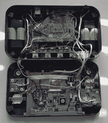

# 使用便携式 Wii 在旅途中玩几个 Smash Brothers 游戏

> 原文：<https://hackaday.com/2018/01/27/play-a-few-games-of-smash-brothers-on-the-go-with-a-portable-wii/>

你会如何处理一个需要你拆开一个完美的主机主板的构建？沉着而有力的完成。来自[BitBuilt.net]的[jefflongo]——一个致力于使游戏机便携的论坛——已经完成了这样一项任务，向世界展示了他的版本[便携式 Wii](https://bitbuilt.net/forums/index.php?threads/jeffs-first-portable-nogc-edition.1898/) 。

虽然这只是一个便携式 game cube(T1)的一般外观，但里面的  才是最重要的。一个经过大量修改的 Wii 主板——以减小尺寸——形成了这款便携式电脑的主干，它的面板上包括两个红外 led，用于 Wii 遥控器。单个玩家可以使用内置控制器，但[jefflongo]已经包括了四个 GameCube 控制器端口，以实现最大的多人混乱。虽然他可能会计划利用内置的 AV 输出端口在电视上玩游戏，并为那些延长的游戏会话充电，但四节 3400 毫安时电池(估计电池寿命为四小时)应该可以让他在移动中感到满意，直到他可以充电。

虽然电子显示了令人印象深刻的大量工作，但最后一块是一个景象。休息后请观看演示视频！

 [https://www.youtube.com/embed/zEJpmFXLQ-A?version=3&rel=1&showsearch=0&showinfo=1&iv_load_policy=1&fs=1&hl=en-US&autohide=2&wmode=transparent](https://www.youtube.com/embed/zEJpmFXLQ-A?version=3&rel=1&showsearch=0&showinfo=1&iv_load_policy=1&fs=1&hl=en-US&autohide=2&wmode=transparent)

经过 11 个月漫长的建造之旅——大量的建造日志在这里展示——我们希望[jefflongo]正在享受他的劳动成果。

我们这里有便携式的 Wii，那么 PlayStation 3 和 Xbox 360 呢？

[通过 [/r/smashbros](https://www.reddit.com/r/smashbros/comments/7sqsop/i_finished_my_portable_smash_system/)