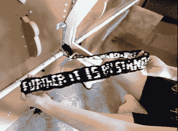
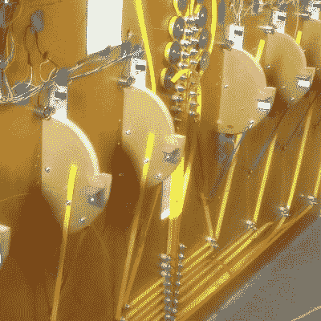

# 诗歌是这台织布机的果实

> 原文：<https://hackaday.com/2018/06/14/poetry-is-the-fruit-of-this-loom/>

我们敢打赌，大多数读到这些文字的人以前从未使用过织布机。你们大多数人也没有搅拌过黄油，没有坐过马车。尽管这些东西一度是最先进的技术，但今天普通人只是模糊地意识到它们的存在。在发达国家，生活在继续。我们不自己做衣服，也不自己种庄稼。我们消费，但是生产的地点和方式对我们来说已经变得模糊不清。

 【大卫·海瑟勒】和他的妻子【丹妮尔·艾芙琳】，认为这种消费和生产的现代分离是一个错误。如果不了解曾经生产哪怕一件简单的服装所需的家务劳动，我们怎么能欣赏我们的服装来自哪里，更不用说制作它的人了？为了以有趣而有意义的方式教育公众纺织生产，他们[创造了一个名为 Meme Weaver](http://memeweaver.org) 的诗歌印刷织机。

这位迷因编织者将在 6 月 15 日和 16 日于明尼阿波利斯市中心举行的[北方火花节](https://2018.northernspark.org)上发表羊毛智慧的言论。如果该地区的任何 Hackaday 读者有机会试用这台机器，我们很乐意在评论中听到它。拍照！如果你突然想自己做衣服，不要责怪我们。

吉他英雄和 T2 草原上的小房子各占一半，迷因编织者只是指导用户如何编织布料，而不是为他们做。Arduino Mega 和 Adafruit FX 板提供的灯光和声音会指示要拉动哪些杠杆，最终目标是创建一个两英寸宽的手工编织织物带，其中包含一首诗或一段引文。手工编织织物的行为与文本的个性化本质相结合，旨在在成品和用于创造成品的劳动力之间建立一种有意义的联系。

 但这是怎么回事呢？在现代人看来，这台机器的操作似乎很神秘，这可以说是加强了[大卫]和[丹妮尔]最初试图提出的观点。前面的杠杆是机器另一侧的移动综丝，它控制纱线穿过织机的路径。

通过升高和降低白纱，可以在本质上是*超低分辨率的点阵中打印文本。当综丝杆锁定到位时(由于微型开关触发的电磁铁)，用户然后将梭子穿过织机，最后拉动杆，用所谓的打浆机收紧完整的线。如果这对你的现代思维来说似乎很复杂，想象一下试图向 19 世纪的人解释 Arduino。*

如果这些关于编织的话题引起了你的兴趣，[你可以随时 3D 打印出自己的织布机](https://hackaday.com/2017/07/25/make-a-bit-of-cloth-with-this-3d-printable-loom/)。然后当你厌倦了手工操作，[你可以升级到树莓 Pi 驱动版本](https://hackaday.com/2016/08/20/one-man-a-raspberry-pi-and-a-formerly-hand-powered-loom/)，重新开始整个循环。

[https://giphy.com/embed/w6YCnqx8zQ95RylrjF](https://giphy.com/embed/w6YCnqx8zQ95RylrjF)

[通过 GIPHY](https://giphy.com/gifs/w6YCnqx8zQ95RylrjF)