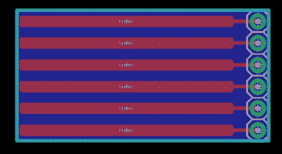
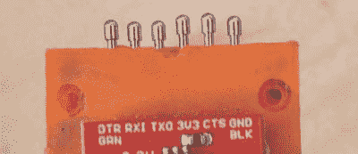
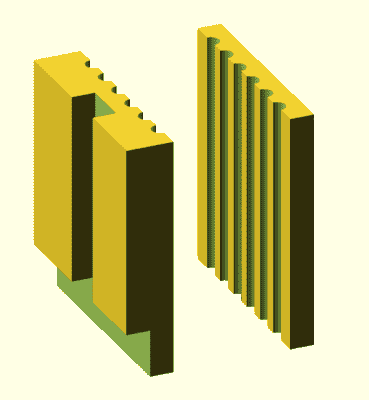
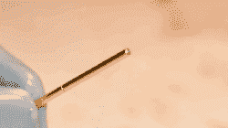
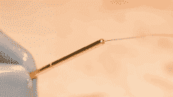
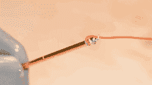
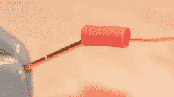
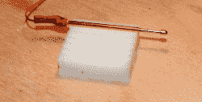
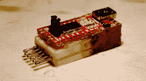
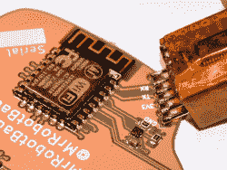

# 弹簧针串行适配器的事情

> 原文：<https://hackaday.com/2017/08/04/pogo-pin-serial-adapter-thing/>

几周前，我在做我的一个小项目，我面临一个相当大的问题。我不得不在一周内编程近 500 个徽章。我需要一个小的编程适配器，允许我在一个有六个弹簧针的徽章上刺几个垫，按一个按钮，然后移动到下一个徽章。

虽然不是生活中的所有事情都是如此，但有时你需要用质量换取权宜之计。这就是我如何建立一个可怕的，但功能齐全的 USB 转串行适配器，在短短几个小时内编程数百个徽章。

### 这不是做这件事的正确方法。

我写的任何教程通常都是这样，这不是正确的做事方式。在商业或制造环境中，弹簧针通常出现在测试或编程夹具中。在这些夹具中，弹簧针垂直于 PCB 安装，每个针穿过安装在支座上的第二个相同的 PCB。看看 Tindie 上的这些神奇的产品就知道了。这两个 PCB 为每个弹簧针提供机械稳定性和电气连接。这是一个非常强大的系统，但建立一个这样的测试夹具意味着我需要订购一些 PCB。我没有时间这样做，所以我需要另一个解决方案。

[](https://hackaday.com/wp-content/uploads/2017/07/pogoeagle.png)

Three minutes in Eagle, and it will work.

我所需要的是以某种方式在 0.1 英寸的中心固定六个弹簧针，用几个焊盘将这些针连接到 USB 到串行适配器。单个 PCB 完成这项工作非常简单，您只需要几个焊盘来固定弹簧针和一组孔来插入串行适配器。

我设法在大约三分钟内完成了 PCB(右)。它非常简单，唯一显著的特点是六个非常长的弹簧针垫。如果你非常擅长手工涂抹焊锡膏，熔化的焊料的表面张力会使弹簧针对齐，这样你就有六个完美的弹簧针相互对齐并平行。

[](https://hackaday.com/wp-content/uploads/2017/07/pogo.jpg)

A poorly assembled Adafruit Fiddy. You have no idea how annoying these misaligned pins are

PCB 解决方案很简单，但也需要时间。除非你的实验室里有一个 PCB 工厂，否则你必须向 OSH Park 或其他地方订购电路板。有时你现在需要一个弹簧针程序员*。*

如果你没有 PCB 厂，我希望你有一台 3D 打印机。去年，【蒂莫西·里斯】[为 Adafruit](https://learn.adafruit.com/fiddy-ftdi-pogo-pin-clip/overview) 创作了 Fiddy。这是一个用于六个弹簧针的 3D 打印“夹子”，旨在夹在 Adafruit Pro 饰品的末端，用于 FTDI 编程。在设计自己的 pogo 引脚适配器之前，我制作了 Fiddy。它很好地完成了它的工作。Adafruit Fiddy 会夹紧小电路板，并对其进行编程。

Adafruit Fiddy 有一些缺点。我发现我的 3D 打印版本有点太灵活了，尽管这可能是因为我是用 ABS 打印的，而不是 PLA。Fiddy 有点笨重。我也不需要一个夹在电路板上的编程器——我非常乐意让一个串行编程器靠着电路板 45 秒，如果这意味着引脚更安全一点，设备更鲁棒一点。

### 我是这样做的

有一个简单的手持式 pogo 引脚编程器的现有解决方案的 lit 审查。他们都很好，但是我需要一些东西。除了弹簧针(在任何出售精细电子产品的地方都可以买到)，我只需要我工作台上已经有的几样东西:

*   30 AWG Kynar 线
*   5 分钟环氧树脂
*   焊料
*   任何随机的“FTDI”USB 转串行转换器

对于这个项目，弹簧针将通过 3D 打印适配器固定在适当的位置。在 OpenSCAD 上呆了几分钟后，我想出了这个模型。它在 0.1 英寸的中心对齐六个弹簧针，并可以用环氧树脂固定在标准的现成 USB 转串行适配器的背面。

```
module pins(){
  for (a=[2.54:2.54:15.24]){
    translate([0,a,-0.01])
    cylinder(d=1.45,h=21, $fs=0.01);
  }
}

module front(){
  difference(){
    cube([2,17.78,20]);
    pins();
  }
}

module back(){
  difference(){
    translate([-4,0,0])
      cube([4,17.78,20]);

    translate([-5,0,0])
      cube([3,17.78,4]);

    translate([-5,6.5,0])
      cube([3,4,21]);

    pins();
  }
}

```

[](https://hackaday.com/wp-content/uploads/2017/07/openscad.png) 这款 3D 打印弹簧针适配器没什么特别的。可以把这些 3D 打印的零件想象成更多的夹具，用少量的环氧树脂提供机械强度。

这些部分是用我的打印机里已经有的任何一种细丝以非常低的层高度(0.05 毫米)打印出来的。基座上器件的方向需要支撑突出部分，突出部分将成为正常 FTDI 引脚接头后面的空间，Kynar 线从引脚到焊盘需要一个通道。

在 pogo 引脚的正常应用中，您只需将引脚放在圆形焊盘上，并将黄铜外壳焊接到 PCB 上。我没有这个选项，所以我需要附加 Kynar 线。我这样做是通过剥离 Kynar，将 2-3 毫米的剥离线放在针的非 pogo 端的孔中，将其钉牢，并将其余的剥离线缠绕在针上。一点点的焊料将所有东西连接在一起，一旦组装好，一点点的热收缩将防止引脚之间短路。

[](https://hackaday.com/wp-content/uploads/2017/08/1_bright.png)

The end of a pogo pin

[](https://hackaday.com/wp-content/uploads/2017/08/2_bright.png)

place the wire in the hole, tack it down.

[](https://hackaday.com/wp-content/uploads/2017/08/3_bright.png)

place the wire in the hole, tack it down.

[](https://hackaday.com/wp-content/uploads/2017/08/4_bright.png)

cover everything with heat shrink.

准备好六个弹簧针后，我必须将它们全部夹在两片塑料中间。如果我有一个如何做到这一点的建议，那就是，'*慢慢来'*。为此，我使用了五分钟的环氧树脂，一次安装一个引脚，并确保它们都对齐且均匀。这需要耐心，但会奏效。

之后，剩下唯一要做的就是将 Kynar 线的另一端焊接到 FTDI 适配器上。它很小，需要复杂的焊接，但它可以做到。

[](https://hackaday.com/wp-content/uploads/2017/08/plasticbullshit_bright.png)

Installing one pin at a time

[](https://hackaday.com/wp-content/uploads/2017/08/final-adapter_bright.png)

The finished adapter

[](https://hackaday.com/wp-content/uploads/2017/08/programming_bright.png)

Yes, all the pins are even and the pogo pins work

### 成功了吗？是的。好吃吗？呃……

虽然我能够用这种 pogo 引脚串行适配器编程几百个徽章，但我不认为这是一个“好”的解决方案。这个设备有几个问题，实际上我很惊讶它居然能工作。

编程后，徽章上的 ESP8266 重新启动，led 亮起。虽然 FTDI 适配器的电源能够为徽章提供所需的约 300mA 电流，但我应该使用更大规格的导线将弹簧针连接到 USB 转串行适配器。这确实不是一个大问题，但这是一个问题。

此外，我必须非常非常小心，不要让任何环氧树脂沾到弹簧针的“弹性”部分。如果你在处理焊料，很容易不破坏弹簧针的弹性，但是环氧树脂无处不在。我发现用异丙醇快速擦拭确实可以清洁针脚，但这仍然是我不希望遇到的问题。

如果我不得不再次这样做，没有时间或金钱的限制，我会拿起我在 Eagle 中创建的 PCB，抓住一个 FTDI 芯片和一个 USB 连接器，并简单地构建我自己的 USB 到串行适配器，它使用 pogo 引脚而不是引脚接头。这实际上没有那么多工作——两个小时设计电路，也许一个小时组装，如果一切顺利，我将拥有完成这项工作的完美工具。

然而，有时你不得不焊接和粘合一些垃圾在一起，并希望它能工作。这就是我在这里设法做到的，是的，它确实起作用了。