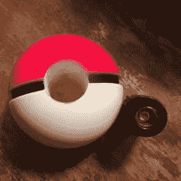
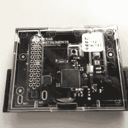

# 口袋妖怪 Go 物理口袋球抓住他们所有人

> 原文：<https://hackaday.com/2016/07/25/pokemon-go-pokeball-catches-em-all-real/>

向意想不到的生物投掷小球有一种不可抗拒的魅力。但是等等。你什么时候真的扔过扑克牌？对[Trey Keown]来说，在彩色像素上滑动是不够的，所以他为 Pokemon Go 制作了一个真正的、可投掷的、捕捉 Pokemon 的 Pokeball。

对于他的构建，[Trey]获得了一个现成的泡沫口袋球，他从其中移除了原始的“灯光和声音”内脏和一些泡沫填充物，为真正的口袋妖怪 TI SensorTag 2.0 腾出空间。这款小巧、独立的物联网开发板配有 BLE 和一个加速度计，因此在硬件方面，除了将它塞到预先准备好的泡沫球中，没有太多事情可做。

      

[Trey]继续编写一个 iOS 应用程序，从他的 Pokeball 中访问加速度计数据。如果加速度值超过某个阈值，他的应用程序会将触发命令写入一个文件，该文件由一个名为 AutoTouch 的用户输入仿真宏应用程序定期轮询。AutoTouch 模拟游戏中投掷扑克球的滑动。

即使它只是半透明的 CGI，它可能实际上对一些粉丝来说是一个真正的失望，Pokemon Go 在游戏预告片中扮演了如此重要的角色[后，却没有任何实体的 Pokemon Go。任天堂和 Niantic 错过了一个商业机会，还是一个即将到来的机会？请在评论中告诉我们，并欣赏视频，其中[Trey]展示了他的身材:](https://www.youtube.com/watch?v=2sj2iQyBTQs)

 [https://www.youtube.com/embed/VnawsB9XSC0?version=3&rel=1&showsearch=0&showinfo=1&iv_load_policy=1&fs=1&hl=en-US&autohide=2&wmode=transparent](https://www.youtube.com/embed/VnawsB9XSC0?version=3&rel=1&showsearch=0&showinfo=1&iv_load_policy=1&fs=1&hl=en-US&autohide=2&wmode=transparent)

