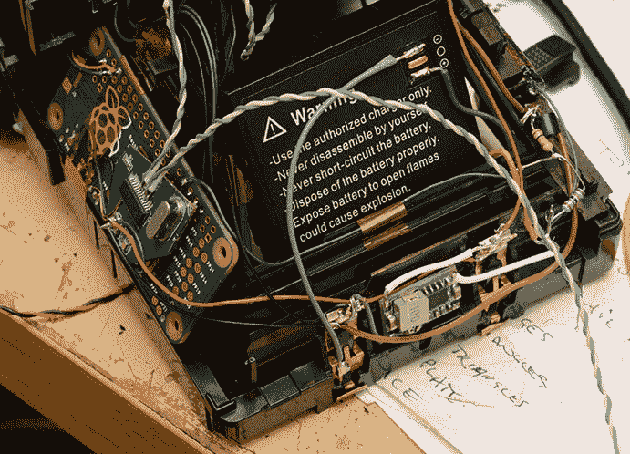
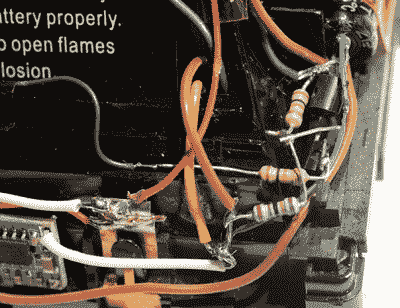

# 宝丽来得到热敏打印机和树莓派

> 原文：<https://hackaday.com/2018/04/16/polaroid-gets-thermal-printer-and-raspberry-pi/>

不管你在评论中读到了什么，我们 Hackaday 并没有意识到有一种“Pi 疲劳”正在酝酿。类似于“Arduino”在这些地方曾经是一个肮脏的词，围绕世界上最流行的 Linux SBC 构建的项目偶尔会被认为是懒惰的。Hacker 将 Raspberry Pi 塞入一个旧的电子设备中，大量使用热胶水，在 Imgur 上发布一个画廊，然后嘣！起泡，冲洗，重复。

 我们之所以只提这个，是因为下面这个项目，尽管有树莓派零嫁接到一台老式宝丽来相机上，却是*不过懒罢了。 [[mitxela]在一篇细节和照片完美无缺的报道中，解释了 Pi Zero 和热感相机如何再现经典的宝丽来体验](https://mitxela.com/projects/thermal_paper_polaroid)，即在几秒钟内从快门按钮到实物照片。这个版本的做工和对细节的关注简直是惊人的，应该可以消除我们亲爱的读者对 Raspberry Pi 项目的任何疑问。至少现在是这样。*

 *休息后的视频将向您展示操作中的改装相机，并回顾一些构建的亮点，但对于这一个，您真的应该花时间从头到尾阅读整个过程。[mitxela]从拆卸宝丽来相机开始，并配有大量精彩的图片，展示了这款传奇的消费电子产品是如何组装起来的。如果你从未见过这种相机的内部，你可能会惊讶地发现在那不起眼的外表下隐藏着什么样有趣的硬件。从无螺丝的结构到纸质基板的电路，许多令人着迷的工程设计使这款相机达到了大众市场的价格。坦率地说，光是拆卸就值得一查。

 但是一旦相机被剥得只剩下光秃秃的框架，真正的乐趣就开始了。在概念层面上，[mitxela]用廉价的网络摄像头取代了摄像头光学元件，用 Raspberry Pi Zero 取代了“大脑”，用用于收据的热敏打印机类型取代了胶片机制。但是*他是如何把这一切联系起来的，这就是为什么这个项目如此令人印象深刻。几乎在这款相机的设计和制造过程中所做的每一个决定都是为了减少开机时间。没有人想要一台开机需要 30 秒、15 秒甚至 10 秒的相机。它必须在你需要的时候随时可用。*

让这个 Linux 驱动的相机在短短 2 秒内启动需要很多聪明的软件技巧，如果你曾经考虑过构建一个嵌入式 Linux 设备，你绝对想看看这些技巧。你不能把一张拉斯扁的图片放在 SD 卡上，然后期待最好的结果。[mitxela]使用 buildroot 制作了一个定制的 Linux 映像，其中只包含相机操作所需的*和一系列深奥的调整，这些调整是年轻的企鹅牧马人可能永远不会考虑的。比如通过禁止在启动时将内核消息转储到串行端口来减少整整一秒的启动时间。*

[mitxela]带着他的相机在最近的伦敦黑客日聚会上炫耀，但这已经不是我们第一次看到他的作品了。从今年早些时候他的[伺服驱动音乐盒](https://hackaday.com/2018/03/23/servos-do-the-plucking-in-this-midi-music-box/)到他的[对微型 MIDI 设备的嗜好](https://hackaday.com/2016/01/08/the-smallest-midi-synthesizer/)，他一直给我们冰冷的机器人心灵留下深刻印象。

 [https://www.youtube.com/embed/6CwaT4R5_WA?version=3&rel=1&showsearch=0&showinfo=1&iv_load_policy=1&fs=1&hl=en-US&autohide=2&wmode=transparent](https://www.youtube.com/embed/6CwaT4R5_WA?version=3&rel=1&showsearch=0&showinfo=1&iv_load_policy=1&fs=1&hl=en-US&autohide=2&wmode=transparent)

*