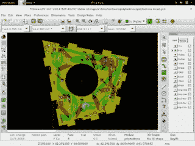

# 多面体

> 原文：<https://hackaday.com/2016/03/04/polyhedrone/>

[Brainsmoke]有个简单的计划。做一个有很多可寻址发光二极管的四轴飞行器。

不仅仅是一个普通的四轴飞行器，还有难看的 LED 带子。[Brainsmoke]想把他的发光二极管放在一个球里。就这样诞生了[多面体](https://wiki.techinc.nl/index.php/Polyhedrone)，一个飞行的[三角六面体](https://en.wikipedia.org/wiki/Deltoidal_hexecontahedron)的想法，就像你所期望的那样，覆盖着所有那些可寻址的发光二极管。

一个[加泰罗尼亚固体](https://en.wikipedia.org/wiki/Catalan_solid)对于自制多面体构建器来说是一个很好的选择，因为它的面都是一样的。因此，举例来说，如果你正在制作携带 led 的 PCB，你只需要创建一个用于所有面的 PCB 设计。在 KiCAD 中做了一些工作，一个带有互锁边缘的单面设计已经准备好了。测试电路板，设计布线图，组装多面体。

但是[Brainsmoke]并没有就此打住。他为多面体制作了一个飞行箱，一个更大的多面体，看起来像是激光切割的薄片。

有了一个完成的多面体，接下来的事情就是挂一个树莓派和写一些软件。先用 [Python](https://github.com/brainsmoke/dhxlamp) ，再用[围棋](https://github.com/brainsmoke/goled)。

结果简直令人震惊。如果多面体的数学和构造不足以让这个项目值得再看一眼，那么[图片画廊](https://wiki.techinc.nl/index.php/Polyhedrone#pictures_3)就足够了。你会注意到，这表面上是一个四轴飞行器项目，但在这一页上没有提到飞行。这是因为这仍是 T4 科技公司正在进行的一项工作，未来还会有更多。但老实说，如果这个项目从未离开地面一毫米，这并不重要，就我们而言,[Brainsmoke]创造了一个凭借自身力量建造的精美建筑，我们喜欢这一点。

正如你所料，这只是众多涉及可寻址 led 或四轴飞行器的项目中最新的一个。其中值得注意的是[这个 LED 多面体](http://hackaday.com/2015/11/23/the-ommatid-is-an-awesome-thing/)巧妙地关闭了它的所有部分，这个[配备 LED 的四轴飞行器](http://hackaday.com/2015/05/10/roswell-eat-your-heart-out/)产生了非常令人满意的像素交叉图案。