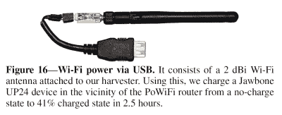
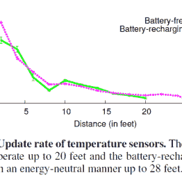
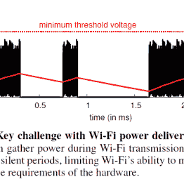
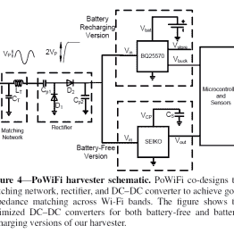

# 无线上网可能终究不是独角兽

> 原文：<https://hackaday.com/2015/11/27/power-over-wifi-might-not-be-a-unicorn-after-all/>

最近在互联网上有一些关于 WiFi 供电的报道。如果这是真的，那肯定会让所有物联网粉丝们大吃一惊(抱歉，其他人*时髦词*粉丝们，物联网的孩子们迅速包围了现场，他们是认真的)。

我们发现的所有最新信息都指向[一篇由【大众科学】撰写的文章，标题为“2015 年新品精选”](http://www.popsci.com/best-of-whats-new-2015/engineering)。这份简短的报告包括一份缺乏技术信息的简短总结，公平对待[PopSci],因为这是一份“最佳”清单，他们没有宣传这是一份深入调查。

然而，我们倾向于以“如果你要淋湿，你还不如去游泳”来生活。心态，所以我们决定获得更多的信息。经过一番挖掘，我们在[康乃尔大学]的电子文档库上看到了真正的[文章，你可以在那里](http://arxiv.org/abs/1505.06815)[下载发表的 PDF 文件](http://arxiv.org/pdf/1505.06815v1.pdf)。

USB energy harvesting dongle.

本文详细解释了电能收集理论，包括接收端硬件原理图。他们必须为收割机创建一个恒定的传输，以超过其最低要求的工作电压。这是通过无线路由器的一个未使用的信道来完成的，以填补正常 WiFi 通信之间的无分组静默空白。

可以想象，PoWiFi 目前仅限于为间歇使用的低功耗设备供电/充电。研究小组能够以 2.3 毫安的速率为 Jawbone 耳机充电 2.5 小时，导致电池电量从 0-41%。这里的重点是距离，正在充电的设备距离 PoWiFi 路由器只有 5-7 厘米，接近感应充电范围。研究人员在论文中表示，他们正在研究将采集电路和天线集成到耳机中，同时努力实现更大的充电距离。

  Rate of update vs time.  WiFi packets and silence.  Power harvesting schematic.

在撰写本文时，PoWiFi 似乎最适合于以下设备:低功耗传感器和运动激活相机，这些设备具有更高的储能容量，该团队提到这是继续研究的可能性之一。

我们以前报道过无数的无线电力项目，有些是合法的，有些是 T2 的，我们仍然很喜欢 T3。你认为这一个属于那个范围吗？请在下面的评论中告诉我们。

感谢[ScottVR]的提示。