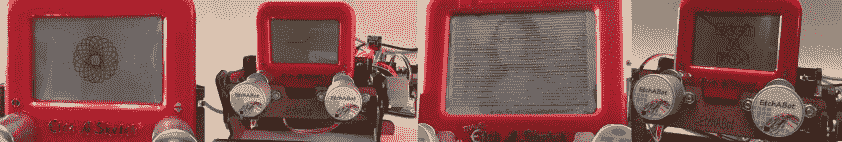

# 用蚀刻机器人实现精密数控绘图

> 原文：<https://hackaday.com/2016/01/18/precision-cnc-drawing-with-etchabot/>

将经典的玩具蚀刻草图变成一个 CNC 绘图板激起了大量黑客的兴趣。由[GeekMom]开发的这个[版本肯定会因其精确性和实用性而获奖。一旦你构建了这样的东西，你就很难停止为它写固件；[GeekMom]开发了一个完整的 Arduino 代码库，允许操纵杆涂鸦、绘制网页图像和自擦除螺旋图模式。topper 是作为时钟运行的版本！](http://www.geekmomprojects.com/etchabot-a-cnc-etch-a-sketch/)

制作这个玩具的 CNC 版本的主要麻烦是绘图机制中的溢出。反转拉伸方向时会有很大的间隙。如果这还不够糟糕的话，在垂直或水平方向上的反冲是不同的。[geek mom]演讲的一部分是关于如何衡量和纠正这种反弹。

蚀刻机器人使用三个小型步进电机。两个驱动绘图控件，第三个将设备向前翻转以擦除之前的绘图。每个电机都由 ULN2003 步进电机驱动器控制。Arduino Uno 提供情报。可选组件是 DS3231 实时时钟和双轴 X-Y 操纵杆，用于时钟和涂鸦功能。激光切割木材为放置蚀刻草图和电子元件创造了一个基础。

这个项目的文字和细节令人印象深刻。请务必查看[geek mom]博客中的其他条目。休息后观看完整的肺活量描记器视频。

 [https://www.youtube.com/embed/bS-zDuRoe_Q?version=3&rel=1&showsearch=0&showinfo=1&iv_load_policy=1&fs=1&hl=en-US&autohide=2&wmode=transparent](https://www.youtube.com/embed/bS-zDuRoe_Q?version=3&rel=1&showsearch=0&showinfo=1&iv_load_policy=1&fs=1&hl=en-US&autohide=2&wmode=transparent)

