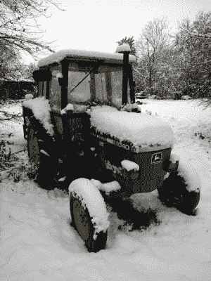
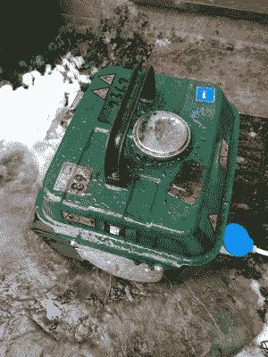

# 为停电做准备

> 原文：<https://hackaday.com/2017/12/19/prepping-for-power-outages/>

当市电断电时，我们会突然面对许多我们认为理所当然依赖它的设备和服务。以电话为例，以前它们是通过电缆连接到墙上的，现在它们是一种带有电源供电基站的无绳设备。你的手机可以填补这一空白，但电池寿命不到一天的现代智能手机很难成为可靠的长期解决方案。与此同时，现代供暖系统可能仍然燃烧天然气或燃油，但依靠电动泵进行循环。你的厨房里堆满了电力驱动的白色家电，你的食物由电冰箱保存，甚至你的煤气灶(如果你有的话)也可能需要电源。

当停电时，我们可能会说我们瞬间回到了几个世纪前，但事实是，我们的祖先在 1817 年不会陷入我们现在这样的困境，他们有适当的解决方案来度过一个寒冷的冬天，当时电在[迈克尔·法拉第]的眼中还是一线曙光。简而言之，他们的准备方式与我们大多数人不同。这是一个遗憾，所以让我们仔细看看明智的现代准备。

### 城市对乡村

If Hackaday did Christmas cards, this might be one of them.

这是从一个非常小的英国村庄写来的，这个村庄在几天前的一场暴风雪中停电了很长时间。一夜之间，我们下了几英寸厚的潮湿大雪，在无风的条件下厚厚地覆盖着，刮倒了大量的树枝，以及我们变压器的 11kV 电源。来自寒冷国家的读者在这一点上可以尽情欢笑。(但如果我们没有迅速建立必要的备份系统来继续，你周末的黑客故事可能已经岌岌可危。)在下雪的早晨，你可以认出那些在我们村子里住的时间不长的人:他们的房子没有开灯。

如果你没有被几英寸厚的白色东西吓住，开车离开城镇，沿着几条积雪的乡间小路行驶，你会发现开着灯的农业社区安全而温暖，我们愿意考虑通过 ADSL 线路检查 Hackaday，暂时具有 1:1 的争用率。这并不是因为他们是那种在地下室里放满步枪和罐装豆子以备不时之需的人，而是多年生活在长长的电线链末端的经验告诉他们，为不可避免的停电做好准备是必要的。

在没有电的情况下，最基本的取暖要求是，你不可避免地会发现，在农业社区里，用某种烧木头的炉子就能满足这一要求。在 Chez [List],它是一个充满大型壁炉的房间加热器，但典型的英国农场厨房有一个 Aga 或类似的固体燃料炊具，在烹饪午餐时烘干惠灵顿长靴和厚袜子。如果你是一个没有 Aga 的长期农村居民，那么在房子的后面会有几个橙色的丙烷气瓶，用于执行相同功能的煤气灶。

Just a few of the bits and pieces that come out to fight the power cut.

无论有没有电，木头和煤气取暖器和炊具都是一成不变的。为了充分替代其他一切失去的电力，需要收集各种各样的设备，几十年来积累的零碎东西，并储存起来，只为这些时刻。一部 20 世纪 80 年代的有线电话，取代了我们的 DECT 基站，一部电池收音机，各种照明设备，一堆电源延长线和多路适配器，一个深循环蓄电池，一对固态逆变器，以及一台小型二冲程发电机。停电一小时后，我们光线充足，我们的冰箱冷藏着圣诞火鸡，网络也恢复了。Hackaday 的排班有救了！

### 从一点蜡和一些线到锂离子

最简单的停电照明设备是不起眼的蜡烛，我们在橱柜里放一两盒以防万一。除非你是在追求狄更斯式的氛围，但公平地说，更好的选择是存在的。各种结实的农家灯首先被拿出来，从带有铅酸凝胶电池和汽车前灯的老式灯到轻便的现代锂离子 led 灯，紧接着是通常的 LED 手电筒阵列。明亮的光线和长时间的电池寿命对于那些在昏暗的锌碳电池白炽灯光下长大的人来说仍然是不可思议的。

首先，对于低功耗电源设备，我们准备了几个电源逆变器。不是特别高质量的，便宜的沙堡波形 300 和 600 瓦的单位。它们被连接到 ADSL 路由器、我的笔记本电脑和家庭电视上。一个小农场有深循环铅酸蓄电池充电，并交给电动击剑手，愉快地提供这些负载，并可以很容易地用汽车或拖拉机的正确充电器充电。

### 电器功率

Get warm on cold days, by starting a tiny two-stroke that hasn’t seen action since the summer!

用一个便宜的逆变器来运行一个冰箱或冷藏库不是一个明智的做法，所以如果停电持续几个小时，发电机就会停止工作。幸运的是，一个有缺陷的汽化器阻止了我们这次使用我们的首选，所以我的廉价而讨厌的 800W 二冲程机器和一个延长引线的花环出现了。它非常适合夏天偶尔的野营旅行，但不是我的首选，因为它的电压调节有点混乱。你很快就学会了在连接任何你关心的电器之前，确保它有一个灯泡作为负载插入，当你看到没有连接时，电压超过 300V 大关，插入式电源电压表成为一个必不可少的附件。

我们的电话交换台位于一个邻近的村庄，像所有这样的建筑一样，它有一个备用电源系统，以便在停电时维持必要的服务。它必须有某种形式的电源管理保存时间表，因为在任何断电开始后几个小时，它就会关闭 ADSL 服务，我们就会失去互联网连接。因此，我们断电应对策略的最后一部分包括临时安装数据 SIM 卡的手机，并将其作为无线热点放置在楼上的一个窗户上，以获得质量不错的信号。我们可以解决我们的电力问题，但英国农村无线覆盖的危险状态超出了我们的能力范围。

### 告诉我们你是如何为停电做准备的

所以，你已经描述了一个典型的英国村庄在潮湿寒冷的 12 月的生活，是的，你会对我们作为一个国家缺乏抵御气候变化的能力嗤之以鼻。不过，任何地方的农业和农村社区都有同样的“我们能修好”的心态，所以一旦你用你当地的版本替换了我们的 230V 市电和 BS1363s，也许在我们的断电准备中会有一些仍然有用的东西。更重要的是，当你所在的地方隆冬断电时，你会做什么？作为一名黑客抄写员，我们所做的任何事情都会被我们的读者更惊人的作品所掩盖，这是生活中不变的事实，所以你们中的一些人会彻底解决这种情况。评论是开放的，告诉我们*你*是怎么做到的。