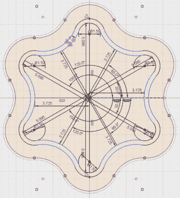

# 印刷适配器教老忍者新招

> 原文：<https://hackaday.com/2018/02/06/printed-adapter-teaches-an-old-ninja-new-tricks/>

你喜欢为了改变而改变吗？你是否不能让某样东西处于已知的工作状态，而宁愿无休止地摆弄它？你不担心在你看似简单的产品线中引入任意的兼容性问题吗？如果你对这些问题中的任何一个回答“是”，我们已经为你找到了工作！你可以成为一名产品工程师，整天迷惑那些不切实际地期望他们过去购买的产品在几年后仍然可以与同一家公司提供的看似相同的配件一起工作的客户。如果有兴趣，请向位于地狱最黑暗深处的招募办公室报告。

A 2D representation of the adapter in Fusion 360

在这个世界摆脱消费硬件的任意限制之前，我们将继续记录像[亚历克斯·惠特莫尔]这样的勇敢战士的功绩，他们将这些事情掌握在自己手中。当他意识到他的新型号 Ninja 食品加工机的刀片不能在旧型号的电机上工作仅仅是因为花键的尺寸不同时，他开始[设计和打印适配器，以重新统一 Ninja 产品线](https://hackaday.io/project/41257-ninja-blender-black-to-gray-adapter)。

[Alex]尝试拍摄样条的照片并将其导入 Fusion 360，但最终发现这是一个不值得的麻烦。正如许多印刷零件成功的故事一样，他最终花了一些时间用一对卡钳来得到他想要的设计。一旦分解成它的核心几何组件(一组用拱门相互连接的圆柱体)，并没有他担心的那么长时间。根据打印机的不同，最终适配器可能会比需要的更紧一点，但这并不是用橡皮锤快速敲击几下就能解决的问题。

这个项目是一个完美的例子，如果没有 3D 打印机，这将更加困难(但不是不可能)。虽然您可以通过其他方式创建这个样条适配器，但是我们肯定不想这样做。尤其是当你想做不止一个的时候。高度专业化物品的小批量生产是 3D 打印真正大放异彩的地方。

* * *

 **这是 Hackaday 的**里的一个词条

### [修理你可以打印竞赛](https://hackaday.io/contest/32812-repairs-you-can-print-contest)

20 个最佳项目将获得 100 美元的 Tindie 信用，对于学生或组织的最佳项目，我们有两台全新的 Prusa i3 MK3 打印机。有了这样一台打印机，你就可以在家里到处破坏东西，只是为了有一个借口来制造替换零件。