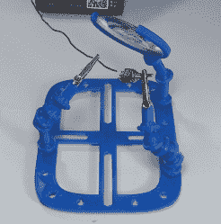
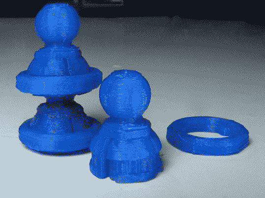
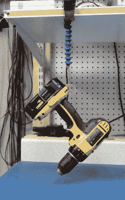
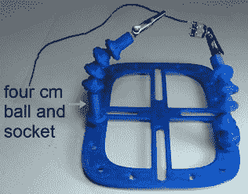
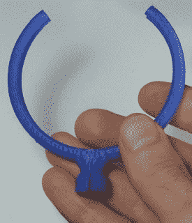
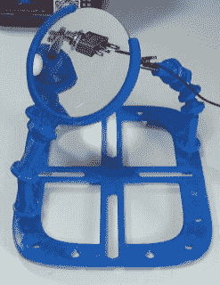
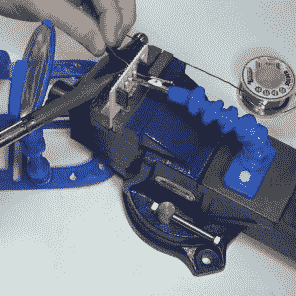
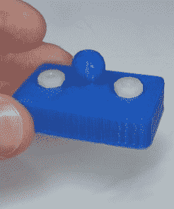
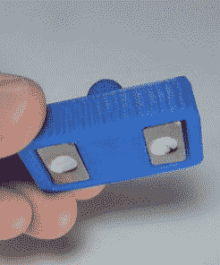

# 打印出来:用可锁球和插座帮助手做更多事情

> 原文：<https://hackaday.com/2018/02/08/printed-lockable-ball-and-socket-helping-hands-plus/>

一只手拿着烙铁，另一只手拿着焊料，再用两只手把你要焊接的零件焊接在一起。显然，在这种情况下，伸出援助之手是有用的。

Magnifying glass with helping hands

幸运的是，帮助之手很容易制作，冷却剂软管将在 10 美元以下完成这项工作。将鳄鱼夹连接到一端，安装在某种底座上，就完成了。或者，你可以[从通常用于手机的“章鱼”三脚架](https://hackaday.com/2017/06/25/another-helping-hands-build/)上偷腿。那你为什么要 3D 打印它们呢？

一个原因是利用标准化、开源的创造力。任何人都可以分享他们的设计模型，供所有人使用，或者根据他们的需要进行修改。一个恰当的例子是我下载的球窝模型。然后，我绘制并打印了一个带有匹配插座的放大镜支架，制作了一个球窝接头的变体，并制作了一个带有匹配球的磁性支架。让我们来看看哪些有效，哪些无效。

## 开放式设计很棒吧？

  Ball and socket, and twist lock ring  Tensile test

我开始使用的球窝模型是【亚历克斯·里奇的】[锁定球窝臂](https://hackaday.io/project/5739-locking-ball-and-socket-gooseneck-system)，它在 Thingiverse 上有[的设计文件。为什么选择那个？一个原因是球可以被锁定在承窝中，另一个原因是相同的机制收紧了承窝对球的夹持，使手臂更加刚性。将球放入球窝可能需要一些努力，但在球窝中切出四个插槽的帮助下，这变得更容易，这样球窝在组装过程中可以扩展。](https://www.thingiverse.com/thing:824711)

他可选的扭锁环是尝试这种设计的另一个原因。有三个凹槽嵌入戒指所在的插座。将环拧入连续的凹槽进一步压缩球周围的承窝。他通过把十个连接在一起的钻头悬挂起来，演示了由此产生的拉伸强度。

[Alex]还包括一个鳄鱼夹支架，带有一个插座，用于连接手臂上的最后一个球。幸运的是，我已经在一个旧的电子夹子套件中有了完美的鳄鱼夹，但如果我没有，我可以简单地将他的模型加载到建模程序中，在我的情况下是搅拌机，并调整孔的大小。查看他的 Hackaday.io 页面上的图库，获取更多正在使用的锁球系统的照片。

基地呢？这就是分享你的设计并允许其他人重复的地方。[Alex]从试用[giufini 的] [带铰接臂的 PCB 工作站](https://www.thingiverse.com/thing:801279)开始。在那里，我找到了一个可供选择的基地打印。因为那是(亚历克斯)的起点，基础上的球已经适合这些插座。

## 第一印象和印刷更高的球和插座

  Four cm ball and socket  Tightening ball and socket joint

在我的 Creality CR-10 3D 打印机上打印非常完美。手臂链很好地支撑着鳄鱼夹，我可以轻松地将电线焊接到开关上。无论我把它们放在什么形状，手臂都保持不变。一个小实验表明，在 0.25 mm 或 0.1 mm 层高的印刷之间没有明显的差异。

然而，我的目标也是把事情做得更好，那里有足够的工作空间。每个球窝只有两厘米长，这意味着我每只胳膊需要大约六个球窝。我明白为什么它们被设计得很短，以便于形成曲线。但是我也想要高度，所以我把一个关节放入搅拌机，简单地把中间部分拉长，这样整个关节就有四厘米长了。这减少了一个关节的数量，如果我想的话，我可能会更换另一个。

更高的中部也意味着我可以得到两个扳手来帮助扭转环的第三个凹槽。然而，我是用 PLA 打印的，虽然这有时有效，但我确实用这种方式破解了一个插座。这一招也许应该留给 ABS 的部分。

## 添加放大镜

  Original magnifying glass  Magnifying glass holder  Magnifying glass holder on helping hands

如果你像我一样，你的眼睛已经有一段时间了，你有时需要一个放大镜。我在一元店找到了一个镜头大小适中(7.5 厘米)，景深不错的相机。良好的景深意味着我可以在镜头后面有一个大的区域来放置东西，并且它们仍然保持在焦点上。用钢锯在放大镜的边缘切割了不到一分钟就把镜片取出来了。

对于持有者，我记得在 giufini 的 Thingiverse 页面上看到过一些模型。它们的尺寸不对，所以要送回搅拌机。加载一个时，我发现摇篮部分的多边形数量太多，以至于无法轻松调整大小，所以借鉴基本设计，我绘制了自己的摇篮。对于插座，我导入了一个[Alex 的]球和插座模型，删除了球，并将插座连接到我的新支架上。第一次打印显示镜头在支架上有点太松，但快速编辑和重印解决了这个问题。为了增加鲁棒性，我还把第二个摇篮做得更大，填充比例从 50%增加到 60%。镜头现在贴合，非常牢固地固定在适当的位置。

但很难使关节足够坚硬，以某个角度固定住它。这并不奇怪，因为镜头的重量相对较重，为 83.5 克。它确实起作用了，但只是勉强起作用。这就是我的新的四厘米长的关节再次派上用场。他们把关节的数量从五个减少到三个，而且下垂的趋势更少。不过，找到一个小巧轻便的菲涅尔透镜还是不错的。

## 磁性支架

  Attached to vice  Top view  Bottom view

到目前为止，我打印的东西有助于将元件焊接在一起，但我也用穿孔板做了很多通孔焊接。如果你像我一样，你会遇到这样的问题:试图将一个元件整齐地固定在电路板的一侧，直到你可以通过焊接将它固定在电路板的另一侧。在这些时候，我的老虎钳通常会垂直握住板子，这样我就可以从两边够到。这让我想到了另一个附加装置，一只可以用磁铁固定在铁磁性虎钳上的辅助手。

我仔细考虑了包括放置磁铁的盒子在内的设计，但很难找到一个可以 3D 打印的盒子，并且关闭得足够好，当意外靠近一些金属物体时，磁铁不会飞出来。最后，我选择了带孔的磁铁，可以用螺栓固定住。这样盒子的一个面上就可以有磁铁的开口，这很容易打印出来。为了避免正面碰撞损坏磁铁，我把磁铁放在盒子里。

我的第一次尝试只有两个磁铁，没有通过粗略的强度测试(用手拉)，所以我做了一个新的，足够两个两个的深度。我不会依靠它来固定放大镜，但事实证明它非常适合固定奇怪的电阻或电容。

## 最后的想法

如果没有前期的工作，我不可能这么快完成这件事。只有当你为了他人的利益传递火炬时，开放的力量才会持续。磁性支架、四厘米球窝和放大镜支架都可以在 Thingiverse 上的[系列中找到，作为【Alex's (alexrich82)】原始型号](https://www.thingiverse.com/stevendpe/collections/ball-and-socket-helping-hands)的“混搭品”。

这些帮助之手对于轻量级的对象来说工作得很好，但是自然地，有一个限制。7.5 厘米、83.5 克的放大镜已经到了极限。也许扩大球窝的尺寸，通过摩擦提供更大的阻力会有所帮助。

另一方面，据报道，不同长度的冷却液软管很难拆卸和重新组装，而这种可锁定系统很容易做到这一点，一旦锁定到位，它们就不会分开。但我推荐它们的最大原因是设计和附加定制部件的简易性。想想 Meccano 或 LEGO 的帮助之手。

不过，如果你使用的是一个精密的电路板，那么金属虎钳可能会有点太苛刻。考虑一下这个 [3D 打印的塑料老虎钳，它用橡皮筋](https://hackaday.com/2018/01/24/printed-it-rubber-band-pcb-vice/)固定住，我们的【汤姆·纳尔迪】改进了这个橡皮筋。