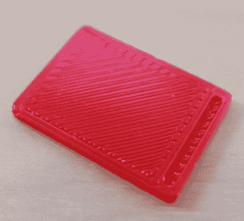

# 印刷 Nexus 7 SIM 卡托盘很好

> 原文：<https://hackaday.com/2018/02/02/printed-nexus-7-sim-tray-is-good-nuff/>

当修理某样东西时，实际上有两种想法:你可以精心制作一个无缝地融入原始硬件并且看起来不像是修理过的东西的修理，或者你可以把那个东西拼凑在一起并让它继续运转。这个决策过程中有很多变量，比如维修的复杂程度、可用的材料，当然还有你是否需要向你的另一半隐瞒你把东西弄坏了的事实。

当他的 Nexus 7 平板电脑上的 SIM 夹套最近破裂时，[亚历克斯·惠特莫尔]进行了心算，并得出结论，不值得他花时间试图找出如何模拟一个精确的替代品。但是他能够打印出足够符合他目的的东西，这才是最重要的。我们正在进行的“[维修你可以打印](http://hackaday.com/2018/01/16/win-big-prizes-with-repairs-you-can-print/)比赛的完美参赛作品。

You must be this small to ride

显然，2013 年 Nexus 7 中的 SIM 夹套是出了名的差，当然，因为这是一个已知的问题，在线零售商正试图从你那里获得高达 100 美元的一小块塑料。有时候，谷歌似乎真的决定在放弃 Nexus 系列之前将其彻底抛弃。

打印如此微小的部分，尤其是像指甲钩住的通道这样的小细节，需要一台校准相当好的打印机。如果你不能鼓起一个 0.1 毫米的第一层，你还不如坐在这一个；如果你还没有掌握桥接的艺术，帮助你找回 SIM 卡的那个小山谷可能最终会溢出成为一条眼泪的河流。

对[亚历克斯]来说，这件作品最终完美地完成了。这可能看起来有点奇怪，但如果你把平板电脑放在一个盒子里，你就永远不会看到它。同样值得注意的是，这种设计可以在具有类似 SIM 卡排列的其他设备上工作，或者至少，如果您想出自己的设计，这可能是一个很好的起点。

请记住，仍然有足够的时间将您自己的打印修复输入到我们的“您可以打印的修复”竞赛中。排名前 20 的维修将获得 100 美元的 Tindie credit，对于学生或组织完成的最佳维修，线上有两台 Prusa i3 MK3 打印机和 Quad Material 升级套件。