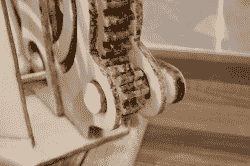

# 困扰食用大理石机的问题

> 原文：<https://hackaday.com/2017/11/18/problems-that-plagued-an-edible-marble-machine/>

多产的创造者[Martin Raynsford]最近为一个蛋糕国际展览和比赛创造了一个加大尺寸的激光切割大理石机的可食用版本；一开始做起来似乎很简单，但是有相当多的陷阱等待着，并且需要一些聪明的解决问题的方法。

Gears are three layers, stacked and cemented with sugar glue, and coated with a hard edible shine.

最初的想法是组装激光切割的姜饼零件来制造机器。姜饼可以用激光切割得很好，起初似乎对马丁来说一切都很顺利。然而，几天后，姜饼严重下垂。摆弄食谱和烘焙是没有用的，很明显[马丁]需要找到除了姜饼以外的东西来工作。经过试验，他选定了一种改性的糖膏，这种糖膏保持了原有的形状，而且干得足够硬，可以用来工作。(虽然似乎超出了大多数人对“蛋糕”的定义，但[马丁]参加比赛的类别允许它。)使用激光切割的木材部分作为导向，手工切割这些部分，然后在食物脱水机中过夜。

下一个问题是如何创建形成主坡道的大型螺旋。答案是激光切割一个定制的支撑结构，当它变干时支撑它，并作为一种安全运输的方式。高应力点用糖胶粘合了额外的层，一些部分用未煮过的意大利面条加强了内部。所有东西都用一种可食用的亮光剂密封,[马丁]说这种亮光剂就像是蛋糕的一种清漆。下面嵌入了视频演示。

 [https://www.youtube.com/embed/vVTvJ5YGCx4?version=3&rel=1&showsearch=0&showinfo=1&iv_load_policy=1&fs=1&hl=en-US&autohide=2&wmode=transparent](https://www.youtube.com/embed/vVTvJ5YGCx4?version=3&rel=1&showsearch=0&showinfo=1&iv_load_policy=1&fs=1&hl=en-US&autohide=2&wmode=transparent)

很高兴看到工作得到了回报，特别是因为第一个版本(有姜饼)很接近但最终被证明是一个死胡同，还有许多其他问题要克服。我们确信可食用的大理石机器引起了一些人的惊讶，尽管可能没有同样可食用但有点奇怪的[范·迪塞尔火腿三明治](https://hackaday.com/2017/03/30/sudo-make-me-a-sandwich/)那么多。