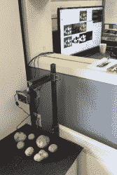

# 保护你的家免受土豆入侵

> 原文：<https://hackaday.com/2016/10/29/protecting-your-home-against-potato-invaders/>

不知道土豆是从哪里溜进来的，[24Gospel]做了任何一个正派的黑客都会做的事情:把一个摄像头绑在一个树莓 Pi 上，在 OpenCV 上黑了一点，为自己建了一个[土豆检测系统](https://imgur.com/a/CUpOm#oku0KBr)。现在那些讨厌的俄国佬如果不触动块茎警报就进不了房子。

好吧，说真的。[24Gospel]在一家土豆农场工作，是一名系统/软件开发人员。(马铃薯农场需要多大才能需要一个专门的软件人员？)他的系统仍是第一步，但目标是对土豆进行分级，记录大小和缺陷的数据，甚至区分不同类型的土豆。到目前为止，他已经取得了相当大的成功，尤其是在金钱方面。我们不经常建造需要在恶劣环境中运行的项目，但我们欣赏漂亮的塑料外壳和坚固的可调节钢架，它将 Pi 和相机支撑在分类床上。

更有甚者，我们在此为黑客精神喝彩。[24Gospel]显然是在一个严肃的生产环境中工作，但他仍然在尝试新的东西，试图使它工作得更好。虽然不可能量化这种在职独创性的影响，但我们打赌这种影响不可忽视。为什么我们在这里看不到更多记录在案的职场黑客呢？请无名英雄起立。

[via [/r/raspberry_pi](https://www.reddit.com/r/raspberry_pi/comments/585xbf/potato_detection_analysis_system/)