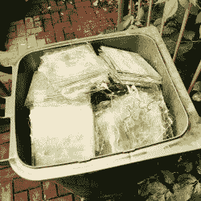
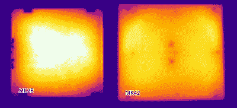
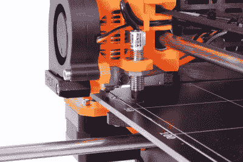
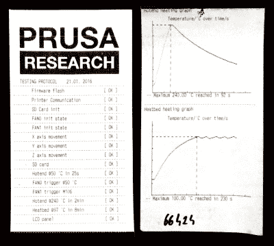

# Prusa 向我们展示了新的 I3 MK2 3D 打印机以及该社区的发展方向

> 原文：<https://hackaday.com/2016/06/15/prusa-shows-us-the-new-i3-mk2-3d-printer-and-where-the-community-is-headed/>

Josef Prusa 的设计一直值得信赖。他有一种在 RepRap 社区中搜索大量作品的天赋，找到最有价值的创新，然后将它们与他自己的一些创新融合在一起，成为比各部分之和更大的东西。因此，不难说，一旦一个功能出现在他的打印机上，它就是打印机的发展方向。随着经常被模仿的 Prusa i3 设计的最新版本，我们可以看到接下来会发生什么。

Prusa research 的打印机是我对任何开始 3D 打印的人的推荐，这些人希望了解他们桌子上的魔法盒，在夜里嗡嗡作响。万豪复印机还不错，但它是普鲁萨、E3D、Ultimachine 和其他人所做工作的成本优化版本。你只会在它坏掉的时候学习，它会坏掉。Prusa 在每台打印机上都安装了顶级部件，设计简单易懂，文档也是最好的。这是 3D 打印的老质量。

正如 Prusa 在下面的视频采访中告诉我们的(我们在 Maker Faire 的微软展台上找到了他——微软展台上的 RepRap！)，MK2 具有许多新功能。

 [https://www.youtube.com/embed/sgCQojQ8rEQ?version=3&rel=1&showsearch=0&showinfo=1&iv_load_policy=1&fs=1&hl=en-US&autohide=2&wmode=transparent](https://www.youtube.com/embed/sgCQojQ8rEQ?version=3&rel=1&showsearch=0&showinfo=1&iv_load_policy=1&fs=1&hl=en-US&autohide=2&wmode=transparent)

## 自动调平及其诸多好处

Le verre est mort. Prusa recently posted a trashcan full of borosilicate glass plates on [his twitter.](https://twitter.com/josefprusa/status/742370342149230592)

该行业一直在大力推动自动调平。这是我最喜欢的打印机升级。在我看来，它改变了打印机。我没有意识到，在我做完家务之前，被迫把我的打印机平放在床上会阻止我使用它。

从将限位开关移动到位的伺服电机开始，到非接触式电感传感器结束，reprap 社区已经向自动平台调平发展了一段时间。在今年的 MRRF 展会上，SeeMeCNC 展示了他们的小型[厄里斯](https://www.seemecnc.com/products/eris-desktop-3d-printer) delta 打印机，该打印机使用构建板下的加速度计来完成这项任务。MK2 使用了另一个技巧，它带有一个非接触式电感传感器，用于自动调平底座。

这与冷角补偿加热床一起让 Prusa 放弃了 3D 打印机常见的玻璃或铝构建表面。这是一个已经进入行业一段时间的特性；在 MK2 之前，E3D 在他们的大盒打印机中推出了 VariPower 床。冷角补偿加热床是指在电路板的不同部分具有不同走线密度的床。这允许加热的构建平台将更多的能量放入床的通常较冷的部分；这导致更均匀的加热区域。

A thermal image showing the effect of the new heated bed.

传统上，电路板上没有明显的平面度公差，尤其是在受到约束、振动和加热超过正常设计要求时。然而，这是在 3D 打印机中不使用交流电而获得加热表面的最便宜和最可靠的方法。玻璃板或者放在电路板的顶部，或者放在铝的下面，为加热床提供一个平坦的表面。

当自动调平玻璃板时，最简单的方法是让软件在三个地方进行测量。这给了固件足够的信息来定义一个平面和一个垂直于它的向量。它用这个来转换 gcode 始终保持喷嘴垂直于床。然而，如果你没有像玻璃一样完全平坦的表面，另一个选择是使用一种称为网格床调平的功能。在这种方法中，打印机测量网格点，产生一个非平面表面，然后补偿整个表面上的床的变化。

The inductive sensor above the pre-arranged spots on the i3 MK2’s new heatbed.

由于不再需要玻璃提供的平整度，MK2 直接在加热板电路板上使用 PEI 薄膜。PEI 是一种被称为长效薄膜的塑料材料，具有优异的粘附性能。大多数 3D 打印机材料在温度稍高时会完美地粘在上面，温度稍低时就会脱落。Lulzbot 和其他公司已经在他们的打印机上使用了几个版本。

与此同时，他们大大改进了马林固件，以利于均衡过程。正如一个手臂上纹着开源硬件标志的人所期望的那样，你可以在他们的[马林固件](https://github.com/prusa3d/Prusa-Firmware)的分叉上找到所有的代码变化。

## 3D 打印机生态系统的购买力增强

当家庭 3D 打印刚刚开始时，像廉价的步进电机和线性轴承这样的东西并不容易找到。然而，人们一直在购买和制造 3D 打印机。这创造了一个需求，现在 3D 打印机组件有一个非常好的市场。

这体现在打印机套件中使用的组件上。使用的电路板是来自 ultime 的兰博迷你。这是一块在美国田纳西州查塔努加市外制作的防弹板。兰博是由同一个人设计的，他制作了人人都在模仿的坡道板。

挤出机是另一个例子。MK1 使用了 E3D v6 Lite，可以做 PLA 和 ABS。MK2 已经升级到完整的 E3D v6 发动机。这款英国制造的挤出机可将打印机扩展到任何所需的细丝。这些公司之间的密切合作关系是另一个指标，表明双方都致力于将用户和质量放在第一位的社区。

Prusa found a motor manufacturer and now gets whitelabled motors made for the printers to the exact specs required. Including a faster and lighter extruder motor.

在 MRRF 这样的活动中越来越明显的另一个趋势是制造商能够购买定制零件。由于 Prusa Research 的打印机销售非常好，它可以购买自己品牌的步进电机。前面提到的 E3D 得到定制的加热器筒，使他们的规格以及。

## 价格和抛光

The Included QC report. Prusa is known for shipping parts that fail his tests back to manufacturers

随着供应链的改善，各地的打印机都看到越来越好的硬件，因为他们开始在 Z 轴分辨率和打印振铃上竞争。例如，Lulzbot 已经开始使用带有适当负载的 igus 套管的更大的光滑杆。在 MK2 中，Prusa 已经将 Z 从[有问题的螺杆](https://hackaday.com/2016/04/29/fail-of-the-week-my-3d-printer-upgrade/)切换到与电机集成的真正的丝杠。该打印机还具有更大的体积，更安静，更容易组装。

Prusa 做得非常好的一件事是他的打印机的质量控制。我正在帮助我的朋友把他的放在一起，惊讶地发现盒子里有一份完整的质量控制测试报告。这在 3D 打印世界中通常不会发生。

在整个装配过程中，我对抛光的程度印象深刻。配有配套螺母的扁平黑色螺纹杆看起来很棒。线束都经过预焊接和预压接。只要按照手册上的说明把它们插上就行了。应该可以，都测试过了。我认为这也是 3D 打印的一个趋势。参加顶级赛事的人，如普鲁萨、西梅肯、E3D、路兹博特等。(相对于进口层，万豪，爱好王等。)必须在可靠性、精度、声音、性能和支持成本方面展开竞争。他们必须在 600-3000 美元的范围内获得最大的性能，同时还能赚钱。

## 结论

普鲁莎又来了。如果你想开始 3D 打印，或者你想要一个可以正常工作的打印机套件；像 MK2 这么好的选择[很少。一旦您构建了 i3，就很难不被它所吸引，继续开发更复杂的版本，比如 SeeMeCNC 的 deltas。它体现了 3D 打印机套件应有的一切。社区设计，抛光，测试，并填充了良好的组件。仅仅是为定制打印机购买 E3D 和兰博 Mini 就会占 Prusa i3 MK2 成本的近一半，而且你不会得到电机、HBP、框架材料，或者最重要的是，极其彻底的测试。文档也很棒。它展示了家庭 3D 打印的美好未来。](http://shop.prusa3d.com/en/3d-printers/59-original-prusa-i3-mk2-kit.html)