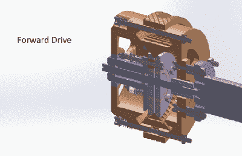

# 滑轮中的滑轮为机器人形成了独特的传动装置

> 原文：<https://hackaday.com/2017/09/25/pulleys-within-pulleys-form-a-unique-transmission-for-robots/>

在摆弄了几千年的齿轮之后，你会认为在动力传输领域不会有太多新的探索。然后你会看到类似于[的由嵌套滑轮](https://spectrum.ieee.org/automaton/robotics/robotics-hardware/inception-drive-a-compact-infinitely-variable-transmission-for-robotics)构成的无级变速器，你会意识到总有改进的空间。

机器人中通常使用的电动马达效率极高，在高速和低扭矩下效率通常超过 90%。安装传统的固定传动比变速箱，或者改变输入速度，效率就会降低。一种无级变速传动装置，如[Alexander Kernbaum]巧妙命名的 Inception Drive，允许电机保持最高效率，同时在很大范围内平稳地改变传动比。

该机制需要一点思考才能完全实现，但它基本上使用了一对间距可变的分裂滑轮。输入轴偏心地旋转内滑轮，这有效地“行走”围绕固定外滑轮的宽 V 带。这以取决于皮带轮半体的间距的比率驱动内部皮带轮；变速器可以平稳地从前进档换到倒档，甚至可以保持空档。下面的视频将帮助你了解它。

我们最近在这里看到了一些创新的传输方式；有些，像[这种应变波齿轮](https://hackaday.com/2017/01/17/3d-printed-strain-wave-gear-needs-your-help/)和[这种行星齿轮箱](https://hackaday.com/2017/03/02/unique-planetary-gearbox-can-be-custom-printed-for-steppers/)，适合 3D 打印。看起来盗梦空间也可以被打印出来。黑客们，启动你们的打印机，看看这个驱动器能做什么。

 [https://www.youtube.com/embed/0-uSUrcRsyw?version=3&rel=1&showsearch=0&showinfo=1&iv_load_policy=1&fs=1&hl=en-US&autohide=2&wmode=transparent](https://www.youtube.com/embed/0-uSUrcRsyw?version=3&rel=1&showsearch=0&showinfo=1&iv_load_policy=1&fs=1&hl=en-US&autohide=2&wmode=transparent)

感谢提示，[anfegori91]。