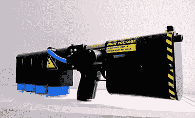
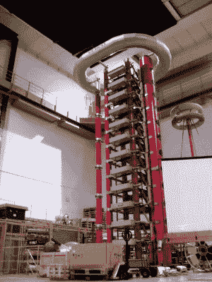
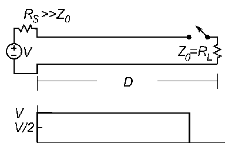
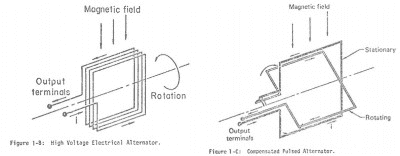
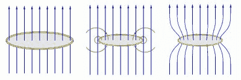
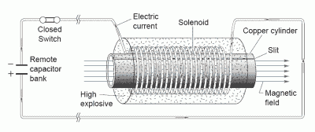

# 脉冲功率及其应用

> 原文：<https://hackaday.com/2017/01/11/pulsed-power-and-its-applications/>

脉冲功率是一种在一段时间内积累能量，然后快速释放能量的技术。因为功率等于能量(或功)除以时间，所以想法是在尽可能短的时间内发出恒定量的能量。虽然它只能持续几分之一秒，但这种瞬时能量有非常有趣的应用。通过这项技术，已经获得了超过 300 太瓦的功率水平。这种技术的预算是无限的，还是普通黑客可以达到的？

例如，考虑对电容器进行放电。一个 450 V、3300 uF 的大型电解电容放电时间约为 0.1 秒(因电容设计而异)。因为储存在其中的能量是由 1/2 CV 给出的，它给出 334 焦耳的能量，所以输送的功率将是 3340 瓦。事实上，一个流行的黑客项目是建造大型电容器组。一旦你有了银行，有了充电的方法，你就可以用它来驱动非常有趣的设备，比如:

A portable, 1.25 kJ coilgun by [Jason Murray]

*   [线圈管](http://hackaday.com/2010/09/23/youll-shoot-your-eye-out-another-coilgun/)
*   轨道炮
*   [清洗器发射器](https://www.youtube.com/watch?v=2M3rzx6jtnk)
*   [硬币缩小](http://hackaday.com/2011/08/20/shrinking-coins-with-high-voltage/)
*   [电磁脉冲发生器](http://hackaday.com/2016/10/12/become-very-unpopular-very-fast-with-this-diy-emp-generator/)
*   [点焊](https://www.youtube.com/watch?v=t3kwpQbVHBo)
*   [Airgap 闪光高速摄影](http://uzzors2k.4hv.org/index.php?page=airflashunit)
*   还是仅仅为了[把东西炸出来](https://www.youtube.com/watch?v=gj1pkyCL75E)

轨道炮尤其受到认真的研究。你可能已经读过关于海军轨道炮的报道，这种轨道炮的初速超过 4600 英里/小时(大约 6 马赫)，超过任何其他爆炸动力炮。电力由 9 兆焦耳的电容器组提供。电容器在两个导电轨道上放电，产生电磁场，沿着轨道发射射弹。由于数百万安培范围内的巨大压力和电流造成的轨道磨损仍然是一个有待解决的问题。

另一种使用电容器产生高功率脉冲的装置是 Marx 发生器。这是一个非常简单的电路，允许你对多个电容并联充电，然后利用火花隙对它们进行串联放电。[非常大的](https://www.youtube.com/watch?v=IrQsghadA8A) Marx 发电机已经建成，用于高压元件测试和[其他目的](http://hackaday.com/2010/10/23/marx-generator-knocks-our-rocks-off/)，但如果你有一些高压电容器和电阻器，在一个小时内制作一个[小型闪电模拟器](http://hackaday.com/2011/08/23/lightning-simulator-cant-send-you-back-to-the-future/)也是非常容易的。Marx 发电机用于 Z machine，这是桑迪亚国家实验室聚变研究项目，能够在 95 纳秒内发射 2600 万安培。已经获得了 37 亿开尔文的温度。

Marx 发生器是脉冲形成网络或 PFN 的一个特例。在各种[拓扑](http://www.nessengr.com/techdata/pfn/pfn.html)中，电容器、电感器和传输线或者它们的组合用于能量存储。然后，网络通过高压开关向负载放电

Transmission line PFN. By Chetvorno, via [Wikimedia commons](https://upload.wikimedia.org/wikipedia/commons/0/06/Charge_line_animation.gif).

例如火花隙或闸流管。传输线 PFN 很有趣，因为线路中导体的电容既用于传输又用于储能。当电源接通时，它通过*R*S 慢慢给线路电容充电。当开关闭合时，等于 *V* /2 的电压被施加到负载，存储在线路中的电荷开始通过负载放电，电流为*V*/2*Z*[0]并且电压阶跃沿线路向上朝着源行进。

[强制发电机](https://en.wikipedia.org/wiki/Compensated_pulsed_alternator)(补偿脉冲交流发电机的组合)是输送高电流脉冲的另一种方式。它们将飞轮的旋转能量直接转化为电能。compulsator 的工作方式与普通交流发电机相似，但其电感绕组最小，可在极短的时间内提供极高的电流。关于 compulsator 设计的信息很少，据我们所知，没有爱好者做过。你有你的家庭作业。

Alternator vs compulsator simplified designs. From [Weldon et al](https://repositories.lib.utexas.edu/bitstream/handle/2152/33185/PN_046_Weldon.pdf?sequence=1).

爆炸抽吸磁通量压缩发生器，简称 EPFCG，是一种利用高能炸药压缩磁通量产生高功率电磁脉冲的装置。EPFCG 在单个脉冲中产生数百万安培和数十太瓦的功率，因为该装置在运行中被破坏了。

Steps in flux compression. By Croquant, via [Wikimedia commons](https://upload.wikimedia.org/wikipedia/commons/9/91/Flux_compression_3.png).

通量压缩的三个基本步骤如上所示。

1.  外部磁场穿过闭合的环形导体。
2.  爆炸缩小了戒指的直径。磁通量的变化在环中感应出电流，这又产生了新的磁场，从而环内部的总磁通量得以保持。
3.  外部磁场和感应磁场相加，使得总磁通量保持恒定，并且在环中产生电流。

压缩过程使炸药的化学能(部分)转化为被相应大电流包围的强磁场能量。EPFCG 有几个设计。图示为空心管型。

脉冲功率也用于粒子加速器和高功率激光器，该技术正在迅速发展。

如果你刚开始，你可能想尝试电容器组，这是一种相对简单的获得脉冲功率的方法。但如果你这样做了，采取一切必要的预防措施。这种能量水平非常危险。