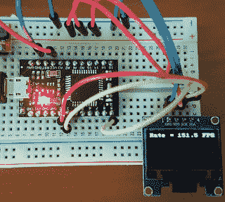

# 推到极限:SSD 1306 150 FPS

> 原文：<https://hackaday.com/2018/05/08/push-it-to-the-limit-ssd1306-at-150-fps/>

从严格的意义上来说，我们在 Hackaday 上讨论的很多项目都不是实际工作。如果我们要求美化我们数字页面的所有东西都有一个明确的最终结果，那么这个网站将会处于一种相当糟糕的状态。有时候，为挑战做点什么就足够了。但通常情况下，你会在这个过程中学到一些东西，将来可以用得上。

 这正是促使[拉里·班克]去看看他能在流行的 SSD1306 有机发光二极管显示器上优化帧速率的原因。经过几次代码迭代，[他能够达到惊人的 151.5 FPS](https://bitbanksoftware.blogspot.com/2018/05/fast-ssd1306-oled-drawing-with-i2c-bit.html) ，显然如果他觉得能够迎接挑战，还有一些改进的空间。但考虑到他的第一次尝试仅以 5.5 FPS 的速度运行，我们可以说他已经在这一次赢得了他的黑客信誉。

使用了一些不同的技巧来实现如此难以置信的性能提升。首先，虽然 I2C 的官方规范说，当与设备通信时，你应该等待设备的确认，[Larry]意识到 SSD1306 实际上并不在乎。他可以在显示器上连续不断地发出命令，而不需要等待确认。他承认这种方法有问题，但你不能否认结果。

为了充分发挥系统的性能，Larry 戴上了汇编帽，研究 Arduino IDE 编译器是如何解释他的代码的。他确定了几个领域，在这些领域中，更改他的 C 代码将迫使编译器生成更快的输出。他指出，在使用更高级的编译器时，通常不需要这样做，但是 Arduino 工具链偶尔需要有人帮忙。

这不是我们第一次看到有人[试图通过完全相同的有机发光二极管显示器](https://hackaday.com/2015/04/03/high-speed-ssd1306-library/)推动更多的像素，看到两种截然不同的方法实现相同的目标是很有趣的。