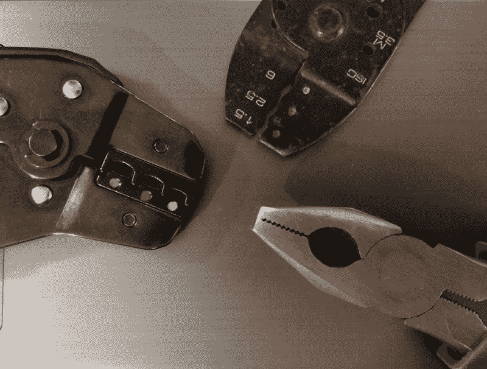
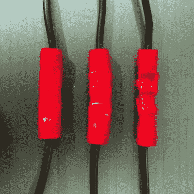
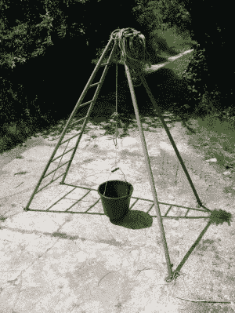
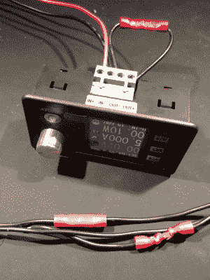

# 测试压接工具:我们的压接工具有多好？

> 原文：<https://hackaday.com/2018/06/26/putting-crimpers-to-the-test-how-good-are-our-crimp-tools/>

我在过去四分之一世纪的几乎每个项目，如果包含任何布线，都至少有一个压接连接器。有多种不同类型的压接，但在这种情况下，我指的是无处不在的各种红色、蓝色或黄色塑料套管，表示其设计的电线尺寸。它们提供了物理上坚固和电气上可靠的连接，能够抵抗由于振动引起的电线疲劳，并且能够在高电压下承载大电流而没有任何问题。

你可能认为现在应该深入压接连接的细节，但是我的同事 Dan 已经详细说明了什么是好压接或者坏压接。取而代之的是，最近我不断地寻找怪异和奇妙的东西来供你娱乐，这让我想到了一种新的压接工具，并由此对不同类型工具的有效性产生了好奇。因此，我将评估我可用的三种不同的压接方法，即我的闪亮的新棘轮压接钳、我的旧简单压接钳和用于比较的普通钳子。我将看看每种压接方法的物理强度及其电气效果，但首先值得看看工具本身。

## 摆放工具

The business ends of the three crimp tools up for comparison. Left, the ratchet crimp pliers complete with coloured dots in the wrong order, top, the cheap automotive tool that has its dots in the right place, right, my bench pliers.

除了说它们是一套非常普通的钳子(有时被称为线路工人的钳子)之外，关于这套钳子没有什么可说的，它正好在我的工作台上，所以我将它们称为台钳。你几乎可以肯定有一个非常相似的设置。

我的简单压线钳是在 20 世纪 90 年代的某个时候从一家汽车超市买的，它们是一种多功能汽车电动工具，你们很多人可能都有。它们有许多功能，但最让我们感兴趣的是它口部有彩色圆点的形状各异的容器。将一个压接连接器夹在其中，插入一根电线，挤压手柄，就可以进行适当的连接。

最后，棘轮压接钳是一种更昂贵的工具，但具有一套可拆卸的模具，带有相同颜色的点来表示压接尺寸。我可以购买适合其他类型连接器的模具，但在这种情况下，我可能不会这样做。有趣的是，它们廉价的来源(通过硬件的一个中国渠道)被应用到错误的骰子上的彩色圆点所揭示，但这并没有减损它们作为工具的有效性。

## 测试卷曲拼接

My three crimp splices. From left to right: bench pliers, simple crimp pliers, and ratchet crimp pliers.

如果我要评估一些压接工具，首先我必须进行一些压接连接，所以我从一个旧 ATX 电源的乱七八糟的电缆中抢了一些电线，并采取了三个红色压接电缆接头，大小适合电线。这些一点也不特别，来自廉价的压接连接器零售套装。

棘轮钳在红色塑料上留下了最深的印象，使它在模具的形状上最明显地变形。棘轮的调整可能会改变这一点，我现在只是简单地使用它。与此同时，简单的压接钳完成了它们通常的整洁工作，而台钳仅仅是将连接器压扁成椭圆形。

要测量压接连接的有效性，您需要了解什么？在实验室里，你可以用一把精密的锯子把它锯断，然后抛光露出的一端以供检查，或者像冶金学家那样用 x 射线研究它，看看它对金属晶体的影响。但在我的工作台上，我没有这些东西，无论如何，我对压接的需求更加实际。我需要知道以下:*会分崩离析吗？*，*它会接受我想要给它的电流吗？*所以我需要检查它的断裂强度和电阻。

## 一点后院计量学

No expense spared, when it comes to the Hackaday tensile strength evaluation lab.

我缺少一个带有抗拉强度评估装置的实验室，但是我住在一个农场里，有现成的水果采摘梯子和水桶。梯子是一个大约 6 英寸/2 米的三脚架，这取决于你如何放置它的腿，所以我从它上面悬挂了一根绳子，我通过我的电线将我的桶绑在上面，电线上有卷曲接头。用量杯往桶里装满水，直到接头分开，这样我就可以粗略地测量它的强度。塑料桶的重量很小，但是因为我的分辨率是一升水，或者大约 10 牛顿，如果你稍微改变一下英国重力的强度，我会说这在实验误差范围内。

这可能是我为 Hackaday 做的最不寻常的事情之一，坐在阳光下将水一点一点地倒入水桶。如果你们中的任何一个人觉得有必要这样做，一个好的建议是将水桶悬挂在离地面仅约 1 英寸/25 毫米的地方，因为当拼接处断裂时，所有水中有大量的势能会将水桶劈开。事实上，每次失败都会产生令人印象深刻的水花，这只是轻微的泡脚，但在农家庭院工程的世界里，你必须面对艰难险阻。

将每个工具上的接头分开所需的力整理在下表中:

| 工具 | 公升水 | 近似断裂力(牛顿) |
| 台钳 | five | Fifty |
| 简单压线钳 | Fourteen | One hundred and forty |
| 棘轮压线钳 | Twenty | Two hundred |

很快我们就可以看到，只有 50 牛顿的断裂力，我的钳工钳没有给出好的质量结果。这不足为奇，但值得记录。这也不奇怪，棘轮钳给出了比简单的更强的结果，这可能是更好的模具的功能，及其杠杆作用。令人惊讶的是，它们好得多，但由于压接连接的目的是电气的，而不是物理的，这并不意味着简单的压接钳连接的 140N 强度不够。

## 以测量的名义折磨无辜的电源

Torturing a Ruideng voltage regulator in the name of measuring tiny resistances using only what I had on my bench.

因此，我们已经确定，在由给定压接工具形成的连接的抗拉强度方面，物有所值。那么在我们评估的另一个领域，连接的阻力呢？这里我们立即遇到一个问题，它存在于所涉及的微小阻力中。压接连接器旨在提供尽可能完美的连接，因此它们的电阻非常小。要测量毫欧级的电阻，你很难拿起你信赖的万用表，打开探针。我们生活在一个阻力重重的世界里，普通的仪器不是为如此微小的数值而制造的。

考虑了一些如何处理这个问题的想法，最后我选定了一个涉及当前有限电源的想法。我的万用表擅长测量微小电压，因此，如果我对所有不同的压接连接施加相同的恒定电流，我可以读取预设电流下的电压，并利用欧姆定律推导出电阻。出现了一个普遍存在的瑞登开关稳压器模块，将其最大电流值设置为 5A，并测量了所有三个压接接头以及一根相同长度的导线上的电压。下表列出了结果值和计算出的电阻。

| 测试中的拼接 | 调节器端子电压(mV) | 计算的总电阻(毫欧姆) | 卷曲拼接电阻(毫欧姆) |
| 直导线(无接头) | Fifteen point one | Three point zero two | 0(不存在拼接) |
| 台钳 | Twenty-one | Four point two | One point one eight |
| 简单压线钳 | Fifteen point seven | Three point one four | Zero point one two |
| 棘轮压线钳 | Fifteen point eight | Three point one six | Zero point one four |

乍看起来，用简单的压接钳制作的压接接头是电阻最低的压接接头，这似乎是一个明确但出乎意料的故事，但实际情况却有很大的矛盾。即使切换到电压读数，我们也是在用廉价万用表测量的下限，而依靠廉价稳压器模块上的限流器成为计量美德的典范是一种永远不会成功的策略。所以这些读数都带有明显的误差线，因此并不像数字本身让我们相信的那样清晰。这些数字告诉我们的是，两种专用压接工具和台钳之间有明显的区别，但只要压接被适当压缩，工具产生的最终电阻就没有什么区别。

因此，在深入了解压接连接的特性后，我的结论是，虽然在我的工作台上有一对别致的棘轮压接钳很好，但它们并没有比我想象中的简单压接钳好多少。与此同时，没有人会指望一把标准的钳子能很好地压接，我已经充分证明了这一点。关于压接连接，所有这些都表明，如果使用正确的工具，压接接头的成本很低，但你可以获得非常坚固和超低电阻的连接，这让我对这些无处不在的连接器产生了新的看法。