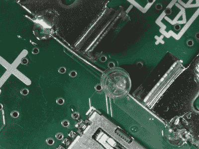

# 用一点水银让 Mooshimeter 休眠

> 原文：<https://hackaday.com/2018/05/08/putting-the-mooshimeter-to-sleep-with-a-bit-of-mercury/>

如果你没有听说过，Mooshimeter 是一个双通道万用表，它通过蓝牙 4.0 将你的智能手机用作显示器。同时监控电压和电流的能力是相当独特的，事实上，你没有物理束缚，这使得它非常适合在难以触及甚至危险的地方使用。Mooshimeter 的宣传材料显示，用户在开车时会将设备留在汽车的发动机舱内，并读取车辆电气系统的读数。

Note the vertical orientation

所有这些听起来都很好，但最终，Mooshimeter 可能不会成为您的主要万用表。它将被束之高阁，直到适合其独特能力的任务出现。[不幸的是，正如[nop head]发现的那样，这可能是个问题](http://hydraraptor.blogspot.co.uk/2017/06/mooshimeter-mod.html)。像许多现代设备一样，Mooshimeter 实际上并没有关闭。它只是坐在那里耗尽它的电池，直到你准备好使用它。这当然意味着，当你终于准备好把它拿出来使用时，你会收到电池电量低的警告，需要装上新的 AAs。第一世界的问题。

这个完全现代的问题的解决方法是令人愉快的老办法:一个水银倾斜开关。

使用由 [Kapton 胶带](http://hackaday.com/2018/04/04/kapton-miracle-material-with-a-tragic-history/)制成的小垫片，[nop head]能够将电池触点与 PCB 本身隔离。然后，他将水银开关焊接在它们之间，确保灯泡垂直放置。当 Mooshimeter 正面朝上时，水银向下流动并桥接触点；但是当设备倒置时，接触断开，电池停止消耗。他还得记得用完 Mooshimeter 后把它面朝下，但这总比处理一直没电的电池好。

当 2014 年[宣布推出](https://hackaday.com/2014/01/27/measuring-185-%c2%b5%cf%89-in-circuit/)时，最初有很多人对 Mooshimeter 感兴趣，但从那以后我们就很少看到它了。这当然看起来很整洁，但是[也许对它自己来说有点太小众了](https://hackaday.com/2017/10/26/the-most-useless-tools-you-cant-seem-to-part-with/)？如果 Mooshimeter 在您的工具集中扮演了一个重要的角色，请在下面的评论中告诉我们。