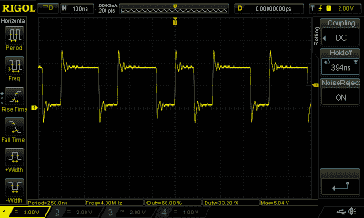
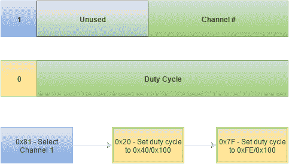
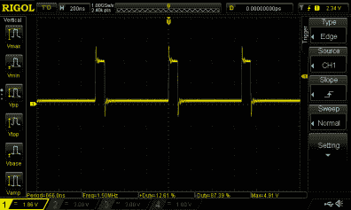

# 格子冰棍上的 PWM

> 原文：<https://hackaday.com/2015/12/17/pwm-on-the-lattice-icestick/>

[上次](http://wp.me/pk3lN-LgZ)，我给大家展示了一个简单的 PWM 模块和一个开源的 UART 内核。这次，我将把这些器件放在一起，创建一个 PC PWM 输出外设。

## 综合

有了工作代码(至少在仿真中是工作的)，您可以将 PWM 模块添加到 UART 驱动器中，以获得基于 PC 的 PWM 发生器的第一个版本。为了简单起见，现在只需发送一个 8 位十六进制数来设置 PWM 输出占空比。例如，如果你发送一个大写的 A (65 十进制或 41 十六进制)，输出将是 65/256 或大约 25%。正如我上次提到的，使用能够发送十六进制代码的终端程序更容易，比如 [Cutecom](http://cutecom.sourceforge.net/) 。

我会尽量保持最初的集成简单，让它工作，然后添加特性。首先，您需要实例化 PWM 内核:

```

reg [7:0] pwmduty;
wire pwmout;
assign LED0 = pwmout;
ppwmblock pwm(iCE_CLK, reset, pwmduty, 8'b0, pwmout);

```

然后将接收到的字符连接到 PWM 占空比寄存器:

```

if (received) begin
    tx_byte &lt;= rx_byte;
    pwmduty &lt;= rxbyte;
end

```

由于 PCF 文件的原因，`LED0`输出连接到电路板的 LED 0，这并不奇怪。如果你想试验代码，尝试改变驱动一个不同的 LED 或甚至多个 LED 一次。您还可以尝试使用等面积 PWM 来代替比例 PWM，尤其是在您可以在示波器上观察输出的情况下。如果您确实想连接一个示波器，您可能希望将输出(或复制它)更改为一个边缘引脚或 PMOD 插座。

如果您尝试添加或复制输出，有两件事情需要注意。首先，包含的 PCF 文件中有一些未使用的管脚用#字符注释掉了。该工具的最新版本有一种方法可以将引脚分配标记为可选，但如果没有它，如果您不使用 PCF 文件中命名的引脚，构建过程将会失败。第二件事是，您必须将您使用的任何端口添加到顶层模块中(参见 led 是如何完成的)。只要顶级模块中的名称与 PCF 文件中的名称匹配，名称就不重要。

[](https://hackaday.com/wp-content/uploads/2015/12/dca0.png) 我对 UART 演示做了另外一个改动。我修改了 Makefile 以理解输出不仅仅依赖于`uart_demo.v`文件。你可以在 v1 文件夹中找到 GitHub 上的整个项目[。](https://github.com/wd5gnr/icestickPWM)

右侧的示波器轨迹显示了占空比为 0xA0 的 FPGA 输出。你可能会注意到，在一系列脉冲的中间有一个奇数大小的脉冲。那是因为 0xA0(十进制的 160)不是 256 的整除。因此计数器值(和输出状态)将如图所示。


请注意，启动后，该序列每 8 个时钟周期重复一次。有一个短高脉冲和两个双高脉冲。由于我要求 160/256 或 62.5%的占空比，算法每 8 个时钟周期产生 5 个高电平脉冲，5/8 实际上是 0.625。短脉冲意味着如果你想要一个清晰的显示，你必须创造性的触发示波器。我是守旧派，所以我设置了触发延迟，但你可以使用脉冲宽度触发同步较短的脉冲。

## 扩展设计

我想扩展设计，使其更加有用，并展示 Verilog 的更多功能。具体来说，我想做三件事来扩展系统:
1)添加更多具有不同分辨率的 PWM 模块
2)将 PWM 模块的输出路由到不同的地方
3)实现一个鲁棒的协议来控制 PWM 模块

添加新块一点也不困难。Verilog 模块`pwmblock`(及其相关的包装器)就像一个组件。主文件使用如下包装器之一创建模块的实例:

```

ppwmblock pwm(iCE_CLK, reset, pwmduty, 8'b0, pwmout);

```

添加更多是很容易的。当然，您需要找到空间来放置 PWM 占空比、计数器和互连。您可以创建新的寄存器和线路，但是使用数组会更智能、更具可扩展性。

声明数组的语法很简单:

```

reg [7:0] pwmduty[3:0];

```

这定义了一个 8 位量的四个元素(0-3)。唯一棘手的是，使用数组看起来像是使用单个寄存器中的位:

```

dc &lt;= pwmduty[2];

```

编译器足够聪明，知道既然`pwmduty`是一个数组，括号表示数组下标，而不是位片。一旦有了数组，就很容易安排每个组件拥有自己的计数器。例如:

```

ppwmblock pwm3(iCE_CLK, reset, pwmduty[3], 8'b0, pwmout[3]);

```

当然，将它们都路由到一个 LED 是没有意义的。PCF 文件定义了芯片上的引脚编号和 Verilog 文件中的名称之间的对应关系。例如，以下是 PCF 文件的一部分:

```

# Red LEDs
set_io LED0 99
set_io LED1 98
set_io LED2 97
set_io LED3 96
# Green LED
set_io LED4 95
# IrDA port
#set_io RXD 106
#set_io TXD 105
#set_io SD 107
# Pmod connector
#set_io PIO1_02 78 # Pin 1
#set_io PIO1_03 79 # Pin 2
#set_io PIO1_04 80 # Pin 3
#set_io PIO1_05 81 # Pin 4
#set_io PIO1_06 87 # Pin 7
#set_io PIO1_07 88 # Pin 8
#set_io PIO1_08 90 # Pin 9
#set_io PIO1_09 91 # Pin 10

```

例如，如果您想要连接以使用示波器监控输出，则可以使用 PCF 文件中的任何信号名称将输出发送到其他 led 或 edge 连接器。请注意，在 PCF 文件中，只有正在使用的 I/O 引脚未被注释。

## 新协议和 Verilog 参数

下一个问题是如何加载新的占空比寄存器。每当有串行数据进入这样的设备时，您都需要考虑如果在多字节流中间开始监听会发生什么。例如，一个坏的协议将第一个字节作为通道号(0-3)，第二个字节作为占空比(0-255)。您可能会遇到这样的情况:FPGA 在两个命令字节之间复位，然后与 PC 不同步。

有几种方法可以解决这个问题。例如，假设一个字节的第 7 位总是被设置为指定它是一个通道。如果位 7 清零，则表示占空比。当然，这意味着占空比只能是 0-127。

对于驱动 led，如果没有示波器，你很难区分 50 和 51 的占空比。因此，另一种可能性是确保所有占空比值都是偶数，并将 PC 发送给您的占空比乘以 2(左移很容易做到)。您可以在下图中看到该协议方案的示例。



或者，您可以设置 7 位 PWM 模块，这对资源稍微友好一些。改变位长很容易，因为我在 PWM 模块定义中使用了参数。你可能已经在文件中注意到了。下面是`pwmblock`的部分模块定义:

```

module pwmblock #(parameter CNT_WIDTH=8, DIV_WIDTH=8) (input clk, input reset, 
   input [CNT_WIDTH-1:0] increment, ...

```

这告诉 Verilog 编译器，默认情况下，`CNT_WIDTH`是 8，但是模块的特定实例可以使用其他值。在模块定义的其余部分(像 increment 参数的创建)，代码可以引用`CNT_WIDTH`而不是一个常数。默认情况下，increment 使用[7:0]表示总共 8 位。

如果您查看测试平台(在 EDAPlayground 上的[，您会看到一个不使用默认设置的测试 PWM 模块:](http://www.edaplayground.com/x/E8s)

```

epwmblock #(.CNT_WIDTH(10)) dut1(clk, reset, 10'h3ff, 10'h10, 8'h0, ep);

```

在这种情况下，计数器为 10 位宽，增量将使用[9:0]。代码中所有需要 8 位计数器的地方现在都将使用 10 位计数器。

还有其他方法可以完成同样的任务。例如，可以将通道命令的位 6 用作备用位，放在后续占空比字节的开头或结尾(即 0x80、0x23 会将占空比设置为 0x23，而 0xC0、0x23 会将其设置为 0xA3)。虽然这有点难，也没什么好处，但是如果你想练习的话，值得一试。

无论您如何处理命令协议，您都需要更改处理接收到的 UART 字符的代码。我是这样做的:

```

if ( !rx_byte[7] )  pwmduty[pwmchan] &lt;= { rx_byte[6:0], 1'b0 };
else pwmchan &lt;= rx_byte[6:0];

```

如您所见，`pwmchan`寄存器保存 PWM 通道号，并存储通道命令的最后一个值(去除额外的位之后)。然后，任何 PWM 占空比字节(位 7 为 0 的字节)都会进入相应的占空比寄存器，利用电流通道选择阵列的正确元素。我还做了一个移位，通过添加一个零位来乘以 2:

```

{ rx_byte[6:0], 1'b0 };

```

该协议在 FPGA 中不需要太多处理。它是健壮和高效的(当你想要改变频道时，你只需要发送一个频道命令)。

你可以在 v2 文件夹中找到 GitHub 上的最终项目[。虽然 Makefile 处理构建过程，但是如果您想了解更多关于开源工具如何工作的信息，您可以查看我上次讨论它们的视频，如下所示。](https://github.com/wd5gnr/icestickPWM)

## 结果

我将第一个 PWM 通道连接到冰棍边缘的 JBOY3 乐队，这样我就可以连接一个示波器探头来观察真实的结果。下面你会看到 50% (40 十六进制)和 12.5% (10 十六进制)的输出。记住，百分比乘以 2，所以两个作用域轨迹代表 128/256 和 32/256。

 [](https://hackaday.com/2015/12/17/pwm-on-the-lattice-icestick/fifty/)  [](https://hackaday.com/2015/12/17/pwm-on-the-lattice-icestick/dc125/) 

文本很小，但示波器在屏幕底部附近显示正负占空比测量值。输出为比例 PWM，请注意频率变化(50%时约为 6 MHz，12.5%时约为 1.5 MHz)。这些数字是有意义的，因为 FPGA 的基本时钟是 12 MHz。这些百分比的计算结果没有误差(即占空比计数会除以 256)。在不存在的情况下，小数部分会导致方波反弹(您会看到示波器上有持续的重影，或者只是触发有问题)。这很正常，因为小数部分分布在多个周期中。

显然，这样做的真正好处是从一个软件通过串行端口发送数据来控制节日灯、电机、风扇或其他一些有用的 PWM 功能。如果您更改 UART 代码以在某些外部引脚上工作，您可以从 Arduino 或 Raspberry Pi 等微控制器控制 PWM。

## 没有 CPU？

可以用 CPU 做 PWM 吗？当然可以。尤其是因为许多 CPU 具有专用逻辑来产生一定数量的 PWM 通道。当然，如果你需要比你的 CPU 提供的更多的 PWM，你将不得不用软件来完成。这是有可能的，但是效率远没有那么高，尤其是对于很多频道来说。

借助 FPGA，您可以添加许多 PWM 通道，而性能丝毫不变。如果对您的应用有意义的话，您甚至可以为每个通道提供自己的 UART(并且您可以将其全部压缩到您选择的芯片中)。

一旦 FPGA 上有了 UART，就有了很多选择。数字输入和输出会很简单。PWM 可用于驱动灯或电机。你甚至可以用它来驱动伺服系统。极限是你的想象力，你对 Verilog 的技能，以及你对现成内核的访问。

 [https://www.youtube.com/embed/1CNVsxoLI60?version=3&rel=1&showsearch=0&showinfo=1&iv_load_policy=1&fs=1&hl=en-US&autohide=2&wmode=transparent](https://www.youtube.com/embed/1CNVsxoLI60?version=3&rel=1&showsearch=0&showinfo=1&iv_load_policy=1&fs=1&hl=en-US&autohide=2&wmode=transparent)

