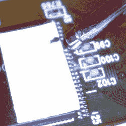

# 用缝纫针缝纫

> 原文：<https://hackaday.com/2016/08/08/pwning-with-sewing-needles/>

如果你没有 root，你就没有设备，尽管成百上千的物联网制造商会告诉你。要真正拥有一台设备，你需要能够在你的新玩意儿中访问和写入嵌入式 Linux 系统，不幸的是，这是一个相对不常见的功能。在今年的 DEF CON 上，[Brad Dixon]公布了一项技术，该技术仅使用缝纫针、万用表探针或回形针来 pwns 设备。不，它不能在每一个设备上工作，而且这项技术将工作的设备设计得很差。但是，这并不意味着它不起作用，也不意味着 Pin2Pwn 技术没有用。

该攻击依赖于嵌入式 Linux 设备的启动方式。加载 Linux 和其他外围设备所需的所有软件通常都存储在主板上某个地方的一点闪存中。通过使用引脚、探针或回形针短接该内存芯片上的两个数据引脚或两个闩锁引脚，引导加载程序将会失败，当这种情况发生时，它可能会退回到 uboot 提示符。这将 pwns 设备。

使用 pin 的 Pwn 有一些限制。如果设备有 JTAG，那也没关系，你已经可以拥有它了。然而，如果一个设备有一个锁定的 JTAG，没有反应的串行端口，甚至他们自己的安全引导解决方案，这种技术可能会工作。

Two data pins on a TSSOP Flash shorted by a multimeter probe

此漏洞利用了引导加载程序的属性。这段代码首先查看一块闪存或其他独立于 CPU 的内存，然后加载那里的任何内容。[Brad]发现一些设备(主要是 LTE 路由器)会尝试从闪存加载 Linux，失败，再次尝试加载 Linux，失败，最后进入 uboot 提示符。

与任何成功的利用一样，必须设计同样有效的缓解策略。有两种方法可以解决这个问题，在这种情况下，软件方面比硬件方面更容易摆脱这种攻击。

由于这种攻击依赖于软件在尝试引导失败后退回到 uboot，如果找不到合适的固件，最简单和最有效的缓解技术就是重启设备。拥有一个静默的串行控制台是很好的，但是如果攻击依靠回退到 uboot，简单地不这样做将有效地防止这种攻击。

硬件方面比写好的固件简单一点。不使用 TSSOP 和 SOIC 封装来存储器件固件，而是使用 BGA。隐藏电路板内层的引脚和走线。虽然这不是防止攻击的万无一失的方法——总会有人拿着热风枪、电磁线，手比你更稳——但如果你看不到数据线，就很难用缝纫针来破坏数据线。