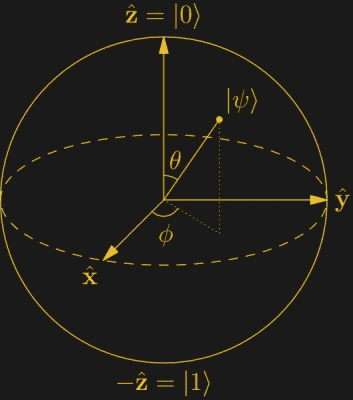
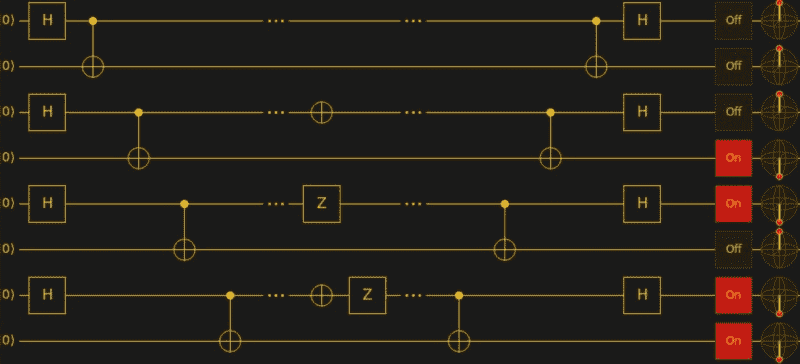

# 浏览器中的量子通信

> 原文：<https://hackaday.com/2018/01/31/quantum-communications-in-your-browser/>

量子计算(QC)是一个很大的话题，上一次[我只能带你走过几个逻辑门的构造，但你必须从某个地方开始。如果你还没有读过这一部分，你可能应该读一读，因为你需要理解我正在使用的模拟器和一些基本概念。](https://hackaday.com/2018/01/24/quantum-weirdness-in-your-browser/)

我喜欢马上付诸实践，但对于这个话题，无法回避一些理论。但是不要绝望。在这一期的最后，我们会有一个小的科幻故事，你可以尝试一下，我们设法将两位信息打包到一个物理量子位中。上次我提到量子位有 1 和 0 状态，我暗示它们实际上是|1 >和|0 >状态。为什么要为两个正常的二进制状态创造新的名字？事实证明这个故事没那么简单。

## 向量是什么，维克多？

在狄拉克符号中，|1 >是一个向量。|hackaday >和|123 >也是如此。你可以用这些进入很多数学领域，但我会尽量避免大部分。这也被称为偈记法(单词括号的最后一部分)，所以你会听到人们说“一偈”或“一偈”无论哪种方式，向量可以代表一个或多个量子位，并且有几种方式来表示它们。

Image via [Wikipedia](https://en.wikipedia.org/wiki/Bloch_sphere)

表示量子位状态的一种方式是用布洛赫球中的向量。布洛赫球的半径是一个单位，其中心位于 XYZ=(0，0，0)。很简单，对吧？通过调出 XYZ 点，我可以知道向量的终点在哪里，它从(0，0，0)开始，所以我有长度和方向。有一点很奇怪:按照惯例，|0 >是(0，0，1)，而|1 >是(0，0，-1)。历史上，这代表电子有自旋向上或自旋向下。

一个向量越接近|0 >位置，我们就越有可能将该向量测量为|0 >。这意味着赤道上(或下)的任何一点都同样可能是|0 >或|1 >。这也意味着球体的任何内部部分都代表叠加态。状态|0 >和|1 >的长度为 1，因为这些状态是确定的:向量从原点到球体的边缘，或者向上(0)或者向下(1)。

## 叠加

那么一个量子位同时是|0 >和|1 >意味着什么呢？记住，根据量子力学，在我们测量系统之前，叠加态实际上是部分|0 >和部分|1 >。给定测量概率为|0 >的状态表示为球体的水平切片。在赤道切片(Z=0)上，所有点都有可能解析为|1 >或|0 >。在靠近北极但不在北极上的切片上，所有点可能有 10%是|1 >，90%可能是|0 >。(记住，|0 >在顶部—向上旋转。)

然而，与普通计算机不同，你不能只将 Z 设置为某个值。你必须得到你得到的向量，并对它进行一定的运算。这些必须满足一定的数学测试，也必须是底层硬件可以执行的。

有了布洛赫球，你现在可以看到反相器——X 门——是如何工作的。它实际上将向量绕 X 轴旋转了 180 度。所以|0 >变成了|1 >,反之亦然。但是其他的向量会有不同的表现，我们会看到。

哈达玛门(里面有 H 的盒子)可以让你将一个|0 >或|1 >移动到一个有 50-50%几率叠加的状态。H 门将向量围绕 XZ 轴旋转 180 度。也就是同时绕 X 和 Z 旋转 90 度。

在模拟器中尝试[这个电路](http://algassert.com/quirk#circuit={"cols":[["H","H"],[1,"H"]]})。最高的量子位显示有 50%的几率成为|1 >。它还显示了一个布洛赫球，其中 XYZ=(1，0，0)。指向正上方的向量(|0 >)先绕 X(指向 Y)旋转 90 度，再绕 Z(指向 X)旋转 90 度。

注意底部的量子位。两次 H 旋转给了我同样的状态。因为它们是 180 度旋转，这是有道理的。如果你转 180 度，然后再做一次，你会回到你开始的地方。或者，更准确地说，再次同时围绕 Z 和 X 旋转 90 度。

不过，有一个问题。[在两个量子位的最前面添加一个反相器](http://algassert.com/quirk#circuit={"cols":[["X","X"],["H","H"],[1,"H"]]})。现在我们在底部得到一个|1 >。不奇怪，因为我们刚从不同的出发位置转了两次 180 度。但是，最高量子位还是 50%。从概念上讲，一个量子位是 50% |1 >和一个是 50% |0 >没有区别——这就像问一个玻璃杯是半空还是半满。但是在 QC 中，这是有区别的，因为虽然 Z 在两种情况下都是 0，但是在 H 门处理 a |0 >的情况下 X=1，而在|1 >的情况下 X=-1。由于|0 >和|1 >之间的距离相同，量子位是不同的，H 门可以分辨出这种差异。如果你愿意，在两个 H 门之间放置一个[布洛赫显示器，你就可以验证这个状态是否与顶部量子位相同。](http://algassert.com/quirk#circuit={"cols":[["X","X"],["H","H"],[1,"Bloch"],[1,"H"]]})

你可以认为一个量子位以|0 >开始，它的相位不同于以|1 >开始的，就像两个正弦波可以有相同的频率和振幅，但相位不同。记得我说过布洛赫球面的每一部分都是等概率曲面吗？该切片边缘的位置就是量子位的相位。

尝试在电路中增加一个 [Y1/4 门。然后改成](http://algassert.com/quirk#circuit={"cols":[["X","X"],["H","H"],["Y^¼","Bloch"],[1,"H"]]}) [Y-1/4](http://algassert.com/quirk#circuit={"cols":[["X","X"],["H","H"],["Y^-¼","Bloch"],[1,"H"]]}) 。随着向量越来越接近|0 >或者越来越接近|1 >，概率发生变化。诀窍是利用所有这些旋转来操纵多个量子位来表示不同的状态，就像我们用二进制数来表示状态一样。

## 超密集隐形传态

我答应给你一点科幻小说，所以现在开始。在月球远端的一个陨石坑底部，有一个未知外星人留在那里的量子通信入口。传送门一次只能发送或接收四个量子位。这对我们来说很不方便，因为我们喜欢用八位。在与外星人痛苦地交流了一段时间后，我们提出了一个 QC 方案，让双方使用四个量子位发送八位信息。这将真正减少我们发送《杰瑞·斯普林格秀》外星人重播的时间。

将两个比特放入一个比特似乎违反了某种宇宙法则，但是一个量子比特不仅仅是一个比特。我们将使用纠缠和叠加来实现它。大致的计划是这样的:首先我们准备两个纠缠的量子比特。我们不知道其中任何一个的状态，但是我们知道它们是相同的(并且它们以|0 >开始)。我们抓住一个，把另一个送进传送门。

现在外星人想要编码四个项目中的一个:00，01，10 或 11。如果他们想发送 00，他们只需向我们发回相同的量子位。如果他们想发送 01，他们反转量子位，然后发送回来。如果他们想要发送 10，他们使用 Z 门旋转量子位(围绕 Z 旋转 180 度翻转相位；布洛赫球面切片周围的点)。为了发送 11，它们都反转并进行相位翻转。

当我们拿回量子位的时候，我们会做一个简单的操作。我们将以原始位为目标，以接收位为控制，进行 CNOT，然后对接收位进行 H 门操作。

想想[那个 00 后的案子](http://algassert.com/quirk#circuit={"cols":[["H"],["•","X"],["…"],["…"],["•","X"],["H"]]})。右边的 H 会把事情恢复到原来的样子，这样就可以解决那个 0 了。我们不知道中间的状态，但我们知道它是 0，底部的位将保持 0。如果中间状态是 1，底部量子位将翻转两次，所以它仍然是 0。如果中间状态是 0，那么 CNOT 门什么也不做，底部量子位仍然是 0。简单。顺便说一下，省略号(…)不做任何事情。他们只是给科幻小说增添了一种感觉，即我们正在传送量子比特穿越银河系。

01 案件有点棘手。反转不会改变量子位的相位，所以一旦我们在目的地运行 H 门，我们仍然会沿着顶部量子位得到 0。然而，不管最高量子位的值是多少，两个反相器不可能同时开启。底部量子位将在左侧或右侧反转。这就是底部量子位的|1 >的来源。

[10 箱体](http://algassert.com/quirk#circuit={"cols":[["H"],["•","X"],["…"],["Z"],["…"],["•","X"],["H"]]})利用 Z 旋转改变相位。这翻转了右侧 H 门的输出。然而，改变相位并不会改变值，因此底部量子位的处理方式就像 00 的情况一样——要么永远不反转，要么反转两次。不管怎样，我们都得到了 0。

现在，看 11 处的[。这里外星人改变了相位和数值。这就像 01 和 10 的组合。](http://algassert.com/quirk#circuit={"cols":[["H"],["•","X"],["…"],["X"],["Z"],["…"],["•","X"],["H"]]})

如果你想看到外星人做一个完整的字节，我[让他们发送 00011011](http://algassert.com/quirk#circuit={"cols":[["H",1,"H",1,"H",1,"H"],["•","X"],[1,1,"•","X"],[1,1,1,1,"•","X"],[1,1,1,1,1,1,"•","X"],["…",1,"…",1,"…",1,"…"],[1,1,"X",1,"Z",1,"X"],[1,1,1,1,1,1,"Z"],["…",1,"…",1,"…",1,"…"],[1,1,1,1,1,1,"•","X"],[1,1,1,1,"•","X"],[1,1,"•","X"],["•","X"],["H",1,"H",1,"H",1,"H"]]}) 这样你就可以一次看到全部四个。如果这些都没有意义，试着在不同的地方添加一些显示，比如 Bloch。在真实的量子系统中，这将破坏我们的算法，但在模拟器中，我们被允许偷看，它真的可以帮助你理解。

就几个流行语。算法的左侧(在第一组椭圆之前)正在准备“钟形状态”右手边被称为“投影测量”

顺便说一下，如果你有一台控制反相器和 Z 门的机器，你可以[自动化编码过程](http://algassert.com/quirk#circuit={"cols":[[1,1,"Counting2"],["H"],["•","X"],["…"],["X",1,1,"•"],["Z",1,"•"],["…"],["•","X"],["H"]]})。哦，看，一个实际上一直在运行的程序！

## 这是什么意思？

还记得我提到过有很多关于 QC 的过度简化吗？很容易得到一份新闻稿，说 QC 可以让计算机在一个空间里装两个比特。但是，如果你仔细想想，你发送的是两个比特，只是方向不同。这实际上是量子隐形传态的逆过程，每次有关于此的新闻发布，你都会听到足够多的关于“科学家更接近传送器”的说法。

实用吗？嗯，我们还没找到外星人，除非你把在拉斯维加斯储存东西的算进去。我们没有伽玛象限的量子位入口。我们也没有持续足够长时间的量子位来进行任何形式的旅行。然而，它确实展示了一些可能有用的东西，需要叠加和纠缠。它展示了一个量子位如何能够存储多种状态，而一个普通的位只能存储两种状态。

一个有趣的旁注:虽然 QC 背后的理论可以追溯到 20 世纪初，但这种超密集算法直到 1992 年才发表。如果你想扬名立万，这个领域大概还有秘密等着你去发现。

## 国际商用机器公司

也许你认为我已经忘记了 IBM 的量子体验。如果你有一个账户，你可以做同样的实验。积木看起来差不多，但是数量少了。此外，硬件拓扑迫使您四处移动东西。例如，看下面，你会看到我不得不翻转 CNOT 门的位置，因为量子位不是双向连接的。[T3](https://hackaday.com/wp-content/uploads/2018/01/ibmq.png)T5

最困难的部分是你根本没有相同数量的门。用户指南解释了如何使用基本门创建[更复杂的门，但这样做通常相当痛苦。如果你真的想使用 IBM 的网站，这里有一个提示:如果你创建自己的拓扑结构，并点击工具面板上的高级，你会得到更多的选项来制作子程序和使用像 CCNOT 这样的宏。然而，这些不能在真实的硬件上运行，如果你只是在模拟，你最好还是坚持使用 Quirk。](https://quantumexperience.ng.bluemix.net/qx/tutorial?sectionId=full-user-guide&page=introduction)

## 结局？

这甚至没有触及 QC 的表面，但它应该让你开始。下一次，我将向你们展示经常被误解的 Grover 算法。如果您还在为如何创建实用的程序而纠结，那应该有助于理清思路。

同时，如果你想先睹为快，你可以看看 [Quirk 的 Grover 的](http://algassert.com/quirk#circuit={"cols":[["X","X","X","X","X"],["H","H","H","H","H"],["Chance5"],["~vn6c"],["⊖","⊖","⊖","⊖","X"],["Chance5"],["~vn6c"],["⊖","⊖","⊖","⊖","X"],["Chance5"],["~vn6c"],["⊖","⊖","⊖","⊖","X"],["Chance5"],["~vn6c"],["⊖","⊖","⊖","⊖","X"],["Chance5"]],"gates":[{"id":"~vn6c","name":"Oracle","circuit":{"cols":[["Z","•","◦","•","•"]]}}]})的例子，虽然我的看起来会有点不同。