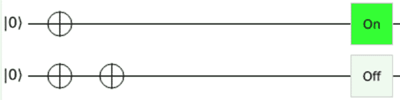
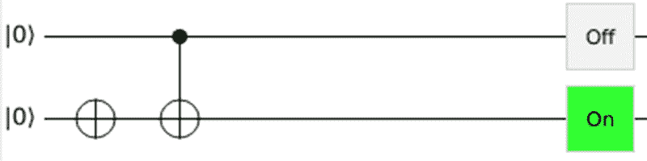
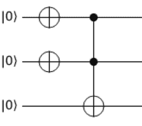
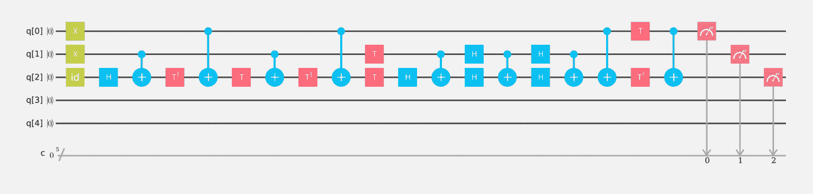

# 你的浏览器中的量子怪异

> 原文：<https://hackaday.com/2018/01/24/quantum-weirdness-in-your-browser/>

我会非常诚实。当我开始写这篇文章时，我打算谈谈 IBM 的 Q Experience(Q Experience )( T1 ),在这个网站上，你可以在一些旧的 IBM 量子计算硬件上运行真正的代码。我会谈到这一点，我保证，但那要等到下次了。事实证明，量子计算是令人困惑的，更糟糕的是，有很多过于简化的东西在流传，这使得理解量子计算变得更加困难。因为 IBM 系统与真实的硬件匹配，所以它比模拟器有更多的限制——想想用 on debugging 对微控制器编程与使用软件模拟器相比。你可以用模拟器放大任何层次的细节，但用裸微你可以切换一条线，使用范围，并希望事情不会走得太远。

因此，在我们开始真正的量子硬件之前，我将向你们展示一个由[Craig Gidney]编写的模拟器。他写了这本书，并很快在谷歌找到了一份工作，谷歌接手了这个项目。[有点像](http://algassert.com/post/1711)。即使你不喜欢在浏览器中工作，[克雷格的]模拟器也足够简单，你不需要一个帐户，一个书签就会保存你的工作。

这不是唯一可用的模拟器，但正如[克雷格]不谦虚地(但正确地)指出的，[他的模拟器比 IBM 的](http://algassert.com/2016/05/22/quirk.html)好得多。从模拟器开始可以避免被硬件限制绊倒。例如，IBM 的设备没有完全连接，就像 CPU 一样，只有一些寄存器可以访问其他寄存器。此外，真实的装置必须处理杂讯，而且量子态不会持续太久。如果你的算法太慢，你的程序就会崩溃，使你的结果无效。这些都不是模拟器上的问题。你可以找到其他模拟器的[列表，但我主要关注 Quirk。](https://www.quantiki.org/wiki/list-qc-simulators)

## 什么是量子计算

正如我提到的，有很多关于量子计算(QC)的错误信息在流传。我认为其中一部分是围绕着计算这个词。如果你年龄够大，还记得模拟计算机，QC 就更像那样了。你建立“回路”来创造结果。还有很多困难的数学——主要是线性代数——我会尽量避免。然而，如果你能钻研数学，那么你花时间这样做是值得的。然而，就像你可以设计一个谐振电路而不需要求解电感的微分方程一样，我认为你可以通过使用结果来做 QC 而不需要一些更大的数学运算。我们会看到这在实践中有多好。

QC 用的不是比特，而是量子比特。毫不奇怪，一个量子位可以取 0 或 1 的状态。如果仅此而已，那就没有什么理由继续对话了。然而，量子位是量子的，所以它们有两个独特的性质，QC 可以利用。首先，一个量子位可以同时是 0 和 1 的组合。众所周知，量子力学中对不确定性有多种解释，但你可以把它想象成量子位为 0 或 1 的概率。这些概率的总和总是 1，这个想法也适用于量子位组。所以四个量子比特有一些概率它们的状态是 0010。如果你把所有状态的概率加起来，你会得到一个。当一个量子位处于多种状态的组合中，每种状态都有一个给定的概率，这就叫做叠加态。

你可能知道，在量子力学中，状态似乎是根据观察而变化的。量子位也一样。虽然它们可以处于叠加状态，但是当你测量这个状态的时候，它要么变成 0，要么变成 1。如果你了解薛定谔的猫，也是同样的原理。在思想实验中，在你偷看之前，猫是半死不活的，就像我们的量子位可以是 0 和 1 一样。

另一个关键概念是纠缠。这个想法是，你可以拿一个量子位，让它的状态依赖于另一个量子位的状态，即使我们不知道它们中任何一个的状态。举个简单的例子，我们可以创造一个量子位，我们不知道它的状态，但是我们知道它与其他一些我们可能也不知道的量子位相反。

迷茫？很好。如果这对你有意义，你可能已经走在了这篇文章的前面。甚至[尼尔斯·玻尔]曾经说过，“任何不对量子理论感到震惊的人都没有理解它。”

## 量子计算不是什么

量子计算不会很快运行文字处理应用程序，如果可能的话。就像我说的，这更像是模拟计算，你提出一个问题，然后得到答案。部分原因可能是我们正处于早期阶段。一部分是因为它是如何工作的。

说到如何工作，QC 通常是概率性的。所以当你搜索某个东西的时候，比如说，你会得到某个概率的答案。同样，这就像一台模拟计算机。也许这个概率是 0.99999，但不会是 1.0000。

已知的实用量子算法不多，已知的有时候也很难付诸实践。例如，如果你阅读了对 QC 的挥手解释，你会听说 Grover 的算法可以让你使用更少的查询来搜索非结构化的数据库。稍微思考一下就可能让你相信这是不可能的。如果您在动物数据库中搜索“dog ”,并且除了索引之外没有其他方法可以访问它，那么您怎么能神秘地知道要跳过哪些索引项呢？你不能，格罗弗的算法也不能。

我们会在另一篇文章中更多地讨论 Grover 的，但算法实际上做的是将其状态与另一个你事先不知道的状态进行匹配。例如，假设您有一个 C 程序，它发出一个库调用，内容如下:

```
int oracle(int x) { if (x==9) return 1; else return 0; }
```

然而，因为它是在一个库中，我们不知道 x 必须是什么才能得到 1 返回值。如果你写了一个程序来找出答案，你可能要打很多次电话。即使您将 x 限制在 1 到 16 之间，您也可能需要调用 16 次。你可能需要打一次电话。格罗弗的算法会调用它四次，并有一个很好的答案猜测。这仍然不是一个完美的类比，因为 QC 中的 oracle 函数提供了关于哪个答案是正确的信息，所以它的实用性不是您经常听到的“非结构化数据库”。一个更好的类比可能是这样的神谕:

```
int oracle(int x) { if (x==9) return 0; if (x<9) return -1; else return 1; }
```

现在，即使是经典的计算机也能做出更聪明的猜测。

## 足够的理论…现在

我们稍后会有更多的理论，但你的眼睛现在应该是好的，呆滞的。我曾想过做一个关于如何使用 Quirk 的视频，但[Craig]做得很好，所以先看看吧。当[Craig]将他的模拟器与 IBM 的模拟器进行比较时，他谈到了他使用的 UI 设计原则，当你使用 Quirk 时就会显示出来。

 [https://www.youtube.com/embed/aloFwlBUwsQ?version=3&rel=1&showsearch=0&showinfo=1&iv_load_policy=1&fs=1&hl=en-US&autohide=2&start=311&wmode=transparent](https://www.youtube.com/embed/aloFwlBUwsQ?version=3&rel=1&showsearch=0&showinfo=1&iv_load_policy=1&fs=1&hl=en-US&autohide=2&start=311&wmode=transparent)


每条水平线代表一个量子位，它们从状态 0 开始。时间沿着量子位从左往右走，不会倒退，所以你这样解读电路。顶部和底部灰色区域中的所有方框都是影响量子位的门或组件。在量子位的右边，有几种方法可以让系统的最终状态可视化。绿色方框显示它们是 1 还是 0(或者至少是概率)。其他两个展示需要更多的理论，我们下次会讲到。

## 直接逻辑

现在，我只想关注 0 和 1(技术上来说，|0 >和|1 >)状态。这就像常规逻辑一样，但是你不能使用你习惯的大多数熟悉的门。你可以使用的一个方法是“非”门:里面有一个加号的圆圈。有时这也显示为 X，被称为 X 门。[试试看](http://algassert.com/quirk#circuit={"cols":[["X","X"],[1,"X"]]}):

[](https://hackaday.com/wp-content/uploads/2018/01/not1.png)

如你所料，将 0 反相一次会产生 1，反相两次会产生 0。不奇怪。还有一个受控的非(CNOT)门，实际上是一个异或门。也就是说，如果一个输入为真，另一个输入反相。要制造一个，你只需在与反相器相同的列中的任何量子位上放一个点。尝试将[实心点(来自探针部分)放在第二个逆变器](http://algassert.com/quirk#circuit={"cols":[[1,"X"],["•","X"]]})上。注意输出，然后删除(中击)左上方的逆变器。你会看到状态的变化，如果顶部量子位处于 1 状态，右下角的反相器只翻转该位。

[](https://hackaday.com/wp-content/uploads/2018/01/cnot.png)

还记得我说过有很多过于简化的东西让事情变得难以理解吗？这是其中之一。这是一个具有两个输入和一个输出的门的想法只有在输入为 0 或 1 的情况下才是正确的。但是一旦我们开始处理叠加态的量子位，这就不再是真的了。“输入”点完全有能力修改第一个量子位——在正确的情况下，你可以翻转反相器和点，这没有关系。QC 很奇怪。然而，对于“计算态”(|0 >和|1 >)来说，门的类比是合理的。别忘了这是错的。

关于模拟器的一个注意事项。如果在输出中看到 NaN(非数字的缩写)，请尝试使用不同的浏览器。我见过一些版本的浏览器在 Javascript 上有问题，但不是全部。这不是量子怪异，一个 NaN 是一个正常的软件错误。

## Toffoli Gate

如果你习惯了普通的逻辑门，你知道你不需要所有的逻辑门。例如，一个与非门就足以构成你想要的任何其他种类的逻辑门。NOT 和 CNOT 盖茨让我们走了一段路。另一种易于在 QC 中实现的门是 Toffoli 门，有时也称为 CCNOT 门。你可以把它想象成一个有三个输入端(比如 A、B 和 C)的门，它有三个输出端(X、Y、Z)。其中两个输出与输入相同(即 X=A，Y=B)。然而，Z 输出是 A 和 B 的 XOR C。这有点粗糙，但你可以用它和非/CNOT 门制作任何你想要的门。

[](https://hackaday.com/wp-content/uploads/2018/01/tg.png) 要在 Quirk 中创建一个托夫里门，你只需将[两个点放在反相器](http://algassert.com/quirk#circuit={"cols":[["X","X"],["•","•","X"]]})上，如右图所示。左边的两个反相器用于将输入设置为 1 状态。试试看，你会看到输出是 1，除非你删除任何一个反相器。把一个反相器放在底部量子位(在另外两个反相器下面)会把答案反相(那就是 XOR C 部分)。

显然，这样配置，我们有一个双输入与门。反相输入给你一个或门。设定底部量子位会给你“与非”或“或非”。将 B 设置为 1 将得到 XOR C。就像 CNOT 一样，这个门在处理量子态时会影响它的输入，但我们还没有看到这些，因此，现在可以将顶部的两个量子位以及底部的左下方视为输入，将底部反相器的右侧视为输出。只不过一般情况下不是这样。

顺便说一下，当我们使用 IBM 模拟器(更像是硬件)时，您会看到没有办法直接构建它。你必须使用许多 CNOT 门来建造一个(见下文)。这是你想从怪癖开始的一个原因。

[](https://hackaday.com/wp-content/uploads/2018/01/ibmtof.png)

## 即时满足

我认为这对于这篇文章来说已经足够了，尽管我们还没有谈到量子的怪异之处。然而，如果你想向前跳，请从 Quirk 中选择菜单，然后单击[量子傅立叶变换](http://algassert.com/quirk#circuit={"cols":[["Counting8"],["Chance8"],["…","…","…","…","…","…","…","…"],["Swap",1,1,1,1,1,1,"Swap"],[1,"Swap",1,1,1,1,"Swap"],[1,1,"Swap",1,1,"Swap"],[1,1,1,"Swap","Swap"],["H"],["Z^½","•"],[1,"H"],["Z^¼","Z^½","•"],[1,1,"H"],["Z^⅛","Z^¼","Z^½","•"],[1,1,1,"H"],["Z^⅟₁₆","Z^⅛","Z^¼","Z^½","•"],[1,1,1,1,"H"],["Z^⅟₃₂","Z^⅟₁₆","Z^⅛","Z^¼","Z^½","•"],[1,1,1,1,1,"H"],["Z^⅟₆₄","Z^⅟₃₂","Z^⅟₁₆","Z^⅛","Z^¼","Z^½","•"],[1,1,1,1,1,1,"H"],["Z^⅟₁₂₈","Z^⅟₆₄","Z^⅟₃₂","Z^⅟₁₆","Z^⅛","Z^¼","Z^½","•"],[1,1,1,1,1,1,1,"H"]]})链接。这应该会让你晕头转向，直到下一次我们谈论更多的理论，进入叠加态，纠结纠结。

如果你想知道这有什么意义？坚持这个想法。现在，我们只知道 QC 如何看起来像常规逻辑门。但这只是量子计算机所能做的一小部分。