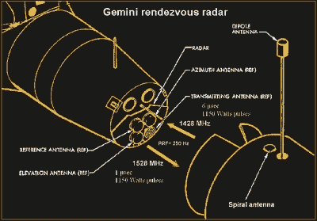
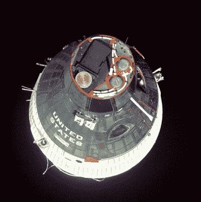

# 太空中的雷达:双子座会合雷达

> 原文：<https://hackaday.com/2018/07/26/radar-in-space-the-gemini-rendezvous-radar/>

在有三个孩子的家庭中，中间的孩子似乎总是吃亏。第一个孩子因为第一个到达每一个里程碑而得到所有的关注，第三个孩子将永远是这个家庭的孩子，第二个孩子在中间迷失了。类似的事情发生在 60 年代的美国载人航天计划中。当美国最终安全起飞时,“水星”计划引起了广泛关注，而“阿波罗”很自然地因为兑现了肯尼迪总统将人类送上月球的承诺而吸引了所有的关注。

在水星和阿波罗之间的是美国宇航局的第二个孩子，双子座计划。双子座在当时甚至今天都没有受到重视，它是学习进入轨道和计算如何飞往月球之间的必要环节。双子座计划教会了美国国家航空航天局如何在太空中工作，以及在阿波罗的大舞蹈之前重要问题将在哪里得到回答。

这些问题中最主要的是解决航天器之间的会合问题。有人认为驾驶两艘飞船以每小时 18，000 英里的速度绕地球飞行是行不通的，双子座试图证明他们错了。为了实现这一目标,“双子座”号需要一个其他航天器从未装备过的东西:太空雷达。

## 你在哪里？

美国国家航空航天局为双子座会合演习做了大量的计划，专门为此建造了一艘特殊的宇宙飞船。Gemini-Agena 目标飞行器(GATV)是一枚 Agena-D 火箭，配有一个对接适配器，Gemini 太空舱的头锥可以插入其中。无人驾驶的 GATV 号将单独发射并进入轨道，随后不久将发射载人的双子座号。任务计划是让双子座号机组人员定位 GATV 号，赶上它，并执行对接动作。

即使在近地轨道，太空也是一个很大的地方，找到 GATV 可能会是一个问题。为了解决这个问题，美国宇航局为 GATV 号提供了光学信标和雷达转发器。GATV 转发器不是依靠双子座号上的雷达反射，而是在收到双子座号发出的询问信号后不久就发射信号。这是为了避免对接机动所需的近距离距离和速度的精确测量问题。应答器的延迟足以让双子座雷达从发射切换到接收；然后，雷达将减去延迟时间来计算距离和相对速度，或距离变化率。

Gemini Rendezvous Radar. The GATV is to the right. Source: [Gemini Familiarization Manual](https://www.ibiblio.org/apollo/Documents/GeminiManualVol2Sec2.pdf)

在双子座一侧，会合雷达是一个安装在太空舱最顶端的紧凑组件。商业端是四个扁平的玻璃纤维盘，从中心到边缘缠绕着交错的螺旋元素。有一个发射天线和三个接收天线，分别用于方位角和仰角，还有一个参考天线。这三个天线相对于航天器的长轴仔细排列，方位角和仰角天线有伺服系统来旋转它们。伺服系统将旋转每个天线，直到信号的相位与固定参考天线的相位相匹配；天线的角度将被用来计算二维目标的角度。

驾驶舱内的距离/距离变化率测量仪是宇航员的重要仪器。它必须在 300，000 英尺到零英尺的范围内准确显示距离，并且它必须表明在当前距离内关闭速度是安全的；车辆越近，速度应该越慢。距离/距离变化率仪器是由雷达的模拟输出驱动的——还有一个输入双子座计算机进行导航计算的数字输出。通过沿着线性曲线升高电压，从发射器发射的时刻开始并在接收到应答器信号时停止，产生驱动测距仪的电流。

## 初次接触

尽管计划周密，会合雷达的第一次测试并没有按计划进行。双子座 5 号，第一次会合任务的彩排，本应使用雷达评估舱测试雷达，这实际上是来自 GATV 的应答器，机组人员可以用来练习。太空舱被释放，但是太空舱上的燃料电池问题阻止了宇航员完成实验。

*Gemini 7* as *Gemini 6A* approaches. Note the single spiral transmitting antenna of the transponder. Source: [NASA](https://www.nasa.gov/mission_pages/gemini/gallery/index.html)

下一个任务“双子座 6 号”被戏剧性地取消了。搭载用于会合演习的 GATV 的阿金纳火箭在飞行两分钟后爆炸，美国国家航空航天局紧急抢救它能抢救的东西。他们决定如期发射*双子座 7 号*，搭载宇航员吉姆·洛威尔和弗兰克·博尔曼，但在机头安装 GATV 应答器，让飞船作为目标飞行器。最初的*双子座 6 号*被更名为*双子座 6A* ，宇航员汤姆·斯塔福德和沃利·希拉起飞去追赶已经进行了 14 天任务 11 天的洛夫尔和博尔曼。会合任务进行得非常完美，两个航天器相距近到一英尺，并精确地保持位置，以至于在整整 20 分钟内不需要校正推进器的燃烧。

凭借从双子座 7/6a 号飞船中获得的经验，剩下的五次任务中有四次能够与 GATV 号会合并物理对接——唯一的例外是 T2 双子座 9a 号飞船，它的 GATV 号在到达轨道后未能抛弃整流罩。到项目结束时，美国宇航局已经将交会对接简化为实践，在这个过程中所学到的一切都被应用到阿波罗任务中，阿波罗任务携带的交会雷达与双子座使用的非常相似。

 [https://www.youtube.com/embed/YNzcz7JA1iA?version=3&rel=1&showsearch=0&showinfo=1&iv_load_policy=1&fs=1&hl=en-US&autohide=2&wmode=transparent](https://www.youtube.com/embed/YNzcz7JA1iA?version=3&rel=1&showsearch=0&showinfo=1&iv_load_policy=1&fs=1&hl=en-US&autohide=2&wmode=transparent)

