# 快速成型假肢、盲文和轮椅

> 原文：<https://hackaday.com/2018/02/23/rapidly-prototyping-prosthetics-braille-and-wheelchairs/>

我们生活在一个惊人的时代，快速成型工具的可用性和使用它们的专业知识比人类历史上任何时候都发展得更快。我们现在有一种惊人的能力，可以快速整合创造性的解决方案——这方面的完美例子是上周整合的专门手臂假肢、盲文印刷和定制轮椅的设计。

本月早些时候，我们公布了在孟买创客收容所进行的 [S.T.E.A.M. Fabrikarium 项目](https://hackaday.com/2018/02/07/steam-fabrikarium-mumbai/)的细节。为期五天的活动旨在将制造商团体与导师配对，以制造辅助设备，帮助改善不同能力的人的状况。

参与者被分成八个小组，在为期五天的项目结束时，他们得出了一些惊人的结果。

## 动手:超越的假肢设计

三个团队致力于基于 Bionico(肌电假肢)的项目

[**DIY 假肢接受腔——一种人机界面**](https://hackaday.io/project/51171-diy-prosthetic-socket) :【摩哂陀·皮塔夫又名马洪】在 2006 年孟买的一系列火车炸弹爆炸中失去了左臂，那次爆炸造成 200 人死亡，700 多名通勤者受伤。他使用一个假肢，基本上是一个三叉爪，用另一只完好的手臂通过电缆激活。虽然它很有用，但有限的功能限制了他做许多简单的事情。DIY 假肢接受腔团队与 MyHumanKit 的[Mahen]和[Nico Huchet](他在 16 年前的一次事故中失去了右臂)合作，为[Mahen]制造了一个带有模块化 3D 打印附件接受腔的假肢前臂。嵌入在手臂内的是一个可充电电源，它在插座端提供 5V USB 输出，为插入的设备供电。它还提供了第二个端口来帮助给手机充电。手臂中还嵌入了一个红外反射传感器，可用于感应肌肉运动，并帮助触发附加电路的特定功能，例如伺服系统。

 [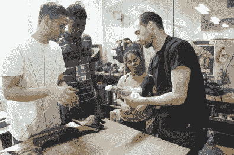](https://hackaday.com/2018/02/23/rapidly-prototyping-prosthetics-braille-and-wheelchairs/attachment/5652171518581176290/)  [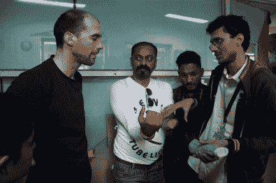](https://hackaday.com/2018/02/23/rapidly-prototyping-prosthetics-braille-and-wheelchairs/attachment/3843841518444392713/)  [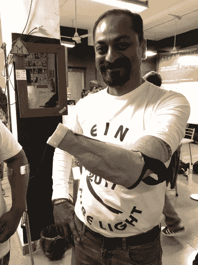](https://hackaday.com/2018/02/23/rapidly-prototyping-prosthetics-braille-and-wheelchairs/attachment/2910351518445240973/) 

[**朴树反馈系统——朴树手的组装和反馈系统的即兴发挥**](https://hackaday.io/project/51025-hackberry-feedback-system) :带承窝的假肢前臂需要附件才能发挥作用。朴树反馈系统项目建造了一双带传感器的关节手用于反馈。这个团队组装了两个[exii 朴树](https://myhumankit.org/en/tutoriels/myoelectric-exiii-hand/)左右手套件，这本身就是一个相当复杂的过程。嵌入式 Arduino 为拇指和手指驱动几个伺服系统。为了扩展功能，team mentor [ [Jean Noel](https://hackaday.io/ootsidebox) ]帮助添加了一个嵌入手掌并连接到 Arduino 的温度传感器，该传感器驱动一组 WS2812 智能 RGB LEDs，这些 led 作为手镯安装在手臂的手腕上。在“温度”测量模式下，蓝色表示冷物体，红色表示热物体。在“有趣”的派对模式中，它会随机播放动画。在第二个组件中，他们嵌入了一对连接到那只手上 Arduino 的力感电阻器。Arduino 驱动一个伺服电机，其喇叭用于提供触觉反馈。

 [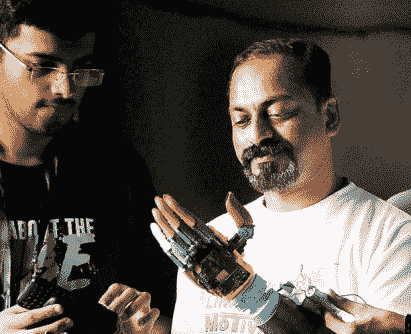](https://hackaday.com/2018/02/23/rapidly-prototyping-prosthetics-braille-and-wheelchairs/dweadgdwkaaad7p/)  [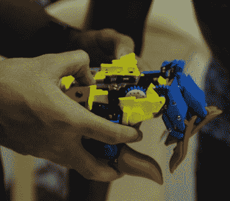](https://hackaday.com/2018/02/23/rapidly-prototyping-prosthetics-braille-and-wheelchairs/attachment/6999941518588179915/) 

[**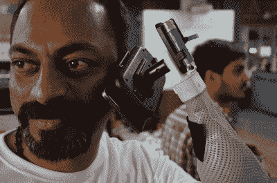湿婆手——创造滑稽/工具手**](https://hackaday.io/project/51666-shiva-hands) :通常，与关节手相比，特定的配件为用户提供更好的功能。SHIVA hands 团队设计并制造了几个可以安装在 DIY 义肢上的附加附件。[Mahen]推荐了一个内置激光笔的手机支架和一个蚊拍支架(在热带的孟买很有用)，而[Nico]想要一个拨子支架，因为他喜欢弹吉他。他们还计划在未来的某个时候建造一个 Nerf 枪架附件。

 [https://www.youtube.com/embed/vYv2zv7A6XA?version=3&rel=1&showsearch=0&showinfo=1&iv_load_policy=1&fs=1&hl=en-US&autohide=2&wmode=transparent](https://www.youtube.com/embed/vYv2zv7A6XA?version=3&rel=1&showsearch=0&showinfo=1&iv_load_policy=1&fs=1&hl=en-US&autohide=2&wmode=transparent)

## 有感情的文字:制作盲文

三个团队基于[盲文说唱](https://translate.google.com/translate?hl=en&sl=fr&tl=en&u=https%3A%2F%2Fmyhumankit.org%2Ftutoriels%2Fbraille-rap%2F)研发盲文设备——使用 3D 打印机作为盲文压纹器。

[**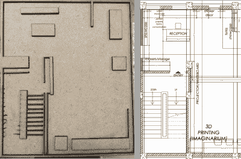Braille rap STEAM——为视障人士创建盲文地图的愿景**](https://hackaday.io/project/51058-braillerap-steam) :对于去图书馆、餐厅或火车站等公共场所的视障人士来说，导航是一大制约因素。在[ [ Hugues Aubin ](https://hackaday.io/hacker/30082-hugobiwan) ]的指导下，该团队的目标是研究创建公共“盲文”地图的各种方式，以及如何在空间内的重要地点显示额外信息，这些地点在盲文地图上有标识。该团队使用 makerspace 中可用的工具和设施尝试了各种制造方法。在与视觉受损的团队成员互动后，他们尝试的另一个想法是使用不同纹理的材料来识别地图上的特定区域。各种砂砾中的研磨纹理(金刚砂/砂纸)被发现非常有用，他们计划进一步研究纹理在地图中嵌入信息的用途。团队成员[ [ Arthur ](https://hackaday.io/hacker/288657-arthur) ]拿了一台 Makerbot Replicator 3D 打印机，修改了它的固件，将其转换为盲文压纹机。唯一需要的机械修改是一个嵌入 3D 打印适配器的简单金属销，该适配器卡扣在热端上。利用这一点，他们成功地使用 3D 打印机在厚纸和塑料膜上压印盲文。

[**braille rap STEAM CNC——改造 CNC 以复制 BrailleRap**](https://hackaday.io/project/51051-braillerap-steam-cnc) :该团队获得了位于制造商收容所的 ShapeOko CNC 工厂，并着手为其添加电子设备和代码，用作盲文压纹机。这是一种相当便宜和快速的方法，可以使用在 makerspace 上常见的材料来制作盲文压纹机。除了数控铣床的机械装置之外，所有需要的就是一个 Arduino，一个电机驱动罩和一个电源。[Arthur]写了一些很棒的代码，它接受文本输入并将其转换为盲文，然后生成所需的 g 代码，这些 g 代码可以发送到 CNC 进行压印。CNC 团队成功地将盲文压印在纸张、塑料以及从废弃汽水罐中获得的薄金属上。

 [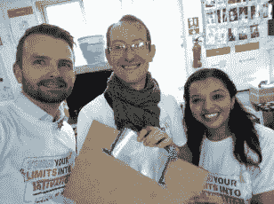](https://hackaday.com/2018/02/23/rapidly-prototyping-prosthetics-braille-and-wheelchairs/dv-1lhsx0ae-q8u/)  [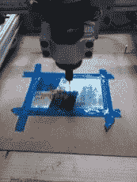](https://hackaday.com/2018/02/23/rapidly-prototyping-prosthetics-braille-and-wheelchairs/dv-1jz_wsaad23u/)  [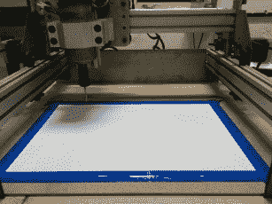](https://hackaday.com/2018/02/23/rapidly-prototyping-prosthetics-braille-and-wheelchairs/img_20180213_202519/) 

[**open braille Steam——打造低成本盲文打印机**](https://hackaday.io/project/51093-openbraille-steam):open braille 团队利用 MyHumanKit 团队自带的一套零件，从头开始打造盲文打印机。开源套件包括用于构建 3D 打印机的常见部件和一些定制的 3D 打印件。原始项目仍在进行中，有点粗糙的边缘。此外，构建团队之前没有太多的经验，所以构建这台机器对他们来说有点困难，但却是一次很好的学习经历。接近尾声时，他们确实制作了一些样本，我们希望随着时间的推移能看到这方面的进一步进展。

 [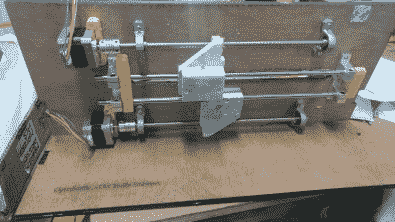](https://hackaday.com/2018/02/23/rapidly-prototyping-prosthetics-braille-and-wheelchairs/attachment/3915111518525157247/)  [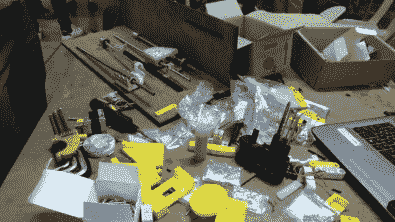](https://hackaday.com/2018/02/23/rapidly-prototyping-prosthetics-braille-and-wheelchairs/dwpk4bcwkaake1m/) 

## 随遇而安:以前没有的轮椅

最后两个项目着眼于如何使用辅助技术帮助坐轮椅的人。

[**O-trotti——将普通轮椅转换为电动轮椅的通用、经济高效的附件**](https://hackaday.io/project/52257-o-trotti-steam-fabrikarium) :在世界上的大部分地区，残疾人无法享受政府对轮椅等辅助技术的补贴。大多数需要它们的人只能勉强买得起低成本的手动版本。因此，电动轮椅对大多数人来说遥不可及。一个简单的解决办法是制造一个附加设备，可以将普通轮椅转换成电动轮椅。不幸的是，即使是这些转换套件也相当昂贵。

O-trotti 团队的任务是提出一种电动轮的模块化设计，这种电动轮可以安装在普通轮椅上。这个团队在[[Yohann Modulaire](https://hackaday.io/YoMHK)]的指导下，同时从事两个项目。一种方法是使用一辆商用电动三轮车，并使用它的部件——灵感来自 [e-Trotti](https://myhumankit.org/en/tutoriels/troti-e-english-doc/) 的设计。另一个团队从零开始构建一个设备。在这两种情况下，所需的硬件都非常简单。一个齿轮传动的 DC 马达，密封的铅酸电池，以及一个控制速度和方向的控制器。两个版本都是在五天内完成的，但是这个项目仍然需要努力才能完成。

 [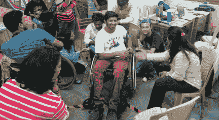](https://hackaday.com/2018/02/23/rapidly-prototyping-prosthetics-braille-and-wheelchairs/attachment/5540401518517877017/)  [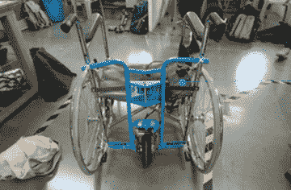](https://hackaday.com/2018/02/23/rapidly-prototyping-prosthetics-braille-and-wheelchairs/o-trotti_01/) 

[**【Fl’air——制造一个可以用于滑翔伞的轮椅**](https://hackaday.io/project/51267-flair) :这是迄今为止最雄心勃勃的项目，也是最需要安全考虑的项目。滑翔伞不是不同能力的人“需要”的东西，但它肯定是必须让他们更容易获得的东西，以便能够享受飞行的刺激。轮椅滑翔伞是一项双人活动，因此飞行员需要极其熟练并持有执照。团队指导约翰·勒尤尼是一名滑翔伞专家，所以他完全知道需要什么，尤其是安全方面。这个团队中还有[ [阿维·马利克](http://www.templepilots.com/SiteData/Innerlinks/Avi%20Malik.html) ]，一位前印度空军飞行员和国际滑翔伞专家，他不会让他的假脚妨碍他对飞行的热情。从事这项工作的团队有几个汽车和自行车制造爱好者，到第五天结束时，他们已经成功地设计了轮椅，切割和弯曲了所有需要的管道，并从当地的喷水切割设施收到了大量的金属片切割的小零件。这一建造工作仍在进行中，但我们期待看到它如何进展，并最终在孟买附近的卡姆谢特看到涉及[约翰]、[阿维]和其他专家的试飞。

 [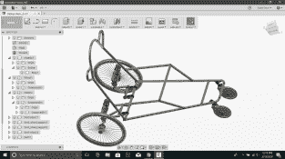](https://hackaday.com/2018/02/23/rapidly-prototyping-prosthetics-braille-and-wheelchairs/attachment/8510181518531810880/)    [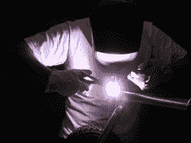](https://hackaday.com/2018/02/23/rapidly-prototyping-prosthetics-braille-and-wheelchairs/attachment/3731911518598087022/)   

要简明扼要地报道一个涉及近 100 名黑客在多个项目上工作的为期五天的项目并不容易，所以我们不得不跳过许多细节。这是一次令人惊奇的经历，这个故事通过每个项目页面分享。请花些时间进一步探索您感兴趣的项目，并请在 Hackaday.io 的项目页面上留下您对团队的反馈和鼓励。

### 关于 Fabrikarium:

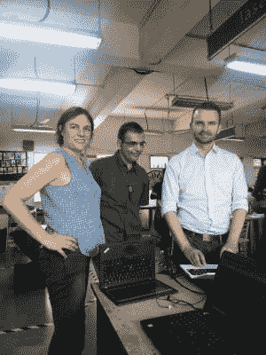

S.T.E.A.M Fabrikarium 与大多数其他“黑客马拉松”不同。首先，65 名参与者和 20 名导师包括 15 名不同能力的人，他们不仅提供反馈，而且也是各个团队不可或缺的一部分，并参与辅助设备的设计和制造。T2 MyHumanKit(T3)团队在法国早期的 Fabrikarium 期间已经建立了五个开源项目。此次活动的目标是在这些现有项目的基础上，复制并改进它们。

该活动在孟买的创客收容所举办。来自纽约州的[ [Bodo Hoenen](https://hackaday.io/Bodo.Hoenen) ]、来自法国雷恩的 MyHumanKit 集团的[ [Delphine](https://hackaday.io/delphine) ]和来自孟买的[ [Anool Mahidharia](https://hackaday.io/anool) ]到场帮助制作文档。Hackaday 很自豪能够通过 Hackaday.io 合作提供文档支持，以确保团队能够记录他们的开源工作并与社区的其他成员分享。

 [https://www.youtube.com/embed/MgyE_KdVA6g?version=3&rel=1&showsearch=0&showinfo=1&iv_load_policy=1&fs=1&hl=en-US&autohide=2&wmode=transparent](https://www.youtube.com/embed/MgyE_KdVA6g?version=3&rel=1&showsearch=0&showinfo=1&iv_load_policy=1&fs=1&hl=en-US&autohide=2&wmode=transparent)

