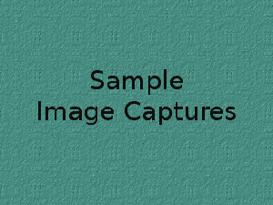

# 树莓 Pi 作为速度相机

> 原文：<https://hackaday.com/2016/04/03/raspberry-pi-as-speed-camera/>

无论你站在道路安全和车辆速度限制的哪个话题上，可以公平地说，速度相机在我们的道路上并不是普遍受欢迎的景象。如果你想在酒吧里激烈争论，就把那个也搅进去。

但是，如果你住在郊区的一条街道上，这条街道被用作所谓的“老鼠赛跑”路线，司机经常以很大的差距无视速度限制。突然间，这个问题变成了个人安全问题，酒吧里的所有争论都变得毫无意义。

Sample car speed measurements

[Gregtinkers]的妹夫在脸书上发布了一条信息，概述了这个问题，遗憾的是，当地警察局缺乏执行限制的资源。这使[Gregtinkers]走上了记录问题规模并为警方行动提供正当理由的道路，[这促使他使用 OpenCV 和 Raspberry Pi 相机制作自己的测速相机](http://gregtinkers.wordpress.com/2016/03/25/car-speed-detector/)。

操作原理很简单，软件在摄像机的视野范围内跟踪道路上的移动物体，计算它们的移动时间，并计算出最终的速度。包含道路的图像区域由边界框定义，以阻止鸟类或邻居的虚假读数进入视野。

他在自己的博客中提供了安装和依赖说明以及软件运行的概要，并且软件本身可以在他的 GitHub 账户上获得。

我们已经有了很多基于 OpenCV 的项目，但是在 Hackaday 上还没有一个速度相机。但是我们有一些可疑的对策，比如[幽默地试图攻击 SQL 注入](http://hackaday.com/2014/04/04/sql-injection-fools-speed-traps-and-clears-your-record/)，或者[基于闪光的对策](http://hackaday.com/2012/10/23/traffic-camera-countermeasure/)。