# Raspberry Pi 在新型号 3 B+中获得了更快的 CPU 和更好的网络

> 原文：<https://hackaday.com/2018/03/14/raspberry-pi-gets-faster-cpu-and-better-networking-in-the-new-model-3-b/>

虽然树莓圆周率的生日(以及最新和最佳圆周率的传统发布日期)是几周前，圆周率日是推出迄今最佳圆周率的合适日期。[树莓 Pi 3 型号 B+是树莓 Pi 基金会的最新产品](https://www.raspberrypi.org/products/raspberry-pi-3-model-b+)。它速度更快，网络更好，最有趣的是，Pi 3 Model B+带有模块化合规认证，允许任何人将 Pi 放入产品中，大大减少了合规测试。

 [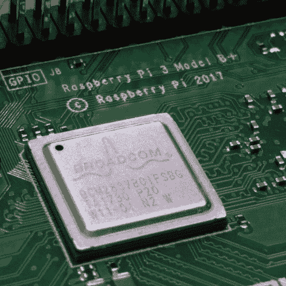](https://i0.wp.com/hackaday.com/wp-content/uploads/2018/03/bcm.jpg?ssl=1)  [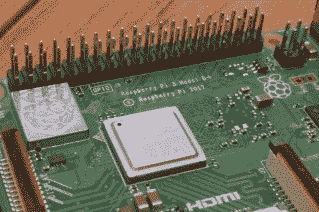](https://i0.wp.com/hackaday.com/wp-content/uploads/2018/03/34pisi.jpg?ssl=1)  [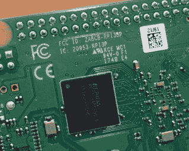](https://i0.wp.com/hackaday.com/wp-content/uploads/2018/03/fccio.jpg?ssl=1)  [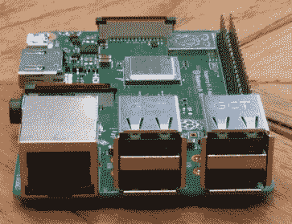](https://i0.wp.com/hackaday.com/wp-content/uploads/2018/03/ports.jpg?ssl=1)  [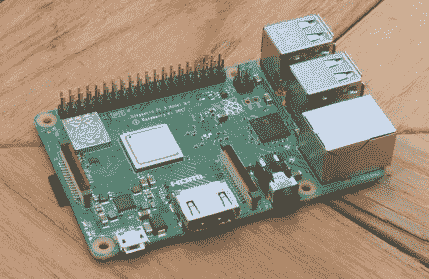](https://i0.wp.com/hackaday.com/wp-content/uploads/2018/03/front.jpg?ssl=1)  [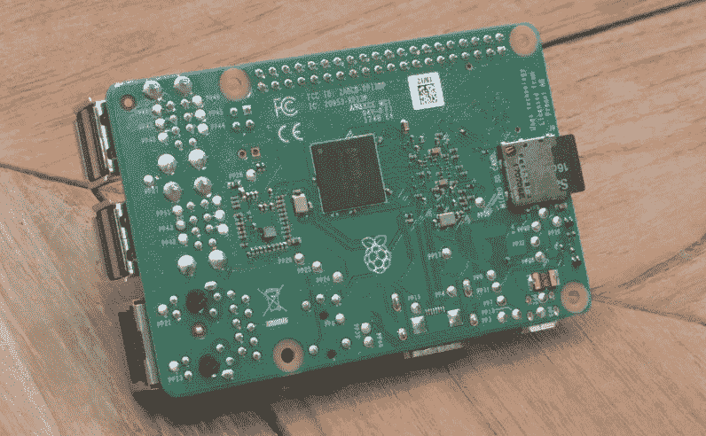](https://i0.wp.com/hackaday.com/wp-content/uploads/2018/03/back.jpg?ssl=1) 

### CPU 速度的小幅提升，局域网的巨大飞跃

 当树莓派第一次发布时，它被宣布为合法的台式电脑，能够做从文字处理到网页浏览的一切事情，价格不到 40 美元。第一批 Pis 卖得很好，但是用这台电脑代替台式机是一次有点令人沮丧的经历。[随着 2016 年树莓派 3](https://hackaday.com/2016/02/28/introducing-the-raspberry-pi-3/) 的发布，这种情况发生了改变。Pi 足够快，软件足够好，是的，这是一台适用于轻量级网络工作甚至一些计算量大的任务的强大计算机。加上机载无线，pi3 B 型是一个伟大的电脑。

Raspberry Pi 家族的最新成员仍然是一台伟大的计算机，但不要指望这次升级会带来真正大规模的加速。处理器仍然是树莓 Pi 3 中的 Broadcom BCM2837，四核 A53，64 位 CPU。比树莓 Pi 3 略有升级；得益于改进的电源完整性、散热设计以及 CPU 上可能的金属罐，Raspberry Pi 3 Model B+现在的运行频率为 1.4 GHz，而不是其前代的 1.2 GHz。

旧的 Pi 3 和 Pi 3 型号 B+之间最显著的视觉差异是电路板射频内部的浮雕金属屏蔽。这包含了新的双频 2.4 和 5GHz 无线局域网，以及蓝牙 4.2/BLE。Pi 3 使用了 BCM43438，它只支持 2.4GHz 的 WiFi，而新的无线芯片组明显更强大，能够与 5GHz 网络配合工作。

但是覆盖新无线芯片组的金属屏蔽不仅仅是为了装饰。树莓 Pi 3 型号 B+带有模块化合规认证。这使得 Pi 3 型可用于符合性测试大大减少的产品。

### 更好的有线网络

[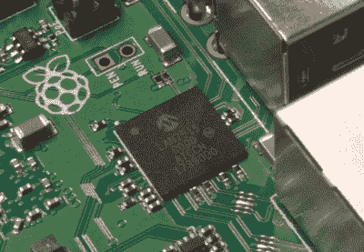](https://hackaday.com/wp-content/uploads/2018/03/lan.jpg)

The new LAN7515 USB and Ethernet controller

虽然这些都是受欢迎的变化，这并不是 Pi 3 模型 B+的最大揭示。在 Pi 3 上引入无线技术之前，以太网受到 LAN9514 USB 集线器和以太网控制器的严重限制。该芯片为 Pi 的 SoC 提供了四个 USB 端口和以太网，但网络在最好的情况下被限制在 100 Mbps，在现实世界中大约为 80 Mbps。

Pi 3 Model B+通过用一个 [LAN7515](http://www.microchip.com/wwwproducts/ProductCompare/LAN7515/LAN9514) 替换 USB 和以太网控制器来改变这一点。它仍然是一个有能力的 USB 2.0 集线器和以太网控制器，但这一个给了 Pi 3 模型 B+ 300 Mbps 以太网。如果您使用 Pi 作为家庭服务器，或者只想通过有线网络向 Pi 发送大量数据，这是一个非常好的特性。

### 罐子里是什么？

作为第一款带有射频屏蔽的树莓派，有一个明显的问题是*罐子下面是什么？*。坏消息是，移除射频屏蔽将使任何担保无效，允许 Pi 到处释放射频，并且没有希望满足合规性。好消息是下面有一些非常酷的组件。

 [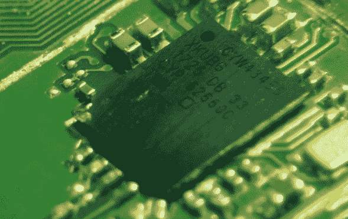](https://i0.wp.com/hackaday.com/wp-content/uploads/2018/03/cypress.jpg?ssl=1)  [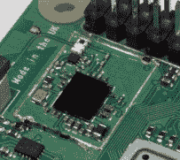](https://i0.wp.com/hackaday.com/wp-content/uploads/2018/03/module.jpg?ssl=1)  [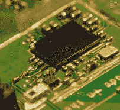](https://i0.wp.com/hackaday.com/wp-content/uploads/2018/03/side.jpg?ssl=1) 

负责所有无线功能的芯片是一个 [CYW43455](http://www.cypress.com/documentation/product-overviews/cyw43455-wiced-ieee-80211ac-wifi-bluetooth-41-connectivity-solution) ，一个 Cypress 和/或 Broadcom 器件，支持 802.11ac，支持 2.4 和 5GHz WiFi 以及蓝牙 4.2。去年的树莓 Pi 3 型号 B 采用了[BCM 43438](http://www.cypress.com/documentation/datasheets/cyw43438-single-chip-ieee-80211ac-bgn-macbasebandradio-integrated-bluetooth)，不支持 5GHz 无线电或蓝牙 4.2。

这是一个受欢迎的新增功能，但真正的故事是 RF 屏蔽帮助确保该板的模块化合规性认证。现在，您可以在产品中使用这种板，而不必为所有采用自制收音机的新产品所需的昂贵的有意辐射测试付费。

### 以太网供电(PoE)报头

[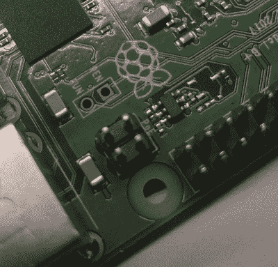](https://hackaday.com/wp-content/uploads/2018/03/poe.jpg)

Designing a new Pi hat? Make sure to take these headers into account.

虽然我不认为这是最新 Pi 的一个失败，但是有些事情你可能需要注意。以太网供电的增加(带附加帽子)，*可能会*妨碍其他 Pi 帽子。

PoE 接头放在 USB 端口旁边，就在 Pi 的一个安装孔下面，40 针接头旁边。这些引脚与 40 引脚接头高度相同，我可以很容易地想象现有的 Pi 帽会干扰 PoE 接头的情况。

这也是 Pi 3 Model B 中“Run”标题放置的位置，我相信有一些产品会机械地使用这种为重置按钮设计的标题。它坏得很厉害吗？不，但它最终会毁了某人的一天。

虽然它不是一个带有 SATA 或 PCIe 的树莓 Pi 或任何不切实际的期望的人所鼓噪的东西，但树莓 Pi 3 Model B+是一个有能力和可取的升级，对于现在这个星球上最受欢迎的计算机来说，它有不同的“计算机”定义。