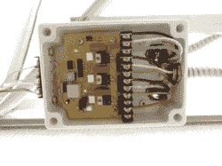
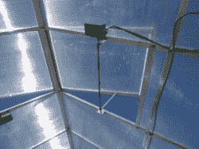
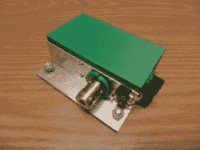

# 树莓派是自动化温室背后的大脑

> 原文：<https://hackaday.com/2017/08/26/raspberry-pi-is-the-brains-behind-automated-greenhouse/>

[Asa Wilson]和他的妻子从 Harbor Freight 买了一个 10 英尺 x12 英尺的温室，因为他们的位置需要一些重大的改变，这是可以理解的，因为他们在科罗拉多州派克峰西坡，那里风很大，正常的生长季节很短。在混凝土底座上组装好并添加了一些钢支撑后，他们开始着手添加一个基于树莓码头的环境管理系统。请继续阅读，看看他们所做的修改。

Fan controller

Vent in roof

Vent controller and actuator

目前，Pi 监控单个温度和相对湿度传感器。基于该输入，Pi 控制位于温室底部相对角落的两个排气扇。这些是通过定制板控制速度，用于从车顶通风口吸入空气。第三个更大的振荡风扇安装在屋顶附近，用于循环空气。它的速度是手动设置的，但也可以通过 Pi 开关。

屋顶上有四个通风口，每个通风口以前都是用单臂手动打开的，允许通风口在风中摆动，有时甚至会关闭。他们通过在 3D 打印的盒子中添加自制的通风口控制器和齿轮电机来解决这些问题。这些电机控制两个臂，牢牢抓住每个通风口的两侧，消除了振荡。

有趣的是，Pi 使用其 RS-232 输出与所有定制控制器对话，但它们遇到了由电噪声增加的电阻问题。为了解决这个问题，他们添加了一个驱动程序，在向前发送信号之前转换为 RS-485。

你可以在他们的页面上看到写有的[结果，到目前为止，他们看起来很有希望。然而，更多的工作正在进行。他们正在增加一个热控制器，用于监控种植区内多达 20 个温度传感器，并计划安装多达 7 个水阀。但即使是现在，温室也和他们开始时的简单塑料外壳相去甚远。](http://www.ideakinetics.com/GHA-Results.htm)

沿着自动化温室的同一条脉络，看看[David Dorhout]的[自动浇水机器人](http://hackaday.com/2013/09/12/fully-automated-watering-robot-takes-a-big-leap-forward-toward-greenhouse-automation/)带着一个 30 加仑的水箱四处游荡，给植物浇水。还有[Instrument Tek]的类似 10 ' X10 '[温室 Arduino 系统](http://hackaday.com/2012/06/05/large-scale-arduino-controlled-greenhouse-does-some-serious-farming/)，除了风扇和浇水控制，还控制热量，并与远程笔记本电脑无线通信。