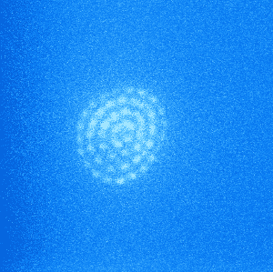

# Raspberry Pi 激光束轮廓仪

> 原文：<https://hackaday.com/2015/12/21/raspberry-pi-laser-beam-profiler/>

加州大学洛杉矶分校的安东尼需要验证激光束的形状。如你所料，这种商品价格不菲。但是一个带黑色照相机的树莓派可以轻松完成这项任务。不仅 Pi 的使用很酷，而且任务也很酷——他们正在使用激光[冷却分子来研究量子效应](http://campbellgroup.physics.ucla.edu/research)。没有红外滤光器的 Pi 相机捕捉宽带宽，使其适合与不可见激光一起使用。[Anthony]沿两个轴捕捉光束，并在 LCD 触摸屏上绘制两条曲线。基于图片的数据也可以在主机上获得。这一切都在一个超紧凑的封装中，配有一个 7 英寸的触摸屏显示器。

    2D crystal of Yb ions.

我觉得这很有趣的一个原因是，1977 年我在罗切斯特大学激光能量学实验室做了类似的工作。我的项目是测量激光束的能量截面。该实验室的研究目标是研究惯性约束激光聚变。虽然[安东尼]使用整个相机，但我的项目仅限于电荷耦合器件(CCD)的一维阵列。输出到 Tektronix 存储终端，并打印在热敏纸上以供参考。他使用在目标系统上运行的 Python。我的工作使用了一个 Z80 开发系统，大小相当于一台塔式 PC，用汇编语言编写我的程序，然后在一台单板计算机上执行。我们已经走了很长一段路。我的代码早就没了，但你可以在 GitHub 上找到[【安东尼的】。](https://github.com/aransfor/PiBeamProfiler)