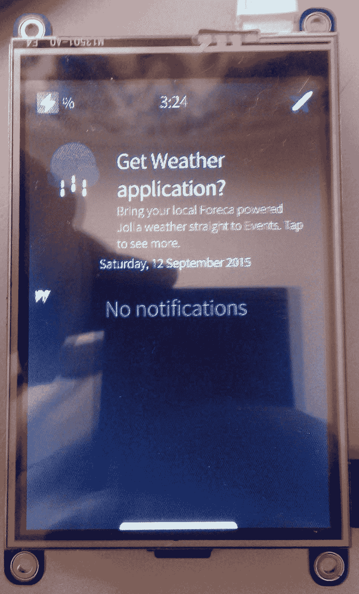

# 基于旗鱼操作系统的树莓派平板电脑

> 原文：<https://hackaday.com/2015/10/18/raspberry-pi-tablet-based-on-sailfish-os/>

这个项目中有太多的漏洞，很难知道从哪里开始。所以让我们从 SailPi 平板电脑开始，这是一个树莓 Pi [在由手机电池组供电的 LCD 触摸屏上运行 Sailfish OS](https://sailfishos.org/) 。这个设计看起来更像是一个中间有 Pi 的高科技三明治，而不是平板电脑。不管它的外观如何，这才是最重要的。创作者【阿列克西·索玛莱宁】在这个项目中花费了大量的精力将所有的碎片拼凑在一起。

Sailfish OS 项目旨在为移动设备，尤其是手机，创建一个新的操作系统。它是开源的，邀请开发者为项目做贡献。触摸屏用户界面旨在通过手持电话的一个手指的手势来方便使用。

[Aleksi]在黑客周期间将旗鱼移植到 Pi 2。他在博客上分享了代码。在黑客周期间，他尝试访问 Pi 上的 GPIO 来闪烁 LED。为了让您快速启动并运行，他提供了一个可以加载到 SD 上的图像。

除了使用 GPIO 的硬件黑客之外，Pi 似乎正在为操作系统黑客找到一个[的位置。](http://hackaday.com/2015/09/23/old-lisp-languaged-used-for-new-raspberry-pi-os/)

不要错过休息后的演示，看看操作系统在 Pi 上运行。

 [https://www.youtube.com/embed/eBneqlCddnk?version=3&rel=1&showsearch=0&showinfo=1&iv_load_policy=1&fs=1&hl=en-US&autohide=2&wmode=transparent](https://www.youtube.com/embed/eBneqlCddnk?version=3&rel=1&showsearch=0&showinfo=1&iv_load_policy=1&fs=1&hl=en-US&autohide=2&wmode=transparent)

