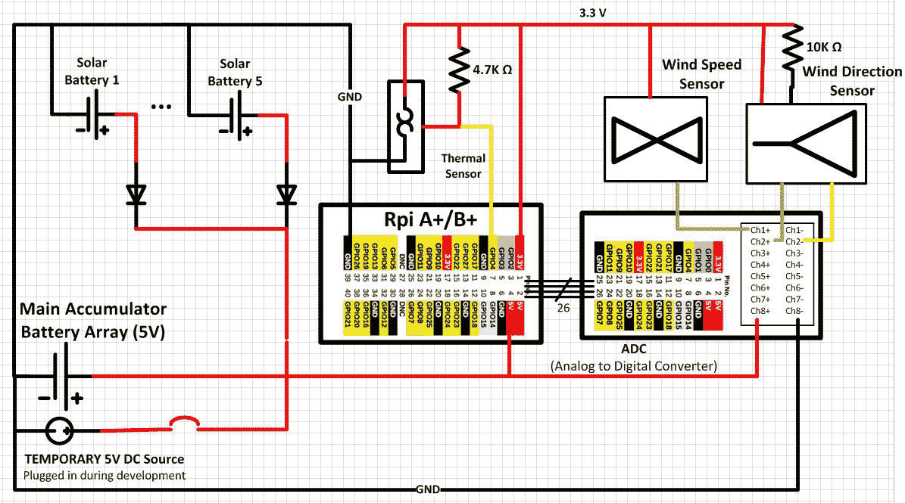

# 树莓 Pi 测风

> 原文：<https://hackaday.com/2016/01/16/raspberry-pi-wind-measurement/>

一个组织良好的项目是一种享受。[Pavel Gesyuk]在他的博客上用这种方法进行实验。实验 13 是一个多部分系列，使用树莓皮作为气象站的核心。【帕维尔】在看[风速风向](http://pagealh.com/2015/07/26/raspberry-pi-experiment-13-anemometer-based-on-sensors-f200-2012/)，和[温度测量](http://pagealh.com/2015/03/21/raspberry-pi-experiment-13-thermal-sensor-and-more/)，加上[太阳能为电站供电](http://pagealh.com/2015/01/17/raspberry-pi-experiment-13-wind-speed-and-direction-meter-anemometer/)。他的一个视频，有很多，是在休息之后。

风速计和方向传感器是使用模数子板连接到 Raspberry Pi A+的库存装置。来自温度传感器的数据是使用 I2C 获得的。在实验的一部分中，他使用 EDIMAX WiFi 适配器来收集数据。

Python 是[Pavel 的开发语言选择，并且[免费分享他的代码](https://github.com/pageal/RPi-Wind)给其他人看。代码收集数据并显示在连接到 Pi 的监视器上。该实验还试图使用太阳能为电池充电，这样该站就不依赖于主电源。

机械装配展示了与他的项目演示相称的对细节的关注，我们尊重这项工作的良好组织。

 [https://www.youtube.com/embed/-yNjU5inS3w?version=3&rel=1&showsearch=0&showinfo=1&iv_load_policy=1&fs=1&hl=en-US&autohide=2&wmode=transparent](https://www.youtube.com/embed/-yNjU5inS3w?version=3&rel=1&showsearch=0&showinfo=1&iv_load_policy=1&fs=1&hl=en-US&autohide=2&wmode=transparent)

