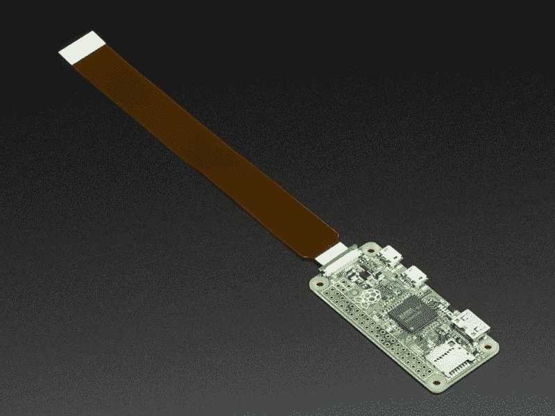

# 树莓派零现在带摄像头支持，仍然只有 5 美元

> 原文：<https://hackaday.com/2016/05/16/raspberry-pi-zero-now-with-camera-support-still-only-5/>

每个人都喜欢的 5 美元电脑的最新版本(1.3)现在有了一个经常被要求的功能:[一个摄像头连接器](https://www.raspberrypi.org/blog/zero-grows-camera-connector/)。Pi Zero 现在将使用与全尺寸 Raspberry Pi 单元相同的经济型相机模块。

圆周率零点的价格不变，仍为 5 美元，但有一个小问题。虽然 Raspberry Pi 相机模块本身可以在 Pi Zero 上正常工作，但它们附带的普通相机电缆就不行了。Pi Zero 的相机电缆连接器比成熟 Pi 上的连接器稍小，因此它需要一根特殊的电缆来将相机模块连接到 Pi Zero 上稍小的连接器。

这应该是个好消息。新的连接器已经出现，因为另一个生产运行正在升温。从逻辑上来说，5 美元的 wonder board 的可用性更高，但我们仍然没有屏住呼吸。

圆周率零点带摄像头模块连接器的线缆。【图片来源:[阿达果](https://www.adafruit.com/products/3157)

随着 Pi Zero 现在能够使用相机模块，或许像[这些数码望远镜](http://hackaday.com/2016/01/11/pinoculars-a-farseeing-pi-camera/)或[延时摄影装置](https://hackaday.io/project/9461-lifepo4weredpi/log/31625-time-lapse-box)这样的基于相机的 Pi 项目现在可以变得更小。

[via [Engadget](http://www.engadget.com/2016/05/16/raspberry-pi-zero-camera-module/)