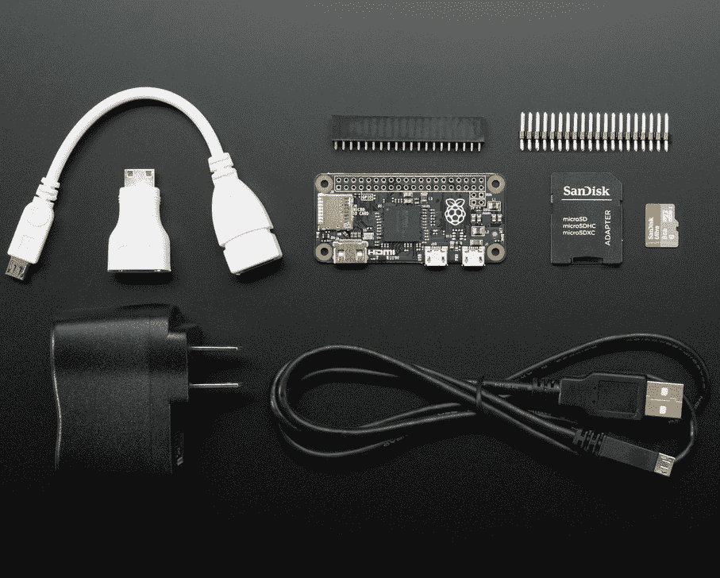

# 树莓派零，还是负一？

> 原文：<https://hackaday.com/2015/12/01/raspberry-pi-zero-or-minus-one/>

华尔街日报报道说，谷歌和现在的 Alphabet 公司的[Eric Schmidt]向树莓派基金会的[Eben Upton]推广了廉价版树莓派的想法。显然[厄普顿]接受了这一建议，尽管现有的计划，使更昂贵，更强大的版本的 Pi。结果就是树莓派 Zero 在某些地方售价 5 美元，并在 MagPi 杂志的封面上免费赠送。

摘自《华尔街日报》的文章:

“他(施密特)表示，很难与廉价竞争。他提出了一个非常令人信服的理由。这是一次改变人生的谈话，”厄普顿先生说，并补充说，他回到实验室，取消了未来更昂贵的 Pi 计算机版本的所有工程计划。“我们的想法是以同样的价格制造一个更强大的东西，然后制造一个同样功率的更便宜的东西。”

计划被取消了。更强大的 Pi 2 以现有 Pi 的价格发布，现在我们有了 Zero。

## Pi 的目的

Foundation Mission

树莓派基金会是一家在英国注册的教育慈善机构。根据他们的“关于我们”页面，这个基金会的目的是“推进成人和儿童的教育，特别是在计算机、计算机科学和相关学科领域。”

为什么树莓派基金会如此关注计算机教育？从 20 世纪 90 年代开始，越来越少的英国申请学习计算机科学的 A-Level 学生有业余程序员的经历。2000 年代的申请者通常只会做一点网页设计。

那么，为什么树莓派零存在？[Upton] [还告诉 Cnet](http://www.cnet.com/news/raspberry-pis-latest-computer-costs-just-5/) ，“我们真的希望这将让最后几个人进门并参与计算机编程。”

很好，但是 Zero 在支持这一目标或解决他们的问题方面做得如何呢？

## 零成本

明显的一点，直接受到谷歌首席执行官的启发:它很便宜。*只不过不是*。Adafruit 正在销售一个预算包和一个初始包，价格分别为 29.95 美元和 59.95 美元。[预算包包含](https://www.adafruit.com/products/2817)一个 Zero、SD 卡、USB On the Go (OTG)线缆、电源和 USB 线缆、一个迷你 HDMI 转 HDMI 适配器和 2×20 头带。如果你想连接 USB 设备，USB OTG 是必不可少的，是的，因为 Zero 没有标准的主机 USB 端口或集线器。但即使这样也不够，我们会看到。

Adafruit Raspberry Pi Zero Budget Pack

[首发包增加了更多的物品](https://www.adafruit.com/products/2816)。如果您想通过串行终端只使用 Linux 命令行，那么唯一需要的是 USB 转串行适配器。其他部分是一个 T-Cobbler，用于与试验板和 WiFi 加密狗一起工作。不错，但不是必需品。[我确实订购了一个入门包，以便亲身体验 Zero。]

其他供应商提供带 USB OTG 和迷你 HDMI 电缆的 Zero，价格约为 20.00 美元。这还不包括 SD 卡或电源，每个 sd 卡或电源大约要增加 5 美元。

最重要的是，因为只有一个 USB 数据端口，你可能需要一个集线器。另一个 USB 连接器用于电源，与所有其他 pi 一样。此外，为了完整起见，您还需要购买一个 GPIO 接头，除非您直接焊接到电路板上。

也许你能以更低的价格买到所需的零部件，但这并不重要。与零一起工作需要花费比 5 美元多得多的钱，甚至接近大于零的 Pi (GTZPi)的成本。

这怎么让零便宜？让 GTZPi 工作只需要 SD 卡。之后的需求都是一样的:标准 HDMI 线、HDMI 显示器、键盘，如果你想使用 GUI，还有鼠标。

## 零发展

Pi 基金会的一个目标是鼓励学习软件开发。Zero 运行与 GTZPi 相同的软件，使用与 Pi A 相同的芯片组。Zero 因此可以用于开发，因为 Pi A(最初的 Pi)被许多人愉快地使用。软件是如此的兼容，以至于我们已经看到了一次黑客攻击，来自 Pi 2 的 [SD 卡启动了一个零](http://hackaday.com/2015/11/28/first-raspberry-pi-zero-hack-piggy-back-wifi/)。

对于开发，您需要设置一个电源，迷你 HDMI 到 HDMI 适配器，HDMI 电缆，USB OTG 电缆，USB 集线器，键盘，可能还有鼠标。几个小时的工作之后，你就可以在你的设备上试用这个软件了。电缆全部断开，电路板连接到设备。测试正在运行。你把零拔出来，然后把所有的东西都插回去，以便进一步的软件工作。

那会很快过时，所以你会得到第二个零，这样一个零就能留在设备中。现在你需要做的就是交换 SD 卡。如果你要这样做，你不需要第二个零，因为你可以使用 Pi 2，并在开发中获得其更高速度的优势。或者，您可以使用带有 WiFi 加密狗的 USB OTG，将文件复制到 Zero 的 SD 中，然后重启或重新启动设备。通过 WiFi，您还可以使用 SSH 或远程控制台来监控设备的活动。

你花了多长时间才弄清楚上面第二段中的所有电缆连接？你觉得一个没有黑客朋友的学生会懂吗？请记住，我们的目标是帮助不懂计算机的学生。

作为黑客，我们理解这些麻烦和复杂性；我们将会把 WiFi 加密狗直接焊接到 Pi 上。这种麻烦让那些寻求更快结果的年轻学生感到沮丧。我不是在这里批评学生的即时满足，只是承认他们在一个项目中投入的时间和精力较少。

## Zero 的小众？

正如我在上一节所暗示的，Zero 的定位可能是嵌入式控制器。如果你打算建造一个小型的独立设备，Zero 的尺寸是一个福音。但是几乎所有的设备都需要某种形式的通信。Zero 需要 USB OTG 适配器来支持 WiFi、蓝牙或其他无线适配器。这挫败了大部分的规模优势。我承认，供应商将很快生产 Zero 外形的子板，以支持可能会抵消这种批评的通信。

更小的零点使用更少的功率，这是一个优势，但一旦增加额外的外设，这种优势就会减弱。

## 致命的弱点

树莓派最大的问题是一个已经存在多年的问题:损坏的 SD 卡。这个问题在论坛上一次又一次地出现，圣诞节后无疑会更多地出现。

一个很大的原因实际上是基于硬件的:没有关机或电源控制。有经验的黑客知道这个问题，所以可以确保 Linux 关机命令以某种方式执行。新手不会知道或理解这一点，这将导致对文件系统损坏的巨大挫折。这对于基金会的目标群体——学生来说尤其如此。他们打算在圣诞节得到这个新礼物，立即尝试使用它，并在 SD 卡坏了两三次后放弃。这是假设送礼者提供了使棋盘运转所需的所有额外部件。家长可能会抱怨 Pi 有缺陷，因为他们也不会理解。

## 总结

Zero 是一个漂亮的小板子，为黑客提供了很多可能性。但是如果树莓基金会对学生来说意味着零分，我认为他们错过了一个重要的时刻。使用 Zero 进行开发所需的附加组件抵消了电路板的低成本，并且在开发和测试中使用起来非常笨拙。这种争论不会鼓励学生使用这个板。

然后是 Pis 再次出现的电源管理问题。该基金会在触摸屏显示器上花费了大量的时间和精力，但却忽略了他们系统的一个设计问题。一个暑期实习生本可以制作一个小子板来解决这个问题。这种挫败感会让学生们望而却步。

这是对零的两次打击。对于学生 Pi 开发人员来说，这显然不是下一个最好的选择。对他们来说，这更像是一个树莓派减一。我鼓励学生的建议是坚持 Pi B+或 Pi 2，理想情况下后者表现更好。

在我走之前，我必须称赞阿达果和阿达女士。他们在零点上提供的[信息非常出色。Raspberry Pi 网站的页面缺少这些重要的数据。Lady Ada 对 Zero 的概述解释了为什么需要每根附加电缆，以及关于添加音频输出和访问其他视频功能的附加信息。干得好。](https://learn.adafruit.com/introducing-the-raspberry-pi-zero/a-tour-of-the-pi-zero)