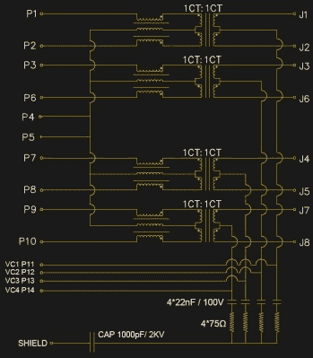
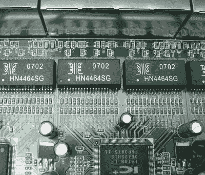
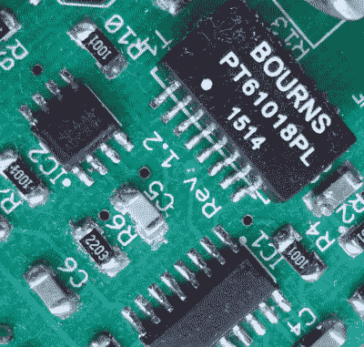

# Raspberry Pi 的以太网硬件能力引发了虚假的间谍活动

> 原文：<https://hackaday.com/2018/06/01/raspberry-pis-power-over-ethernet-hardware-sparks-false-spying-hubub/>

你开过以太网插孔吗？我们敢打赌，绝大多数读者——甚至是那些深入硬件世界的人——都会回答不。因此，我们为这本书的努力喝彩，但结论远远偏离了目标。

在过去的几天里，一条推特显示了一个树莓派的以太网插座被打开，这表明它里面的小 PCB 是一个隐藏的错误。由于内部发生的事情比人们想象的要多，拆机者的结论是树莓派基金会正在通过我们的以太网流量监视我们。事实并非如此。但我们仍然对发现的东西感到兴奋。

对于那些花了很多时间使用以太网接口的人来说，这个事实是显而易见的。为了证实我们的怀疑，我们与 Raspberry Pi Trading 的首席硬件工程师罗杰·桑顿(Roger Thornton)进行了一次交谈，他的手指掌握着 Pi 的脉搏。在一次关于采购集成磁性以太网插孔的有趣对话中，他非常高兴地证实，Pi 当然不包含监控硬件。相反，我们的高音喇叭发现的是磁体、隔离变压器和一些滤波器组件，因为最新的 Raspberry Pi 版本( [Raspberry Pi 3 Model B+](https://hackaday.com/2018/03/14/raspberry-pi-gets-faster-cpu-and-better-networking-in-the-new-model-3-b/) )支持未来的以太网供电(PoE)插件。

正是这些小 PCB 上的滤波器部件似乎作为可能的邪恶部件引起了人们的注意，但在揭穿整个想法时，值得看一看磁性部件本身，因为它们是一种有趣且最重要的廉价部件，在以太网之外还有一些用途。

## 以太网插孔里到底装了什么？

The schematic of the Raspberry Pi 3 B+ ethernet magnetics.

[Roger]很友好地给了我们 Pi 中使用的插孔的示意图，尽管它是这种插孔的典型，与您在任何数量的其他几乎相同的组件中找到的插孔几乎没有区别。在其中心是一排四个变压器，用于将 Pi 与以太网电缆上可能出现的任何杂散电压隔离。每个变压器的左侧是一个三线扼流圈，用于抵消可能通过电缆到达的任何共模噪声。底部是 PoE 电源线上的一组 RC 滤波器，这可能是引发争议的组件。

变压器具有大约 250 kHz 到 100 MHz 的带宽，这允许它们忽略 PoE 的低频 48 VAC，并通过以太网信号。在 Pi 3 B+的情况下，PoE 线路被连接到电路板上的一个接头，该接头将与即将推出的 PoE HAT 配合使用，该 PoE HAT 将包含一个带有 1.5 kV 隔离变压器的开关 PSU，以保护 Pi 和线路之间的屏障。

一个有趣的话题是，一些公司自己生产变压器，而另一些公司购买现成的。一个简单的方法来识别内部的，似乎是他们通常会隐藏在一些黑色密封剂下，就像推文中的那个一样，而购买的将是独立的封装元件。

## 入侵以太网组件

 

一排看起来像交换机的以太网变压器。由汉斯哈斯[ [CC BY-SA 4.0](https://commons.wikimedia.org/wiki/File:Quad_10-100_MBIT_ethernet_pulse_transformers_IMG_7814.jpg) 。

所以在【Roger】的帮助下，我们已经确定 Pi 不包含任何邪恶的成分(我们当然已经知道了)。但我们仍然发现，每个以太网卡都至少有一个非常有用的 RF 带宽变压器，因此，如果您对无线电感兴趣，这些元件非常值得再看一眼。如果你曾经需要一个小的 RF 变压器用于级间耦合，你会意识到这些都不是便宜的元件，所以你可以从一个旧的以太网连接设备中获得现成的电源(或者只花几分钱购买)的想法很有意思。

以太网变压器有多种封装形式，从内置到插座，如 Pi 上的插座，再到各种表面贴装封装，甚至是老式设备上的通孔版本。它们分为三大类，正如你所料，它们对应于不同的以太网标准。10 兆位器件通常在一个封装中有两个变压器，带宽约为 100 kHz 至 10 MHz，100 兆位器件有两个 300 kHz 至 100 MHz 带宽的变压器，1000 兆位器件如上述 Pi 器件有四个 300 kHz 至 100 MHz 的变压器。变压器本身缠绕在微小的铁氧体环上，几乎总是 1:1 中心抽头，阻抗为 600ω，一侧有一个共模扼流圈，如上所述。

An Ethernet transformer providing a balanced mixer input to a home-built HF receiver.

在这些限制范围内，它们可以用于在这些阻抗范围内工作的各种小信号 RF 任务。例如，只使用不含共模扼流圈的一半绕组，就可以将它们配置为 1:2 变压器，具有 300ω输入和 600ω输出。就带宽而言，它们还具有超出其宣传规格的有用性能，例如在欧洲，它们将通过 150 kHz 至 200 kHz 左右的长波广播站，而在其范围的另一端，它们将通过 108 MHz 的 FM 广播站。在这个范围内，你可以使用全部的高频和较低的甚高频，例如，如果你的国家有分配的话，可以在从中频波段到 6 米和 4 米的每个业余波段内使用。在写这篇文章时，它们是自制接收机和小信号级中的首选变压器，比缠绕环形线圈更好。

有时，人们很容易相信以太网变压器等特定应用元件没有其他用途，但值得阅读数据手册，并询问是否有任何有用的元件隐藏在您的垃圾箱中而未被注意到。再看一眼，你会惊讶地发现什么！