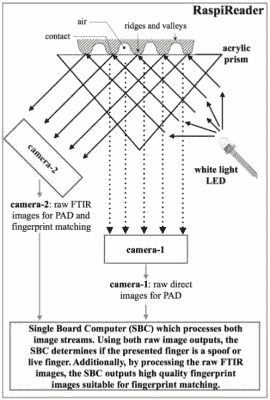

# RaspiReader，一个开源的指纹识别器

> 原文：<https://hackaday.com/2017/09/04/raspireader-an-open-source-fingerprint-reader/>

2008 年，时任德国内政部长的沃尔夫冈·朔伊布勒(Wolfgang Schä uble)让德国混乱计算机俱乐部(CCC)的成员复制了他的指纹，并将其公布在随他们的杂志发行的一片塑料薄膜上。[朔伊布勒]是国家大规模收集生物特征信息的热心支持者，他广为流传的从水杯中提取的指纹有效地证明了生物特征信息的可靠性。

Diagram showing the fingerprint reader’s operation.

当时有报道称，塑料[朔伊布勒]指纹可以骗过当时的商业扫描仪，包括德国护照机构使用的扫描仪，这一事件给这位政治家造成了极大的尴尬。“欺骗”指纹的想法将完全破坏生物特征数据收集的计划，这是当时几个欧洲政府的重要政策特征。

有趣的是，我读到了密歇根州立大学的一篇论文，“[RaspiReader:一个开源的指纹读取器，有助于欺骗检测](https://arxiv.org/abs/1708.07887)”(PDF 可从链接页面下载)，作者是[约书亚·j·恩格尔斯马]、[曹凯]和[阿尼尔·k·贾恩]，他们研究了光学指纹读取器的机制，并提出了一个使用一直很流行的 Raspberry Pi 的设计，试图检测并挫败欺骗企图。对于门外汉来说，它是指纹 FTIR(受抑全内反射)摄影的迷人入门，并描述了他们将它与传统图像结合起来检测欺骗的技术。最棒的是，整个系统都是开源的，这意味着你也可以试着自己构建一个。

如果(曹)和(贾殷)听起来很熟悉，可能是因为他们去年的[三星 Galaxy 指纹黑客](https://hackaday.com/2016/03/11/finger-print-scanners-really-arent-that-secure/)事件，所以看到他们在防御方面工作很有趣。如果你认为指纹是很好的密码，你需要做一些[背景阅读](https://hackaday.com/2016/03/11/finger-print-scanners-really-arent-that-secure/)。如果你不能获得足够的指纹，请阅读今年早些时候的[Al Williams]' [指纹扫描的基础知识。](http://hackaday.com/2017/04/27/fundamentals-of-fingerprint-scanning/)

Via [黑客新闻](http://hackaday.com/2011/09/18/schauble-jr-aims-to-take-away-your-privacy/)。