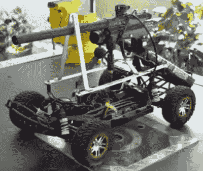

# 遥控汽车闯入彩弹射击坦克

> 原文：<https://hackaday.com/2018/03/14/rc-car-hacked-into-paintball-shooting-tank/>

在崎岖的地形上驾驶遥控汽车，还是进行彩弹大战，哪个更有趣？通过[制造一个遥控的彩弹发射罐](https://www.youtube.com/watch?v=Fo_YxhOBO8k)来同时做这两件事怎么样？来自随机之王 YouTube 频道的[Nate]就是这样做的，他将一把改装过的彩弹枪安装到一辆拆下来的遥控汽车上，添加了一个遥控扳机来远程开火，并将其全部覆盖在坦克形状的 EVA 泡沫装甲中。然后他又做了一次，这样他就有对手了。

RC car with paintball gun attached

在下面的第一个视频中，他展示了完整的构建，但这里有一些让我们印象深刻的东西。它需要一些拨弄得到一个伺服拉动枪扳机，但他怎么能远程控制伺服？为此，他接管了汽车的遥控接收器信号来控制音频，并让它打开和关闭伺服系统。我们也喜欢他对铝条的使用。这种材料在家得宝(Home Depot)等商店的五金店有售，很容易切割和弯曲。你可以在这里看到它用于[将 Wimshurst 机器零件安装到自行车](https://hackaday.com/2015/05/04/bicycle-powered-wimshurst-machine/#more-154631)上，在这个黑客中，[Nate]用它将彩弹枪刚性安装到车架上。当他用铆钉而不是螺母和螺栓将框架固定在一起时，确实让我们大吃一惊。这是你不常见到的，而且效果很好。

我们说过，他做了两个。在下面的第二个视频中，观看[Nate]和 YouTuber [Stuart Edge]在沙漠中进行坦克大战时的坦克战斗。

 [https://www.youtube.com/embed/Fo_YxhOBO8k?version=3&rel=1&showsearch=0&showinfo=1&iv_load_policy=1&fs=1&hl=en-US&autohide=2&wmode=transparent](https://www.youtube.com/embed/Fo_YxhOBO8k?version=3&rel=1&showsearch=0&showinfo=1&iv_load_policy=1&fs=1&hl=en-US&autohide=2&wmode=transparent)

 [https://www.youtube.com/embed/Z14-S1X87z0?version=3&rel=1&showsearch=0&showinfo=1&iv_load_policy=1&fs=1&hl=en-US&autohide=2&wmode=transparent](https://www.youtube.com/embed/Z14-S1X87z0?version=3&rel=1&showsearch=0&showinfo=1&iv_load_policy=1&fs=1&hl=en-US&autohide=2&wmode=transparent)

