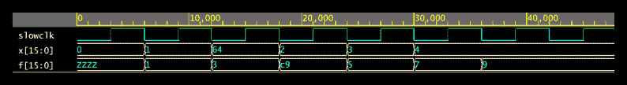
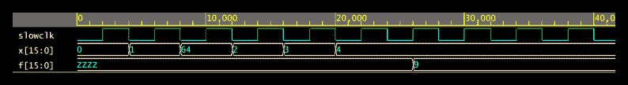
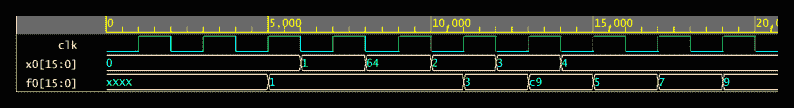

# 精通 FPGAs:真实世界流水线技术

> 原文：<https://hackaday.com/2018/06/12/real-world-pipelining-for-fpgas/>

使用 FPGAs 时，并行是您的好朋友。事实上，这往往是选择 FPGA 的最大好处。隐藏在可编程逻辑中的龙通常涉及时序——将众多逻辑门连接在一起肯定会影响时钟时序。早些时候，我看了看[如何分割逻辑以更好地利用 FPGA](https://hackaday.com/2018/06/05/pipelining-digital-logic-in-fpgas/) 内部的并行性。现在，我将通过对一些函数建模来介绍一个实际的例子。使用带有一些假延迟的 Verilog，我们可以展示它是如何工作的。你应该使用 Verilog 模拟器，我用的是在你的浏览器上运行的 EDAPlayground。整篇文章的代码已经被[预先加载到模拟器](https://www.edaplayground.com/x/6LXJ)中。

如果你习惯了 C 语法，你很有可能能够读懂简单的 Verilog。如果您已经将 Verilog 主要用于合成，您可能不熟悉使用它来建模延迟。这一点在这里很重要，因为通过门的延迟是促使我们一开始就将许多门分成一个管道的原因。你可以在测试台上使用延迟，但是在这种情况下，它们只是让模拟器在引入更多激励之前暂停一会儿。因此，从延迟的一些背景开始是有意义的。

## Verilog 中的延迟

出于我们的目的，Verilog 中的延迟非常简单。模拟器使用无单位时间间隔，您可以使用``timescale`指令进行设置。事实上，时间刻度并没有做什么特别的事情，只是标记了最低级别的刻度。我使用了`1ns/1ps`作为时间刻度，使得每一个刻度值为 1ns，测量单位为皮秒。然而，在这种情况下，只要你想到蜱，这真的无关紧要。

有几种不同类型的延迟，Verilog 可以用几种方法来模拟它们。对于我们想要的，我们只需要从某段代码的输出到它被发送到其他地方的一个非常简单的延迟。你经常听说惯性延迟和运输延迟。具有惯性延迟的线或门将丢失任何至少不满足延迟时间的输入。例如，延迟为 5 的门(您将很快看到如何指定它)会错过宽度为 2 的脉冲。有了传输延迟，整个信号无论如何都只是在时间上发生了偏移。因此，宽度为 2 的脉冲仍然会出现在输出中，只是在 5 个时间单位之后。

对于我们的例子，我们不太关心。我们只是想让一些组合逻辑花费“很长时间”，所以我们会保持简单。如果你想阅读更多关于 Verilog 延迟的内容，以及为什么大多数人都做错了，这里有一篇关于这个的很棒的论文。

所有这些都很好，但是我们只是要在一些逻辑函数中引入一些延迟，比如使用 assign:

```

assign #5 x=y;

```

在这种情况下，当 y 改变时，x 实际上在 5 个分笔成交点内不会改变，不管分笔成交点是什么。这就是所谓的惯性延迟。从技术上来说，对 y 的任何改变，如果持续时间不超过 5 个点，就会丢失，因为这是一个惯性延迟，但现在这没问题。

延误的原因还有很多。您可以有最小、典型和最大延迟。您还可以为上升时间、下降时间和关闭时间指定多达三种类型的延迟。我们不关心那么多的细节，但知道它在那里是很好的。

这里有一个很好的短片，是关于时间尺度和延迟之间的关系的:

 [https://www.youtube.com/embed/1oCm1Gt6_8A?version=3&rel=1&showsearch=0&showinfo=1&iv_load_policy=1&fs=1&hl=en-US&autohide=2&wmode=transparent](https://www.youtube.com/embed/1oCm1Gt6_8A?version=3&rel=1&showsearch=0&showinfo=1&iv_load_policy=1&fs=1&hl=en-US&autohide=2&wmode=transparent)


## 一些整数数学

下面是一些小函数，当它们组合在一起时，将使用整数数学计算(4x+3)/2:

```

module f1(output [15:0] f, input [15:0] x);
assign f=x&lt;&lt;2;
endmodule

module f2(output [15:0] f, input [15:0] x);
assign f=x+3;
endmodule

module f3(output [15:0] f, input [15:0] x);
assign f=x&gt;&gt;1;
endmodule

```

我把这些分开，这样他们每个人都可以在其他地方有一个延迟。顺便说一下，你可以在 [EDAPlayground](https://www.edaplayground.com/x/6LXJ) 上打开并尝试整个项目。

你可以把所有这些加在一起成为一个大的门:

```

module flatmain(input clk, output [15:0] f, input [15:0] x);
assign #`compdelay f=int3;
wire [15:0] int1;
wire [15:0] int2;
wire [15:0] int3;
f1 u1(int1, x);
f2 u2(int2, int1);
f3 u3(int3,int2);
endmodule

```

这相当于将三个 IC 连接在一起。这里没有计时。唯一的延迟来自延迟语句。

compdelay 变量是 6，因为每个“f”函数占用 1 个时钟(两个节拍)。为什么？因为这就是我想要的演示。在现实生活中，这些函数几乎不需要时间来计算。更复杂的结构确实需要大量的时间，这里我希望延迟代替那些更复杂的操作，以保持代码示例的简单。

## 说明问题

测试平台循环输入如下:0、1、0x64、2、3、4。预期结果是 1、3、0xc9、5、7 和 9。现在一切都是这样设置的，非常有效:

[](https://hackaday.com/wp-content/uploads/2018/05/wavenorm.png)

不过，请注意，clk 信号每 6 个时钟周期产生一次，因此总延迟应为 6 个时钟周期。图表显示那是正确的。输入保持 1 个时钟，输出在 1 个时钟后出现。我让测试平台尽可能快地运行。如果您愿意，可以在 config.v 中将 slowclock 参数从 3 更改为 2(这将导致时钟花费 4 个节拍，而不是 6 个)。结果不会好:

[](https://hackaday.com/wp-content/uploads/2018/05/wave-bad.png)

在现实生活中，情况可能更糟，因为延迟模型不一定是真实电路的行为方式。不管怎样，答案不会是正确的。因此在这种配置下，提高时钟速度是不可能的。

## 救援管道

看看这个备用的主要功能:

```

// pipeline
// x-&gt;ff0-&gt;(f1)-&gt;int1-&gt;ff1-&gt;(f2)-&gt;int2-&gt;ff2-&gt;(f3)-&gt;f
module main(input clk, output [15:0] f, input [15:0] x);
wire [15:0] int1;
wire [15:0] int2;
reg [15:0] ff0, ff1, ff2;

f1 #2 u1(int1,ff0);
f2 #2 u2(int2,ff1);
f3 #2 u3(f,ff2);

always @(posedge clk) ff0&lt;=x;
always @(posedge clk) ff1&lt;=int1;
always @(posedge clk) ff2&lt;=int2;

endmodule

```

我仍然使用相同的功能，但是我在 u1 和 u2 的前面和后面放了一个触发器。嗯，技术上来说是 16 个触发器，每个位一个，但你知道我的意思。这就是实现这一设计所需要的一切。我还为这里的每个元素编码了两个节拍(一个时钟周期)延迟。

看同样的测试序列:

[](https://hackaday.com/wp-content/uploads/2018/05/wavepipe.png)

这一次，我仍然在每个时钟周期发送一个新值，但是时钟周期与前面波形中的一个节拍相同。它看起来像两个刻度，但是注意它的大小。轴上的第一个主要标记是 5,000 ps，但在之前的波中，相同的距离是 10,000 ps。

在初始延迟之后，我也在每个时钟周期得到一个结果。请注意，总时间现在是 18 ns，而以前是 35 ns。然而，由于流水线延迟，3 的初始输出较晚。因此时钟速度更快，吞吐量更高。非常值得稍微增加复杂性。

## 管道末端

正如我在上一篇文章的[中提到的，有许多方案可以让流水线更加健壮，包括添加 FIFO 缓冲区或者在不同的元素之间使用握手。然而，原理保持不变。通过在并行工作的电路之间移交较小的工作块，您可以更好地利用 FPGA 资源并大幅提高速度。](https://hackaday.com/2018/06/05/pipelining-digital-logic-in-fpgas/)