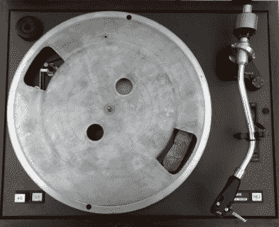
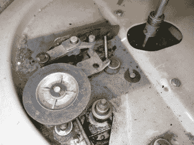
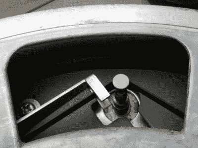
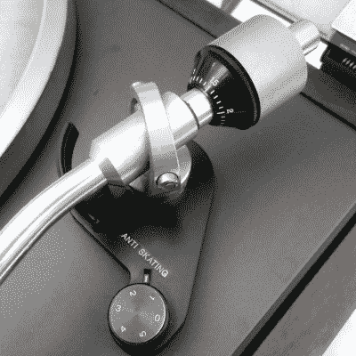
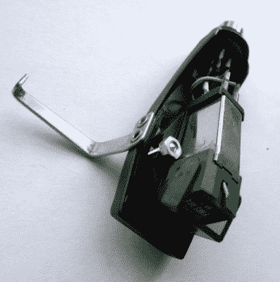

# 电唱机为流媒体一代解说

> 原文：<https://hackaday.com/2017/03/03/record-players-explained-for-the-streaming-generation/>

如今，你是如何消费你的音乐的？除了在收音机上。你会在手机和电脑上播放 MP3 或其他文件吗？或者你会从网上下载流媒体吗？如果你真的在最前沿，你不会做这些事情，因为你会在黑胶唱片上播放它。

[![The legendary Technics SL1200 direct-drive turntable, as used by countless DJs. Dydric [CC BY-SA 2.5)], via Wikimedia Commons.](img/e2d3519901dc0d8d27928fd03384aa00.png)](https://hackaday.com/wp-content/uploads/2017/02/640px-technics_sl-1200mk2-2.jpg) 

传说中的工艺 SL1200 直驱转盘，为无数 DJ 所用。几年前，关于黑胶唱片销售复苏的报道是你永远也想不到的，但消费者的口味是不可预测的。我们穿着红色裤子、留着大胡子的潮人朋友们已经重新发现了这种形式的荣耀，结果它到处都出现了。对于我们这些年龄足够大的人来说，在它再次变酷之前就已经真正喜欢上它了，在当地超市的一个摊位上看到*佩珀中士*和*齐柏林飞艇 II* 以惊人的价格出售是一种娱乐。很高兴看到你的初恋再次流行起来，但是每张专辑 20 英镑(25 美元)真的好吗？

随着转盘作为典型高保真音响系统的一个组成部分消失，新的黑胶发烧友面临着设备选择不佳的问题。通常，在发烧友商店不花大钱就能买到的最好的东西是制造成本尽可能低的 USB 设备，这种设备的播放效果充其量也就一般。对于近三十年的 CD 和 MP3，我们已经失去了关于什么是好的唱盘的集体知识，所以也许是时候快速入门了。

如果你与某一类型的音响发烧友交谈，你会在几乎任何与音频相关的话题上遇到一连串的神话和伪科学，黑胶唱片也不例外。就本文的目的而言，最简单的说法是，播放黑胶唱片是可能的，比如在高质量设备的情况下实现非常高的音频再现标准，然后就此打住。我们不会陷入音响发烧友的幻想，也不会对那些比你的车还贵的唱盘大唱赞歌。相反，我们要看看是什么使一个转盘，并希望帮助你选择一个既不会损坏你的记录或声音不好。

## 黑胶唱片的工作原理

[![Close-up magnification of a 45RPM vinyl record, showing the audio waveform in each groove. The red lines are 1mm apart. Alex:D [Public domain], via Wikimedia Commons.](img/e1068c1ddd09cddcb2a8ef7c0ba6f6bf.png)](https://hackaday.com/wp-content/uploads/2017/02/788px-vinyl_disc_detail_2.jpg) 

一张 45 转/分的黑胶唱片的特写放大图，显示每个凹槽中的音频波形。红线相隔 1 毫米。阿历克斯·:D 的公共领域照片。曾经有一段时间，描述唱机的操作是不必要的，因为它们无处不在，但我们希望这是一个为所有代人服务的初级读本，所以它值得快速转移注意力。

唱片是一张薄薄的塑料圆盘，圆盘表面刻有螺旋槽。模拟音频表现为凹槽壁的变化，当唱片在转盘上逆时针旋转时，通过放置在凹槽中并保持静止的针来播放。

唱针的振动被转换成电子音频信号，并为您的高保真系统放大。光盘两面都有录音，有 12 英寸、10 英寸和 7 英寸三种版本。长时间播放的专辑通常需要一个旋转速度或 33⅓转速，而单曲通常以 45 转/分的速度旋转。您还会看到对早期 78RPM 记录和罕见的 16RPM 有声书籍记录的参考，但它们超出了本文的范围。

凹槽本身原本可以承载单声道音频，但后来的录音通过在其相对的墙壁上表达左右声道而适应了立体声。在录制到黑胶唱片之前，对音频应用均衡曲线，这样可以减少低音，从而减少凹槽所占的面积以及指针跳出凹槽的机会。相应的反向曲线必须应用于您的播放设备的前置放大器，这是被称为 RIAA 曲线后，行业组织规定它。我们见过的最好的观察这些凹槽的方法是用电子显微镜；本·克拉斯诺表演了惊人的魔术。

一个年轻的老黑客的成年礼是播放唱片中的音乐，将一张纸插入形成针的削尖的火柴杆的分裂端，这可以证明这项技术是多么容易使用和简单。尽管如此简单，但要获得好的播放效果，你需要更好的东西。我们现在将仔细检查你的唱机的各个部件，描述它们的操作和种类，并帮助你辨别好坏。

## 盘片和驱动器

A substantial aluminium platter on a belt drive turntable, with its mat removed.

很容易将播放黑胶唱片的完整设备描述为一个转盘，而不考虑转盘本身是一个重要的组件。现在，我们将花一分钟时间来看看它，并将其分为几个部分:盘片、轴承和驱动系统。

唱盘提供了一个圆形的平面，唱片旋转时就放在这个平面上。它上面通常会有一个橡胶或类似的垫子，以提供一个可接受的表面，避免损坏唱片。盘片的工作是在没有振动或弯曲的情况下旋转，因此一个好的盘片应该是刚性的，大于 12 英寸唱片的大小，并且具有相当大的质量。虽然高端唱盘由多种材料制成，但你最常看到的还是铝铸件。相比之下，便宜的唱盘几乎总是有重量轻的塑料盘，不提供阻尼，容易弯曲。

Jockey wheel drive on an ancient and rather grubby 1950s turntable.

位于盘片中心的轴承的作用是让旋转继续进行，而没有过多的摩擦或振动。有些盘片漂浮在一层油上，在滚珠轴承上旋转，放在锥形主轴上，等等。廉价的塑料盘片通常对这一重要部件的关注很少，而是简单地放在主轴的底部，并依赖于塑料和金属之间的摩擦力足够低，驱动系统可以克服它。

为了旋转，盘片必须有一个驱动系统，这通常被吹捧为整个转盘的营销功能。除了在 DJ 唱盘等特殊应用中，驱动器不必特别强大，只需尽可能平稳无振动，并以正确的速度旋转盘片即可。古老的转盘可能有一个靠着盘底边缘的转向轮驱动，但你会想要寻找皮带驱动或直接驱动。顾名思义，皮带传动通过橡胶带将盘片与振动隔离，而直接传动将盘片直接连接到电机轴上。

The belt-drive mechanism in close-up. The lever on the left changes speed by shifting the belt between different widths of the motor spindle.

转盘上电机的选择很重要，因为大部分振动都是通过电机传递的，这会影响播放。寻找带传动转盘中的双极交流电机，避免罩极电机。非常便宜的塑料带驱动转盘通常有小而振动的 DC 马达。

相比之下，直接驱动电机通常将转子磁体固定在盘片下侧的一个环中，位于转盘底盘上的定子电磁体环上方。它们将由多相交流电源以类似于步进电机的方式驱动，电机和驱动器的质量将取决于设备的价格。无数 DJ 使用的传奇工艺 SL1200 系列转盘使用这种安排，尽管其高成本是否更多地归因于传说而不是现实还存在争议。

### 提示音

拾音臂采用枢轴上的平衡臂的形式，该枢轴将拾音器和唱针组件承载在唱片上，并且必须确保唱针在唱片上施加正确的力。向下或向侧面用力过大会影响播放质量，损坏唱片和唱针。

The tonearm fulcrum, showing typical tracking weight and anti-skate adjustments.

一个 tonearm 应该有两个可访问的调整，跟踪重量和防滑力。追踪重量和防滑力的设置应该由你的针筒和针头的制造商来确定，并以克来表示。廉价的唱盘会有制造商预先设定的这些参数，或者可能完全没有这些参数，它们的出现很好地表明了唱盘的质量水平。

跟踪重量就是唱针在唱片上施加的重量，通常在一克左右。在大多数情况下，它是通过拾音臂另一端的配重来设定的，配重可以在螺纹上来回移动。配重上应该有一个以克为单位校准的刻度盘。要设置跟踪重量，首先调整重量，直到拾音臂在水平仪上保持平衡，然后再调整重量，直到所需的跟踪重量设置显示在刻度盘上。

防滑力是施加在拾音臂上的力，将拾音臂拉向记录边缘。这抵消了由于唱片的摩擦而施加在拾音臂上的朝向唱片中心的力，达到了减少凹槽磨损的预期效果。通常有一个弹簧，通过一个小的校准旋钮来收紧或放松，只需转动以克为单位的数值。

拾音臂本身有各种不同的形状，有直的也有弯的。它应该是金属拾音器，避免使用塑料拾音器转盘，因为拾音器应该尽可能坚硬。关于拾音器的完美形状，有很多发烧友的理论，但这个想法是为了确保拾音器轴总是与凹槽成直角，并且它跟踪的弧线尽可能接近直线。你会发现关于直音调臂和 S 形音调臂的激烈争论，但是你可能更关心你的音调臂的质量而不是它的形状。

### 药筒和针头

An Ortofon moving-magnet cartridge in its removable headshell.

唱盘的商业端是一个微小的钻石针，它位于唱片的凹槽中，将振动向上传递到唱盘的安装臂上。拾音器将这些振动转换成电脉冲，通过电线传送到你的 RIAA 前置放大器——放大器的“唱机”输入端。在一些唱盘上，拾音器放在一个可移动的头壳里，而不是直接连接在拾音器臂的末端。

你会看到三种类型的墨盒，按照质量和价格的升序排列:陶瓷，移动磁铁和移动线圈。陶瓷拾音器使用一块压电陶瓷来产生音频信号，通常可以在廉价的转盘上找到，而质量最合理的拾音器将是移动磁体设计，其中一个微小的磁体在一个线圈中振动。高端音响发烧友可能会选择动圈式设计，其中磁铁保持静止，线圈振动。

只要唱针没有磨损或损坏，并且音调臂调节正确，除了音质外，使用哪种类型的拾音器并不重要。然而，你不必陷入音响发烧友的愚蠢，找到一个体面的移动磁铁墨盒是一个比陶瓷更好的选择。

### 安装转台

如果你已经做到这一步，你就会明白振动是转盘主人的主要敌人。我们已经讨论了来自驱动系统的振动，但来自环境的振动呢？

曾经有一段时间，廉价的“音乐中心”高保真音响会在顶部模制一个塑料转盘。它将是该装置的一个组成部分，周围环境中来自交通或行人的任何振动都将直接传到针上。因此，你必须小心行事，否则唱片会跳来跳去。

因此，更高质量的唱盘将包含某种形式的弹簧和阻尼系统，目的是在这些振动影响播放之前消除它们。通常这将意味着一套由转盘质量预加载的弹簧，但你也可以找到精心制作的充油阻尼系统。你需要确保你的转盘有某种悬挂装置。

### 那么…我该找什么呢？

如果你已经读了上面的建议，你现在应该知道什么是一个像样的转盘。您正在寻找刚性组件和尽可能无振动的设计，一个刚性盘片，带有一些耦合到皮带或直接驱动的质量，具有高质量的金属拾音器和移动磁体盒。如果你咨询你最喜欢的高保真商店，你会在新的唱盘中发现大量的这些属性，但你应该准备好为它们支付至少三位数的价格。不惜一切代价避免塑料唱盘，忽略那些主要用于通过 USB 记录你的唱片的廉价唱盘。

如果你买不起新的唱盘，你有什么选择？有几十年的二手音响发烧友转盘在那里，你可以找到便宜货，但是要小心，你不是在为一个新的等价物会是一个更好的赌注支付赔率。如果你真的缺钱，那就去招聘广告和旧货店看看。或者问问你年长的亲戚，他们上世纪 70 年代的高保真音响是否还在阁楼里积灰。通常，20 世纪 70 年代为大众市场高保真音响系统提供的转盘制作精良，令人惊讶，只要跑跑腿，你就能花很少的钱买到这些不被人喜欢和忽视的设备。例如，本页大部分照片中的唱盘是 20 世纪 70 年代的一个不起眼的 JVC 唱盘，配有一个 2 极交流电机和一个巨大的铝制盘片，是几年前在旧货店买的一首歌。

重要的是要记住，模拟音频链中最重要的一环是第一环。花一点功夫去采购一个转盘，它会回报你的。