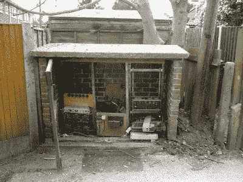
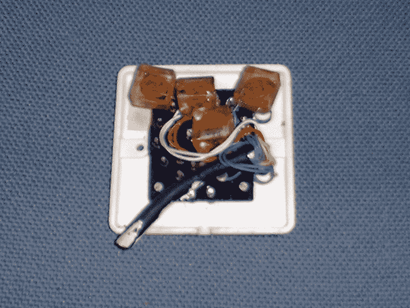

# 转播电视:早期的有线电视，像电话一样传送

> 原文：<https://hackaday.com/2018/08/10/rediffusion-television-early-cable-tv-delivered-like-telephone/>

最近，我在坎特伯雷度过了一个愉快的周末，住在我朋友的公寓里，从屋顶上可以看到这座城市中世纪大教堂的壮丽景色。周日早上，睡眼惺忪的我想去喝杯咖啡，但我的注意力立刻被她住所的一个原始建筑吸引了。房间角落的墙上有一个神秘的开关。

标准尺寸的英国电气面板上有一个 12 位旋转开关，标有字母 A 到 l。这在 21 世纪是一个意想不到的事情，大多数 40 岁以下的人可能都不熟悉，我发现了一个自 20 世纪 90 年代初大学时代以来就没见过的东西:一个扩散选择开关。

如果你有有线电视，很可能有一条同轴电缆进入你家。它很可能携带一个甚高频信号，要么是一系列传统的模拟频道，要么是一套数字多路传输。“有线就绪”模拟电视有宽带甚高频调谐器，允许观看频道，在加密系统中，将有一个带有自己的模拟调谐器和解码器电路的机顶盒。

你的数字有线电视机顶盒将做类似的事情，当它解码多路复用时，给你你订阅的频道。然而，在电视传播的初期，这一切都是不可能的。同轴电缆价格昂贵，质量也不是特别高，晶体管化的宽带甚高频调谐器仍然遥遥无期。设计最早的有线电视系统的工程师们只剩下来自电话网络的技术，在英国，这至少体现在我发现其遗迹的再扩散系统中。

## 四十年代的有线电视

Inside a Rediffusion cabinet in Canterbury. Adam Sampson, ([CC BY 3.0](http://photos.offog.org/rediffusion/g/)).

所以想象一下，现在是 20 世纪 40 年代末，一个 VHF 电视发射机网络(在大约 50 到 80 MHz 的较低 VHF 波段)正在全国各地部署，以辉煌的单色传送单一的 BBC [405 线](https://en.wikipedia.org/wiki/405-line_television_system)电视频道。由于讨厌的地理环境，这个国家的一些地区收不到可接受的信号。整个城市都将错过观看重要事件的机会，因此他们在多个节点的树状拓扑中安装了双绞线电缆网络，在街角安装了中继器盒。

当然，你不能用一束双绞线将基带视频传输很远，所以视频必须调制到某个东西上。在战后时期，有可以做甚高频甚至超高频的电子管，但是双绞线网络只有高频的带宽。

[解决方案](http://www.rediffusion.info/Wired_Vision/)是对视频进行残留边带调制，以分配到高频载波上。当第二个频道在 20 世纪 50 年代中期出现时，不同的载波频率和相反的边带被用来最小化相邻对的串扰。对于双通道 405 线系统，频率为 4 95 Mhz 和 8 45 MHz。只要电缆系统没有不匹配，由重叠边带引起的串扰就会保持在用户设备上看不到的位置。在家里，用户用的不是广播电视，而是一台带有内置解调器的品牌电视。

在 20 世纪 60 年代末，该国从 405 行系统转移到 625 行 PAL 彩色标准，并升级了再扩散系统来应对。我在我朋友的公寓里找到的选择器开关可以追溯到这个时代，到现在为止，每个房子的电缆都有多个双绞线，用于预期的多通道未来。使用的载波频率略有不同，而且由于当时大多数 Rediffusion 客户也从该公司租赁了一台电视机，因此观看设备也进行了升级。

## 再扩散帝国的衰亡

因此，从 20 世纪 70 年代到 80 年代初，一些英国城市仍然保留着 20 世纪 50 年代的有线电视系统。到现在，导致这种情况的条件已经不复存在，因为新的超高频传输网络有更多的频道，因此低信号区域也少得多。多频道的未来被视为来自卫星广播，在一些所有权变更和合并后，该公司在 20 世纪 80 年代末停止了交易。

在大多数情况下，这个网络被简单地放弃了，就像坎特伯雷的情况一样，但是在少数几个城市，它在关闭之前还继续使用了几年。我上世纪 90 年代在赫尔看到的转播盒是由一家当地公司运营的，载有一些天空卫星频道，因为那时这种过时的技术与加密卫星频道相比相对开放，所以出现了一个活跃的黑客场景。以前的再扩散地区总部是城外主干道上的一个废弃的空壳，那里有大量成熟的技术文件。

Potted transformers inside a Canterbury switch box. Adam Sampson, ([CC BY 3.0](http://photos.offog.org/rediffusion/g/index.html)).

根据我当时的记忆以及参考 HackHull 网站,“官方”机顶盒和克隆产品都只是简单的上变频器，将高频载波从双绞线转移到标准电视可以调谐的范围内。一个足够简单的单晶体管电路就可以完成这项工作，而且我记得它甚至可以用一个修改过的机械电视调谐器来完成。网上有一些网站错误地将分布描述为 VHF 频率，并建议使用 VHF 上变频器:这些都可以工作，但通过一种意想不到的方式。在这些设备中，在 VHF 范围内的某个地方有一个振荡器，它会产生一个您的 UHF 电视机可以调谐到的谐波，因此当与 HF 再扩散信号混合时，它仍然会在您的电视上产生图像。订户管理只是在接线盒处断开一所房子的连接，我特别记得，我的学生宿舍并不是那些被意外连接的幸运宿舍之一。

几年后，再扩散网络只剩下一些遗迹。老房子和公寓里的开关盒，几个井盖，偶尔还有一个完整的配电中心。20 世纪 90 年代，同轴电缆形式的有线电视进入了英国的大多数城市，但即便如此，它也正在被光纤上的互联网流媒体所取代，而是以其自身的权利成为主要的互联网传输媒体。在 2018 年，曾经有数英里的多路双绞线电缆蜿蜒在街区周围，只是为了提供一对低清晰度的黑白电视频道，这种想法看起来很奇怪，但在当时，它处于绝对的前沿。如果你碰巧住在一个重新扩散的城镇，留心一下。一定还有一些网络的人工制品残留着。