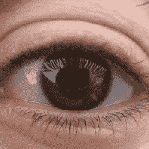

# 通过利用眼球在虚拟现实中重定向行走

> 原文：<https://hackaday.com/2018/04/11/redirected-walking-in-vr-done-via-exploit-of-eyeballs/>

[安朱尔·帕特尼]和[孙祺]在英伟达的 GPU 技术大会(GTC)上展示了一项令人着迷的新技术[，用于欺骗人类，使其认为虚拟空间比实际大](https://www.roadtovr.com/researchers-exploit-natural-quirk-of-human-vision-saccade-hidden-redirected-walking-vr-gtc-2018/)。它的工作方式是这样的:当一个人在虚拟现实中四处走动时，他们总是轮流。在这些转弯过程中，有可能欺骗人们，让他们认为他们转动的角度比实际转动的角度要大或小。有了操纵转弯感知的方法，软件就有了温和地操纵人对虚拟空间有多大的感知的方法。与其他依赖于视觉失真的方法不同，这种方法不会被观察者察觉。

Saccadic movements

该软件本质上利用了我们眼睛工作的一种奇怪现象。当人类的眼睛四处移动以观看不同的事物时，眼球不会从一个点平滑地滑动到另一个点。眼睛做出频繁但不可预测的快速运动，称为[迅速扫视](https://en.wikipedia.org/wiki/Saccade)。关于迅速扫视有许多非常有趣的事情，但这里最重要的一点是，在迅速扫视运动中，我们的眼睛基本上是离线的。我们的视觉被*感知为*一个平滑且不间断的流，但这是大脑将视觉信息拼接成一个连贯的整体，并在我们没有意识到的情况下填充空白的结果。

[Anjul]和[Qi]的方法的第一部分是通过使一个人的枢轴不是 1:1 的匹配来操纵相对于实际物理区域的虚拟区域的感知。在虚拟现实中，可能会出现一个人比现实世界中转动得更多或更少的情况，这样，软件可以引导物理运动，同时使虚拟现实中的*看起来*好像没有什么不对劲。但是这本身还不够。为了使这种不匹配不被察觉，系统会观察眼睛的迅速扫视，并在扫视过程中调整时间。大脑忽略了扫视运动中发生的事情，将其余的缝合在一起，这样你就有了:一种以虚拟空间大于物理区域的方式温和地操纵人类的方法。

下面嵌入的是一个视频演示和概述，其中提到了在 VR 中操纵空间感知的其他方法，以及它如何避免其他方法的陷阱。

 [https://www.youtube.com/embed/ySbhJEF9fXU?version=3&rel=1&showsearch=0&showinfo=1&iv_load_policy=1&fs=1&hl=en-US&autohide=2&wmode=transparent](https://www.youtube.com/embed/ySbhJEF9fXU?version=3&rel=1&showsearch=0&showinfo=1&iv_load_policy=1&fs=1&hl=en-US&autohide=2&wmode=transparent)

RoadToVR 在一篇文章中写下了的示威游行，但是【Anjul】和【Qi】将会在今年夏天以 [SIGGRAPH](https://www.siggraph.org/) 论文的形式发表所有的细节。

温和地愚弄感官可以以其他不那么微妙的方式发生。例如，通过使用[电流前庭刺激](https://hackaday.com/2016/06/01/mind-control-cerebro-helmet-controls-people/)，如果你对术语不挑剔的话，它可以被视为一种精神控制的形式。