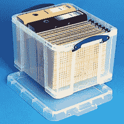

# 再流焊在另一个层面

> 原文：<https://hackaday.com/2016/12/30/reflow-soldering-at-another-level/>

我们习惯于在黑客水平上对 PCB 进行回流焊接，多年来，人们一直在用烤面包机烤箱、煎锅和类似的家用设备进行回流焊接，并为它们配备温度控制器和定时器。我们拿一块或两块电路板，使用模板在焊盘上丝网印刷一层焊膏，然后在将表面贴装元件放入烤箱之前，用镊子将它们夹在一起。这是一个需要细心和关注的过程，但是一旦掌握了，就相当简单了，我们可以小批量生产高质量的电路板。

但是，在专业水平上，如果您的电路板不是由不到 50 个零件组成的火柴盒大小的面板，而是由小型平板电脑大小的密集多层板和数百个零件组成，您会怎么做？理论上，丝网印刷和取放的过程是相同的，但在实践中，要获得成功的结果，需要更多的关注和计划。

这篇文章是在一次马拉松式的会议后的第二天早上写的，这次会议包括了所有的工作日和半个晚上。我手动填充了一排大型高密度板，其中的元件从 0402 无源器件到大型 qfp，以及介于两者之间的所有器件。我无法描述问题中的电路板，因为它是我正在为之投入一天工作的朋友的工业客户的商业敏感原型，但它值得经历成功组装这一级别的小批量原型的细节。抱歉，任何图片将是相当普通的。

[![Would we be insane to use a pick-and-place machine for this job, or are we insane not to have used one? Peripitus [ CC BY-SA 3.0 ], via Wikimedia Commons.](img/320259e0273c6438414f738c097d34ea.png)Peripitus [CC BY-SA 3.0]，via ](https://hackaday.com/wp-content/uploads/2016/12/892px-pick_and_place_internals_of_surface_mount_machine.jpg)[Wikimedia Commons](https://commons.wikimedia.org/wiki/File:Pick_and_place_internals_of_surface_mount_machine.JPG) 。有些读到这里的人可能会问“你到底在做什么，用手工制作这些电路板，你应该用一台取放机来做，或者你应该雇佣一家专业公司！”。这个问题的答案不是我能给出的，因为主板不是我委托的，但事实上，这是一个基于成本、主板数量和最终客户对贸易展的最后期限的微妙决定。为一个非常大的项目建立一个取放机构本身就是一种表现，而对于一个非常小的董事会来说，要做出是否合理的财务决策是很困难的。

于是我们开始着手制作一批八块原型印刷电路板。故事并非始于制造日，而是在几周前，材料清单(BoM)从 CAD 包中导出，采购所有组件的任务开始了。

显而易见，组件采购的复杂性会随着 BoM 中单个组件行的数量增加而增加。如果你的设计完全由每个供应商都有的通用组件组成，那么采购就像下订单一样简单，但遗憾的是很少有真正的设计是这样的。因此，这一步变成了在一系列供应商中搜寻难以捉摸的零件，有时还会打电话给公司代表索要一些免费样品。

## 组件的大集合

在构建的前几天，各种包含组件的包到达了。开始了第二项主要任务，即校勘。既要确保所有东西都已到达，并且是适合工作的正确组件，又要对它们进行索引和排列，以便尽可能容易地将其放置在电路板上。

The hanging file box we used, [a Really Useful Product](http://www.reallyusefulproducts.co.uk/uk/html/onlineshop/rub/b35_0litre.php).

我们从设计用于存放悬挂文件的储物盒开始。每个悬挂文件都标有一系列对应于 BoM 行的数字，如 1-5、6 -10、11-15 等，直到 BoM 的末尾。BoM 电子表格上的每一行都经过检查，元件是否存在，是否与电路板上应有的封装兼容，是否有足够的数量来填充电路板。它在电子表格中的行号被写在标签上，电子表格被更新以显示它存在。然后，将编号的组件包放入对应其行号的适当悬挂文件中，并对下一个行号重复该过程，以此类推，直到覆盖整个 BoM。

在组件整理结束时，我们有一个包含编号组件行的悬挂文件盒，不可避免地会有一些行不太正确或没有到达。一些最后一分钟的隔夜订单是有序的，然后是这些部分的整理步骤。

在制作任何电路板之前，似乎有很多工作要做，但这几天把一切都安排妥当**将会**节省你组装电路板的时间，并进而产生质量更好的最终原型。

在建造的那一天，我们的元件都整理好了，我们从板房拿到了一堆裸露的 PCB。我们为两个人设置了相邻的工作站，然后开始工作。

## 成为浆糊爱好者

[![Solder paste on a PCB, probably depositied by machineas it's much tidier than our stencil work. Ossewa [CC BY-SA 3.0], via Wikimedia Commons.](img/be66615ef6a5642ae0b5529d18ebe873.png)](https://hackaday.com/wp-content/uploads/2016/12/600px-solder_paste_printed_on_a_pcb.jpg)

PCB 上的锡膏，可能是机器沉积的，因为它比我们的模板工作要整齐得多。Ossewa [CC BY-SA 3.0]，via [维基共享](https://commons.wikimedia.org/wiki/File:Solder_Paste_Printed_on_a_PCB.jpg)。

组装电路板的第一项任务是在焊盘上丝网印刷焊膏。我们使用 board house 提供的夹具来完成这项任务，使用定位销来对齐电路板和模板，并使用额外的废弃 PCB 材料来支撑电路板边缘以外的模板。

丝网印刷焊膏原则上非常简单。将模板与焊盘对齐，用刮刀在所有的孔上涂上一层锡膏。当你把模板拿走的时候，电路板的每个焊盘上都应该有一层均匀的锡膏，这样就可以把元件放在上面了。

用这些术语来描述这一关键步骤，让丝网印刷焊膏听起来如此简单，但事实并非如此。糊状物的一致性对大纸板来说非常重要，就像它对小纸板不重要一样。随着时间的推移，你印在垫子上的浆糊会散开，最终你紧密排列的小垫子会被一团无定形的浆糊完全遮住。如果你有一个小的板，你可以摆脱它，但在一个大的板，重要的是要确保传播不要太快。然后，您将有机会在印刷焊料仍然清晰的情况下放置元件并对电路板进行回流。

[![Solder paste. Just like peanut butter, except it's toxic and grey. Lady Ada AKA Limor Fried [CC BY-SA 3.0], via Wikimedia Commons.](img/857976455d1cc335794ccc6321ce2ed4.png)](https://hackaday.com/wp-content/uploads/2016/12/manufacturing_paste.jpg) 

锡膏。就像花生酱一样，除了它有毒而且是灰色的。阿达女士又名利莫尔弗里德[CC BY-SA 3.0]，通过[维基共享](https://commons.wikimedia.org/wiki/File:Manufacturing_paste.jpg)。

最好用顺滑的花生酱来形容锡膏的最佳稠度。想想完美涂抹的花生酱，它不是油开始分离的罐子顶部的流动物质，也不是在冰箱里放了六周的罐子底部的物质，当你把它涂在烤面包上时，它会变得结块。这是一个容易展开的新罐子的中间部分，保持它的一致性，刚好适合你的刀。焊锡膏也是如此，对于一个大的电路板，你需要非常小心地确保你的焊锡膏是充分混合的，而不是干透的。太稀的话，它会很快散开，而太稠的话，它会在模板上结块，粘不到你的垫子上。这是你经历一段时间后就会有感觉的东西。

准备好夹具、模板、刮刀和木板，以及合适浓度的糊状物，在涂抹之前还有一个步骤。用 IPA 溶剂清洗 ***一切***；每一个印刷电路板，模板，电路板，夹具，所有的东西。这看起来很乏味，但它会产生好的和差的结果。所有干燥的糊状残留物、污垢和油都会影响工作质量，您需要尽可能好的结果。

在所有这些努力之后，刮浆糊的速度非常快。确保你的刮刀上有足够的浆糊，一次将浆糊刮过模板，用力覆盖所有的孔。提起模板，检查你的锡膏印刷质量。如果你对结果不满意，不要害怕清理它并重新做一遍，我们重新做了几次测试。

## 了解你的位置

![There are 500 0402 resistors, you have to find one of them in the crowd. Where's Wally record attempt, William Murphy [CC BY-SA 2.0], via Wikimedia Commons.](img/f6babbb772065c00f6c86b09f20185f6.png)

棋盘上有 500 个 0402 电阻，你要在人群中找到其中一个。*沃利在哪里*记录尝试，威廉·莫菲【CC BY-SA 2.0】，通过[维基共享](https://commons.wikimedia.org/wiki/File:Where’s_Wally_World_Record_(5846729480).jpg)。

上午快结束时，在我们的建造日，我们准备了一排用锡膏丝网印刷的电路板。在一个工作站，它们在我的朋友面前排成一行，而在另一个工作站，我在电脑上有一盒零件和 BoM，并打印出来。我们都有大尺寸的元件布局打印件，我的工作是依次提供每条元件线的胶带，末端的塑料条准备好，而他使用真空铅笔和放大镜放置元件。他对付 0402 的技巧比我好。发现元件位置的任务是共享的，这是一个在纸上和电脑上玩的*Wally/Waldo*在哪里的游戏，但是没有条纹跳线。

一旦你开始填充电路板，你就在和锡膏的扩散赛跑，所以在任务完成之前不要松懈。在我们的案例中，整个过程花了我们一整天，一直到晚上，通过 BoM 忽略任何会妨碍较小组件访问的大组件，然后在第二次通过时返回来安装它们。接下来是检查步骤，在此期间，一些不可避免的遗漏被纠正，无论你如何努力，还是会有一些遗漏。在整个过程中，所有整理组件的工作都进入了它自己的状态，当被问到任何一行时，我可以以非常短的顺序挑出它，并且当检测到任何遗漏时，我可以返回到它。

## 带来热量

[![Our reflow oven was a lot smaller than this one. Nelatan [CC-BY-SA-3.0], via Wikimedia Commons.](img/d9be81a06b6ad9a104600a133f855054.png)](https://hackaday.com/wp-content/uploads/2016/12/640px-reflow_oven.jpg) 

我们的回流焊炉比这个小很多。Nelatan [CC-BY-SA-3.0]，via [维基共享](https://commons.wikimedia.org/wiki/File:Reflow_oven.jpg)。

最后一步是回流焊本身，在这种情况下，使用小型专用回流焊炉。每次运行都变成了 10 分钟的焦虑等待，看着显示屏，闻着助焊剂的烟雾，最后从抽屉里拿出完成的电路板。回流焊的过程有一种神奇的东西，看着凌乱的扩散膏进去，明亮的轮廓分明的焊点出来。我们检查了每块电路板，不可避免的是，每块电路板都需要少量的返工。相邻引脚之间总会有一些桥接，甚至元件会稍微偏离焊盘，但这是原型组装的本质。

经过漫长的一天和之前的大量准备工作，我们有了一排原型板。我们应该能够将它们全部作为工作设备进行调试，从这些设备中，我的朋友将有足够多的设备来满足他的客户的需求。以上所有描述了一个非常漫长而乏味的过程，但是没有理由任何一个黑客读者不应该通过一点点实践来做一个大的板。如果我们启发你尝试重新焊接你自己的电路板，无论尺寸大小，然后在 hackaday.io 上与我们分享结果，同时，如果你有任何进一步简化更大电路板的流程的建议，我们洗耳恭听。

如果你喜欢这个马拉松式的小型制造会议的故事，你也会喜欢[Bob Baddeley 的]系列，主题是 [*行业工具*](http://hackaday.com/tag/tools-of-the-trade/) 。您还应该看看用于创建 Hackaday 超级会议徽章的[流程。](http://hackaday.com/2016/11/25/a-tale-of-electronic-manufacturing/)