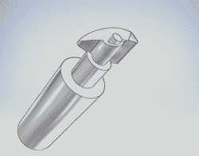
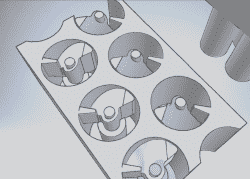
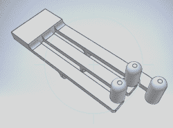
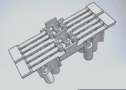
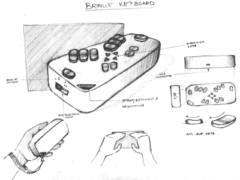

# 可刷新盲文显示器和盲文键盘

> 原文：<https://hackaday.com/2016/04/28/refreshable-braille-display-and-braille-keyboard/>

全世界只有约 10%的盲人能读懂盲文。一个主要原因是盲文显示器的高成本。成本是由它们的复杂性和可靠性决定的——需要确保它们能够承受磨损。

[Vijay]三年来一直致力于研发一种可刷新的盲文显示器，但直到最近与[Paul D'souza]合作后才取得了一些实质性的进展。在他最初的实验中，他使用了点阵打印机头，但目前的版本使用了移动电话中使用的微型振动马达。他将微型马达的旋转运动转化为直线运动，推动盲文“细胞”针上下移动。振动电机上的偏心配重被异形凸轮取代。凸轮的连续旋转受到止动器的限制，止动器是容纳电机的 3D 打印外壳的一部分。另一个 3D 打印部件有三个凸轮随动件，杠杆，弹簧和盲文针卷在一起，以创建半个盲文细胞。根据凸轮的位置，销被向上或向下推。一个盲文单元模块由两个凸轮从动件、一个用于六个振动电机的外壳和一个盖板组成。多个模块链接在一起形成显示器。

下一步将是研究电子设备——特别是确保他能够以可控的方式控制马达在两个方向上的运动。如果你有什么想法，请发表意见。3D 设计文件可以从他的 [Dropbox 文件夹](https://www.dropbox.com/sh/uwrq756dxbna0s4/AADXNlg9dILcTtzPtWK2KhXXa?dl=0)中获得。

他正在进行的另一个补充项目是[盲文键盘](https://hackaday.io/project/10745-braille-keyboard-for-the-blind)——一种可以与智能手机、平板电脑和电脑一起使用的触觉输入设备。他的设计基于一个 Arduino micro，带有 BLE，用于连接智能手机和计算机使用的 USB 端口。该设备将由电池供电，并安装在 3D 打印的外壳中。它将有一组 12 个主按钮和 4 个方向按钮，它们的轮廓和位置有助于使打字更容易，而振动电机将提供触觉反馈。语音选项也计划在键入时读出每个字符。这一个仍然在绘图板上相当多，但是我们确实希望他在接下来的几个月里把它向前推进去建造和测试一些原型。

 [https://www.youtube.com/embed/YNX67mTrCrw?version=3&rel=1&showsearch=0&showinfo=1&iv_load_policy=1&fs=1&hl=en-US&autohide=2&wmode=transparent](https://www.youtube.com/embed/YNX67mTrCrw?version=3&rel=1&showsearch=0&showinfo=1&iv_load_policy=1&fs=1&hl=en-US&autohide=2&wmode=transparent)

The [HackadayPrize2016](http://hackaday.io/prize) is Sponsored by:       