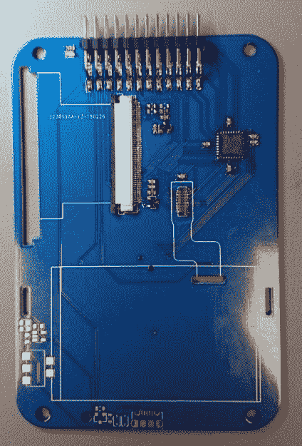

# 从键盘上再生出黑莓手机

> 原文：<https://hackaday.com/2018/03/08/regrowing-a-blackberry-from-the-keyboard-out/>

在 Hackaday，我们是设备重用的忠实粉丝，而[arturo182]对黑莓 Q10 的键盘所做的就是一个极好的例子。有时你在使用一个便携式设备，并对自己说“这实际上是一个 QWERTY 键盘”。什么项目不需要键盘？

典型地，这就变成了对将 60 来个 SMD 轻触开关焊接到电路板上的恐怖行为的成本效益分析，这一点都不好玩。如果有更多的资源，你可以使用像[next thingco]的[pocket chip](https://getchip.com/)这样的[Snaptron snap dome](http://www.snaptron.com/)，但对于一次性项目来说，这些资源很复杂，按键感觉很难真正完美。[arturo182]没有选择任何一条路线，而是对黑莓 Q10 的键盘进行了逆向工程。

当你想到好的小键盘时，总有一个很突出:黑莓。几十年来，黑莓一直以在你的拇指下绝对钉上一个小键的甜美触感而闻名。Q10 就是一个例子，最初于 2013 年上市，是他们当时新推出的黑莓 OS 10 的发布设备之一。像黑莓的大部分业务一样，操作系统和手机早已过时，但这并不意味着键盘已经老化。

[Arturo182]说他可以从通常的中国来源找到它们，每个大约 3 美元，太便宜了，不能不去探索。基于[ [WooDWorkeR](https://hackaday.io/project/27520-pimp-personal-information-manager-pager) ](在 Hackaday.io 上)和[ [JoeN](https://www.eevblog.com/forum/beginners/how-to-connect-to-a-very-very-challanging-blackberry-q10-keyboard-connector/) ]对矩阵进行逆向工程并找到正确的连接器的工作，他将键盘集成到一个易于使用的分线板中，露出了按键矩阵、每行背光控制，甚至 MEMS 麦克风！更令人兴奋的是，他制造了一个小型便携设备，拥有最初 Q10 的所有特征；彩色液晶显示屏、操纵杆、功能按钮等，尺寸非常小。

KiCAD 源，包括键盘的 3D 模型和分线板的[可用。](https://github.com/arturo182/bbq10kbd_breakout)

现在，如果有人能找到一种方法来挽救 Q10 不寻常的方形高 DPI 显示屏，我们就可以进入便携式设备的天堂了。

> 终于！不幸的是，因为其中一个 GPIOs 也是 SWDCLK，并且有一个内部下拉，所以 COL4(负责 RTFGCV)是 bork。是的，我知道我拼错了“amet”；)[pic.twitter.com/vmPV8d8X9r](https://t.co/vmPV8d8X9r)
> 
> —Arturo 182(@ Arturo 182)[2018 年 1 月 5 日](https://twitter.com/arturo182/status/949366244645404673?ref_src=twsrc%5Etfw)