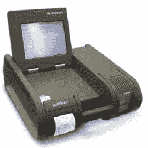
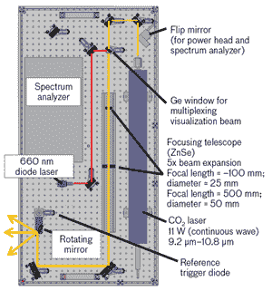

# 遥感炸弹可以阻止恐怖主义

> 原文：<https://hackaday.com/2016/03/29/remote-sensing-bombs-could-stem-terrorism/>

如果你懂技术，在《星际迷航》中有很多东西很难解释。传送器、足够智能的门，除非你在战斗中撞到它们，否则它们会自动打开，还有通用翻译器，所有这些都不容易解释。但是最难解释的事情之一是斯波克先生的传感器。从船上或用三录仪，斯波克可以在远处感知任何东西，从化学成分到能量，甚至生命的存在(至少在今天，甚至很难确定这意味着什么)。

遥感在当今世界将有非常独特的用途:更早地发现恐怖分子的炸弹。[Debora MacKenzie]最近在《新科学家》上发表的一篇文章指出，在不增加拥堵的情况下，很难阻止像最近在布鲁塞尔发生的袭击。例如，将检查站设在门口而不是过境站内，这在亚洲很常见，但会造成排队和延误。

 美国已经使用离子迁移谱(IMS)检测棉签上的爆炸物痕迹(使用像左边这样的机器)。然而，在 2000 年早期，他们试验了一个版本的设备，该设备使用空气来确定当人们经过机器时是否有爆炸物。到 2010 年，官员们认为这些机器故障太频繁，于是停止使用。

## 实践中的遥感

据兰德公司的一位专家称，遥感很可能使用成像或嗅探器。然而，成像解决方案很容易被欺骗，因为炸弹可以采取普通物体的形状。嗅探器，包括生物嗅探器(被称为狗)，更难被愚弄。问题是，部署数千只狗来覆盖全球机场是很困难的。

安全公司 Morpho 正在研究一种他们称为“真相隧道”的东西——行人走过隧道，它用多个传感器扫描他们，包括即时消息系统、面部识别，甚至分析眼球运动来检测紧张的人。对科幻迷来说，这听起来像电影《全面回忆》中的公共交通扫描，这也是帖子顶部图片的来源。

## 微型爆炸的声音

林肯实验室有另一个遥远的答案。[动态光声光谱](https://www.ll.mit.edu/news/dynamic-photoacoustic-spectroscopy.html)(见下图)使用激光远程感应气体和气溶胶。寻找正确的信号可以使该装置从远处(最远 100 米)发现爆炸物。

奇怪的是，该系统通过倾听微小的爆炸声音来工作。激光使用的频率使炸药中发现的分子蒸发，设备监听几乎无法察觉的声音。研究人员声称，它可以检测到移动的汽车门把手上每平方厘米 200 纳克的物质。

还有其他基于激光的系统，包括 G-Scan，它使用拉曼光谱和绿色激光器。一些系统使用微波。每个人都同意，一个能够快速检测爆炸物并且没有很多远距离误报的系统将是一件好事。事实上，一些系统甚至可以探测到炸弹制造设施，并在炸弹存在之前阻止爆炸。

## 砍

在 Hackaday，我们经常谈论为了更大的利益而黑客。我们有一大群聪明人。也许我们需要开始思考这个问题了。一个简单的开源爆炸物探测器可能会改变游戏规则，不仅是针对恐怖主义，还可能解决其他问题，如地雷。

我希望评论区会产生一些关于如何工作的想法。不要只想到相机和光谱学。跳出框框思考——这是我们社区最擅长的。一个足够好的想法可能会吸引一些兴趣，也许很快有一天我们会推出一个 Hackaday.io 项目，可以检测自杀背心或其他对无辜者的危险。这是一个能让每个人的世界变得更美好的方法。