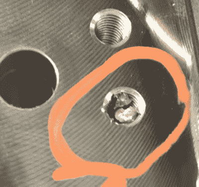

# 从非常非常昂贵的东西上取下一个坏掉的水龙头

> 原文：<https://hackaday.com/2016/07/02/removing-a-broken-tap-from-something-really-really-expensive/>

[当你在一个价格高达数万美元的组件上折断一个龙头或一个螺栓](https://www.youtube.com/watch?v=YbeKxFBZrF8)会发生什么？只是钻出来，扔在螺母插入停止接受。有没有一种方法可以在完全不损坏主零件的情况下移除水龙头？

Broken tap stuck in the hole it was threading

嗯，这就是杰里的坏钻和丝锥[汤姆格拉夫顿]的用武之地。他是来拿水龙头和嚼泡泡糖的，而且他肯定一直在大声嚼泡泡糖。他的主要工作是金属分解机器。

MDM 基本上是典型电火花线切割设置的一半。在电火花加工中，你用电极在材料上打孔。然后你把一根线穿过这个洞，穿过有时令人吃惊的一排滑轮，然后开始走。

[Tom]使用带有适当尺寸电极的 MDM 精确分解水龙头的中间部分。之后，用专门加工的磁性凿子进行一些细致的工作。轻轻一点，就能快速找到线头，并把它还给顾客。

正如你在休息后的视频中看到的，最终结果是一个螺纹孔，与其余部分难以区分，他必须标记出是哪一个；大概是为了让顾客不会忘记他们为什么付钱给他。

 [https://www.youtube.com/embed/YbeKxFBZrF8?version=3&rel=1&showsearch=0&showinfo=1&iv_load_policy=1&fs=1&hl=en-US&autohide=2&wmode=transparent](https://www.youtube.com/embed/YbeKxFBZrF8?version=3&rel=1&showsearch=0&showinfo=1&iv_load_policy=1&fs=1&hl=en-US&autohide=2&wmode=transparent)

[通过[r/金属加工](https://www.reddit.com/r/metalworking/comments/4m9yw2/broken_tap_removal_by_metal_disintegration/)