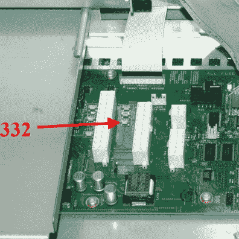
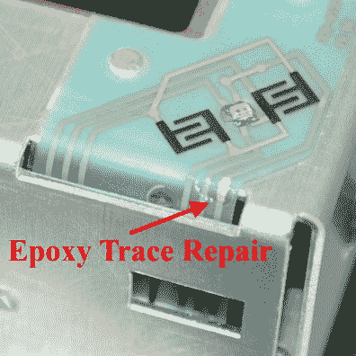

# 维修 14 台 Tektronix TLA5202 逻辑分析仪

> 原文：<https://hackaday.com/2016/08/20/repairing-14-tektronix-tla5202-logic-analyzers/>

[Matthew D'Asaro]最近受托管理整个教室车队，共有 14 台故障 Tektronix TLA5202 逻辑分析仪，这是一堆曾经价值数十万美元的设备。他的任务是:修复它们。他把它们都修好了，在路上[记录了这些旧的但仍然很棒的设备的一些常见故障点](http://www.dasarodesigns.com/projects/a-quick-fix-for-tektronix-tla5000-series-logic-analysers/)。

[Matthew]发现 Tektronix 的那部分电子设备很好地经受住了时间和教室使用的破坏，只有机器内部的嵌入式桌面 PC 根本不是为十年而制造的。一些硬盘必须更换，但大多数设备甚至无法通过开机自检(POST)。对普通英特尔 microATX 主板的进一步检查很快发现，一些 e-cap 已经被灰尘覆盖，留下了泄漏的电解液和熔断的 SMD 保险丝。替换这些主板上的两个恢复功能。

    

修理一台顶级设备的甜蜜胜利并不总是那么近。其中一台分析仪，主板修不好，得换。[Matthew]能够找到一个相同的板，他将逻辑分析仪的定制 BIOS IC 移植到该板上。另一台分析仪则被暗淡的电源指示灯 LED 所困扰，这是由安装它的柔性银墨印刷电路板中的裂纹引起的。一滴银环氧树脂和一点强力胶解决了这个问题。

基于 14 个单元，[马修]的文章涵盖了电子设备在使用十年后可能出现的问题，以及当需要快速修复时首先应该检查什么。当一个设备显示出疲劳的迹象时，我们的读者在看什么？请在评论中告诉我们！