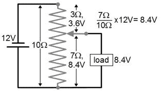
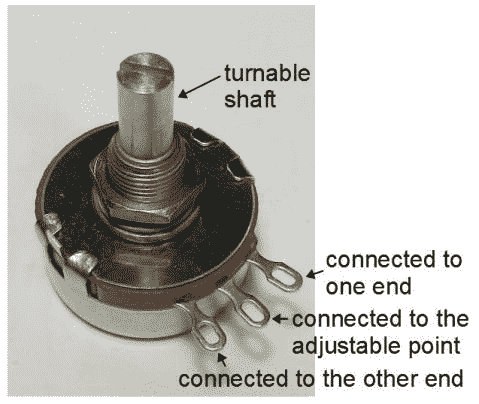
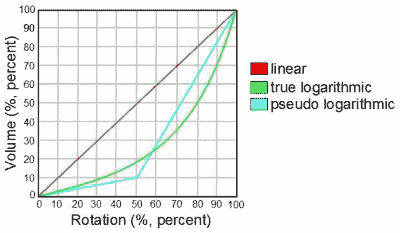
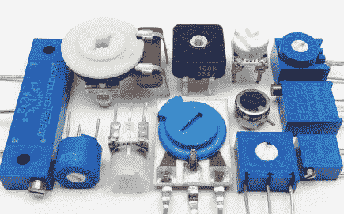
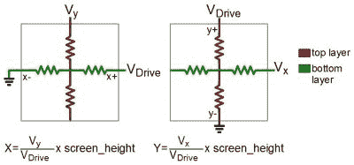
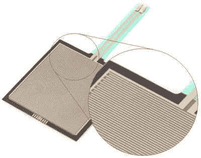
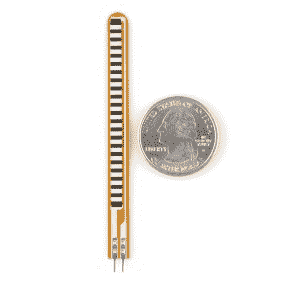

# 运动中的电阻:关于可变电阻你应该知道什么

> 原文：<https://hackaday.com/2016/09/16/resistance-in-motion-everything-you-should-know-about-variable-resistors/>

调节音响系统的音量旋钮、感应触摸屏上的手指位置、知道有人在车里，这些都是日常生活中会遇到可变电阻的例子。改变电阻的能力意味着相互作用的能力，这就是为什么可变电阻装置在许多事物中被发现。

原理是一样的，但是一伏电压有很多种分割方式。让我们来看看旋转电位计、变阻器、薄膜电位计、电阻式触摸屏、力敏电阻以及伸缩传感器都包含什么。

## 电位计

电位计基本上是分压器:一种将给定电压降低到较低水平的方法。如示意图所示，电位计(灰色)有三个连接点。中间连接点是可调节的(由箭头表示),并且在沿着材料长度的某个点处与内部的电阻材料接触。

可调点和其他点之一(电阻材料的两端)之间的电压由这两点之间的电阻决定。如果只有两点连接，那么它被认为是一个可变电阻器或变阻器。

  Potentiometer schematic  Potentiometer in amplifier  Potentiometer

照片中是一个带有圆柱轴的罐子，你可以转动它。音响系统上的塑料音量旋钮隐藏了其中一个罐子。请注意三个连接点(终端)，中间的一个是连接到可调点。照片显示了一个新的，未安装的锅。这里有一个例子，我在花生酱罐放大器上使用了一个用于音量调节的罐子(顺便提一下，[这在 Hackaday](http://hackaday.com/2013/08/11/a-crystal-radio-amplifier-in-a-jar/) 上有报道)。

### 电位计电阻如何变化

Linear vs logarithmic taper potentiometer graph

电位计可以有线性电阻范围或对数范围。线性意味着当你转动轴时，你得到的电阻值线性变化。转动四分之一圈，电阻将改变整个量程的四分之一。转动一半，电阻将改变整个量程的一半。

但是对于一个音量旋钮来说，音量听起来会变得太快；这是由于我们的大脑解释我们耳朵所听到的东西的方式。所以对于音量旋钮来说，最好使用一个电阻随着你转动旋钮而呈对数变化的电位计。该图显示了线性和对数模式下，音量如何随着旋钮的转动而变化。注意，有些对数锅只是伪对数，比真对数便宜。这些由两个具有不同变化率的线性部分组成，并在它们旋转的 50%处相遇。这些也显示在图表中。

这种对数特性有时是通过使内部的电阻元件呈锥形来实现的；它的宽度从一端到另一端变化。因此，电位计通常被称为线性锥形电位计或对数锥形电位计。

电位器的另一种形式是微调电位器。它们比上面的小，用在电路板上。作为校准电子电路的一种方式，它们通常只调整一次(或很少调整)。

  Trimmers  Equalizer with sliders

然而，电位计并不都是旋转元件。它们也可以是滑块，如键盘上均衡器的照片所示。这些很容易有灰尘进入其中并干扰机械装置，如图所示的就是这种情况(我知道是因为它是我的，有些有点难以移动)。

## 变阻器

如上所述，当电位计只有两个端子相连时，通常称为变阻器。变阻器的额定瓦数通常高于上图所示的电位计，当然也比音量控制器的瓦数高。

为了处理更高的瓦数，它们通常是通过在绝缘芯上缠绕电阻丝，然后让电刷在金属丝上滑动，使接触金属丝的地方轻微接触。回想一下本文开头使用三个端子的电位计的电气符号。由于你只连接到一个变阻器的两个终端，符号是不同的；一个带有倾斜箭头(不连接)的电阻符号。下面你可以在这里看到锯齿形线 IEEE 标准版和矩形 IEC 版。

  Rheostat internals  Rheostat electrical symbols

## 薄膜电位计

Resistive membrane

薄膜电位计由一个柔性、绝缘且通常透明的薄膜组成，薄膜下附有一个电阻条。在它下面间隔开的是一个基座，在其顶部印刷有导电路径。当手指或其他物体用其电阻带压下柔性膜时，导电通路形成电连接。这在电阻带的终端产生一个电压。电压根据导电路径的连接位置而变化。请注意，这与本文开头第一个电位计原理图中的电路相同。

Sparkfun 的一个叫做软罐的电阻从 100 欧姆到 10 千欧姆线性变化，额定功率为 1 瓦。

如果连接并不总是存在，例如用手指连接时，则应存在一个下拉电阻(例如 100 千欧)。然而，对于一些薄膜电位计，磁铁或电刷总是对薄膜施加压力，导致持续连接。

## 电阻触摸屏

How a resistive touchscreen works

电阻式触摸屏类似于薄膜电位计，只是两层上都有电阻材料，并且该材料是透明的。前膜是柔性的并且也是透明的，使得手指或触笔可以压在它上面以产生连接。想想十年前便宜的掌上电脑，或者今天仍在使用的一些儿童玩具。这项技术仍在使用，但智能手机革命已经建立在电容触摸屏上，不需要柔性薄膜。

对于 4 线电阻式触摸屏，首先在顶层施加电压，同时从底层读取一个值，以获得 X 值。然后，在底层上施加电压，同时从顶层读取一个值，以获得 Y 值。所有这些都是在毫秒内完成的，并且屏幕不断地被扫描以获得这些值。

这些计算都是由一个辅助控制器来完成的。电阻式触摸屏不如电容式触摸屏响应灵敏，通常需要触控笔来获得所需的精度。它们用于低端智能手机。

## 力传感电阻器

力感电阻器，By[spark fun](https://www.sparkfun.com/products/9376)【CC By-SA 3.0】

力感电阻器由导电聚合物组成，其中含有导电和非导电颗粒。这种聚合物位于两个缠绕在一起但彼此不直接电接触的导体之上。将聚合物压到导体上，导体之间就形成了电接触。增加压力或被压下的面积会增加两个缠绕导体之间的传导，同时降低电阻。在聚合物没有被挤压的情况下，电阻可以大于 1 兆欧。精确度通常在 10%左右。但精度足以用于乐器、假肢、汽车占用传感器和便携式电子设备。

## 弯曲和拉伸传感器

弯曲传感器是一种电阻材料，例如涂在柔性薄膜上的碳。当传感器弯曲时，这导致材料拉伸，以与弯曲半径相关的方式增加其电阻。来自[一张数据表](https://cdn.sparkfun.com/datasheets/Sensors/ForceFlex/FLEX%20SENSOR%20DATA%20SHEET%202014.pdf)平坦时的电阻为 10 千欧，但弯曲 180 度且两端夹在一起时，电阻可能会增加一倍。其用途的一个流行例子是在游戏手套的手指上，如最初的任天堂动力手套(这里有一个[被黑客攻击来控制四轴飞行器](http://hackaday.com/2016/06/06/power-glove-takes-over-quadcopter-controls/))。弯曲手指记录为电阻的变化，给出手指弯曲程度的指示。

  Flex sensor, By [Sparkfun](https://www.sparkfun.com/products/10264) [CC BY-SA 3.0]  Conductive rubber stretch sensor, By [Adafruit](https://www.adafruit.com/product/519)

拉伸传感器的工作原理是一样的，只是你要拉伸它来增加电阻。一个例子是注入碳黑的橡胶绳，看起来很像橡皮筋。拿 Adafruit 的一个例子来说，如果你有一个 2.1 千欧的 6 英寸长的电阻，把它拉伸到 10 英寸长，电阻就会增加到 3.5 千欧。另一个例子是由钢纤维和聚酯纤维混合制成的导电纱线，还有其他形状为丝带或带子的纱线。

## 阻力最小化

这是一个伟大的收集手动可变电阻器，你会发现在这些天的使用。我们可能错过了一两个，如果是这样，请在下面的评论中告诉我们和其他人。

如果你想了解电阻值不变的电阻，可以看看我之前写的关于[固定值电阻](http://hackaday.com/2016/09/06/what-is-there-to-know-about-resistors/)的文章(它们确实会因温度、湿度和其他因素而略有变化，我们也会谈到这些因素)。我计划在这个系列中再写一篇文章:电阻的值在没有人工干预的情况下变化(例如光敏电阻的电阻随光线而变化)。期待最后一期。