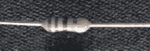

# 阻力是…有一个增强现实应用程序！

> 原文：<https://hackaday.com/2015/09/12/resistance-is-theres-an-augmented-reality-app-for-that/>

像许多一定年龄的工程师一样，我用一种政治上非常不正确的记忆装置学习了电阻颜色代码，今天只有 Tosh 可能敢于在公共场合说出它。当教孩子们的时候，我不得不求助于老的收音机小屋备用:大男孩们和我们的年轻女孩比赛，但紫罗兰通常会赢。不会脱口而出或乞求被记住。也许:劣质啤酒会腐蚀我们年轻的肠子，但伏特加很好喝。但是，当教育孩子的时候，这可能也不理想。

也许你可以忘记那些陈旧的记忆拐杖。首先，世界上流行的表面贴装和颜色编码电阻正在成为过去。然而，如果你真的需要阅读颜色代码，谷歌 Play 商店上至少有三个应用程序可以完成这项工作。最新的是 [ScanR](https://play.google.com/store/apps/details?id=com.laufersteppenwolf.resistorscanner) ，虽然还有[电阻扫描器](https://play.google.com/store/apps/details?id=ca.parth.resistordecoder)和[电阻扫描](https://play.google.com/store/apps/details?id=org.ganza.resistorscan)。如果你使用 iPhone，你可以试试这个应用程序，虽然我不是苹果的人，但我不能给你我对此的反馈。

不过，Android 应用程序有点参差不齐。这个想法很棒，电阻扫描仪似乎是最像我期望的那样工作的一个。然而，他们中没有人能得到我手边几个 1/4 瓦碳膜电阻的像样图像。我的 Nexus 5 的摄像头在获取小电阻的良好照片的范围内根本没有用。一个借来的 LG 手机的更好的相机工作得更好一点，即使图像模糊。然而，没有一个应用程序能正确识别所有的颜色。当然，我知道这些条纹意味着什么，你甚至可以仔细检查颜色。但是如果我不得不输入颜色或者对照我知道的值进行检查，那就有点违背目的了。

我还测试了一款华硕 Zen Pad，没有显示任何更好的结果。然后我打开我的玩具手机到显微镜转换器(在一元店买的),但这使得电阻太大，没有一个程序能处理它。我觉得主要的限制是手机摄像头。对焦时，图像太小。当足够大时，相机离电阻器太近，使其难以辨认。

 然而，Zen Pad 的摄像头可以对焦，仍然没有得到好的效果。看左边的图像。你能读出电阻值吗？我可以。没有一个程序可以。在某些情况下，白带看起来与电阻体没有什么不同。在一些像这样的情况下，不清楚为什么程序不能找出乐队(或者更糟，弄错了)。这可能是我需要试验背景或照明，或者我只是需要更大的电阻。

这些应用离黄金时段还远着呢。即使相机足够用，你也必须将颜色排成一行，你必须知道读取电阻的方式以及哪个带是公差带。如果你知道，我会很惊讶你不知道颜色代码。

电子人的另一个增强现实尝试是同样适用于 Android 的 SandScan。理论上，你可以用相机拍一张芯片的照片，它会读取文本并对零件号进行搜索。我也不能让这些工作。芯片上的激光标记通常非常模糊，只有最大的芯片才能给我任何可用的图像。即使那样，我也无法让程序搜索。从 Google Play 商店对这个程序的评论(以及抵制者的评论)来看，我并不孤单。

在未来，也许你会打开你的谷歌眼镜(或类似的东西),看着电路板获得所有的元件值。右眨眼可能会调出数据手册，而左眨眼则突出显示与器件相连的走线。也许吧。或者这还不够。看着一个电路，并能够想象出通过它的电压和电流，会是什么样子？牵强？也许不是。电子束频闪仪可以显示 CPU 芯片总线上的位(尽管 CPU 最好是在一个循环中，并且你最好一遍又一遍地同步到完全相同的点)。

另一方面，仅仅因为目前照相机和图像软件的技术水平还不能胜任这项任务，并不意味着人们应该停止工作。当你回顾早期的手机时，你会觉得它们很滑稽。按照任何现代的定义，早期的个人电脑都不是真正实用的。然而，它们构成了我们今天所拥有的建筑材料。再过几年，这些东西可能也会看起来很蠢。

当然，如果你想建造一台专用机器，你可能会有更好的运气。或者你可以制作自己的[官方黑客参考卡](http://hackaday.com/2013/08/28/hackadays-resistor-code-reference-card/)。

 [https://www.youtube.com/embed/h_bITwduLPk?version=3&rel=1&showsearch=0&showinfo=1&iv_load_policy=1&fs=1&hl=en-US&autohide=2&wmode=transparent](https://www.youtube.com/embed/h_bITwduLPk?version=3&rel=1&showsearch=0&showinfo=1&iv_load_policy=1&fs=1&hl=en-US&autohide=2&wmode=transparent)

