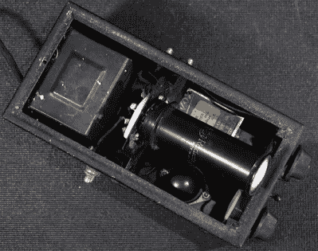

# 修复 20 世纪 30 年代的示波器——无需供电

> 原文：<https://hackaday.com/2018/05/22/restoring-a-1930s-oscilloscope-without-supplying-power/>

我们都做过这样的事情:偶然发现一件老式设备，跳到测试台上，急切地想看看它是否工作，插上电源，打开电源开关，但是……什么都没有。Carlson 先生]解释了为什么这是一个如此糟糕的想法，并伴随着更多成功修复的关键知识-这次是恢复 20 世纪 30 年代的一个[微型示波器。](https://www.youtube.com/watch?v=NKbE5jcLF3U)

抵制立即启动旧设备的诱惑通常是希望看到它再次工作的关键。Carlson 先生]解释了为什么您应该确保在扳动开关之前修复或更换任何降级的组件，因为您知道如果通电，短路/泄漏的电容器很可能会损坏其他组件。

他正在修复的示波器是一个美丽的发现。最初由无线电运营商用来监控他们正在传输的音频，它具有一英寸的 CRT 和电子管整流，外形紧凑。

Carlson 先生]使用他的[电容器泄漏测试仪](https://www.youtube.com/watch?v=LhovRIM5xAo)来确定主滤波器电容器是否需要更换——确实需要，这并不奇怪——以及确认封装在电源变压器本身中的电容器的存在。这些不仅有可能破坏修复，还会通过泄漏到底盘上造成安全隐患。

在更换和重新连接所有相关设备后，示波器被连接到一个隔离变压器上，第一次就成功了——显示了通电前全面调查的价值。[卡尔森先生]讽刺道，“它真的没有选择；当它在这张长椅上时，它会再次工作”，这句话无疑会引起黑客读者的共鸣。

Carlson 先生]承诺在不久的将来将示波器集成到一台新的测试设备中，但在此期间，你可以阅读他的[焊接站 VFD mod](https://hackaday.com/2017/12/22/vfd-puts-the-suck-back-into-desoldering-station/) ，或他的[步入式 AM 无线电发射机](https://hackaday.com/2017/04/05/retrotechtacular-a-walk-in-broadcast-transmitter/)。

 [https://www.youtube.com/embed/NKbE5jcLF3U?version=3&rel=1&showsearch=0&showinfo=1&iv_load_policy=1&fs=1&hl=en-US&autohide=2&wmode=transparent](https://www.youtube.com/embed/NKbE5jcLF3U?version=3&rel=1&showsearch=0&showinfo=1&iv_load_policy=1&fs=1&hl=en-US&autohide=2&wmode=transparent)

